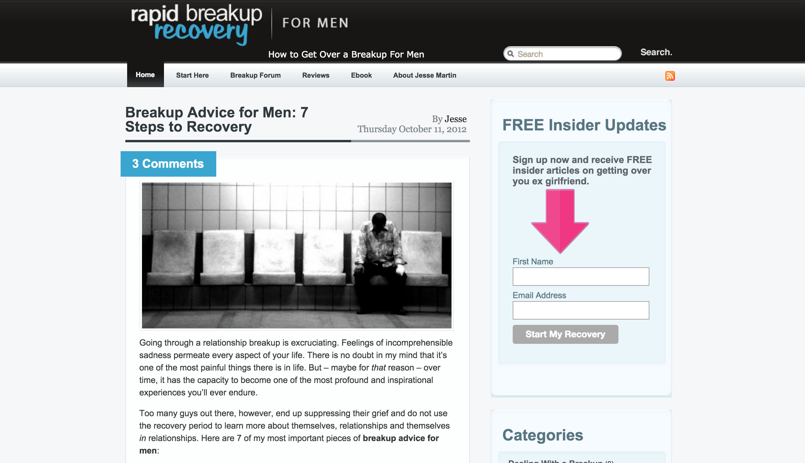
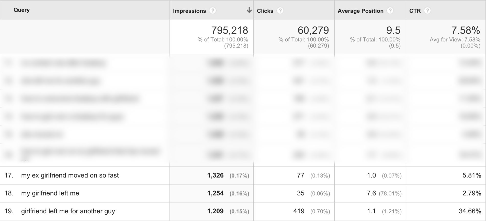
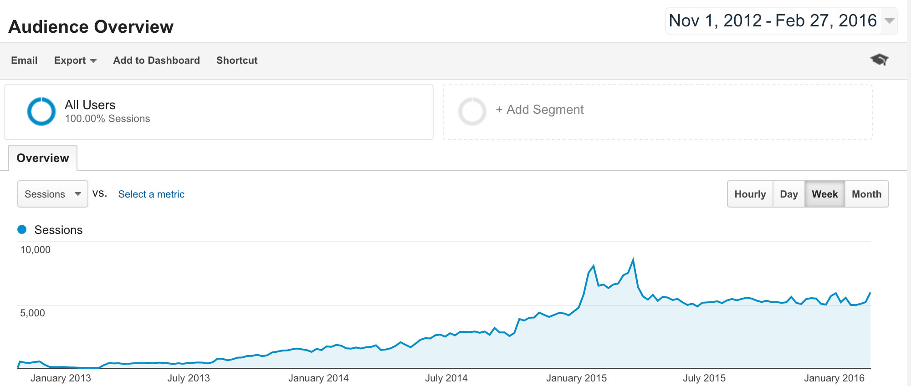
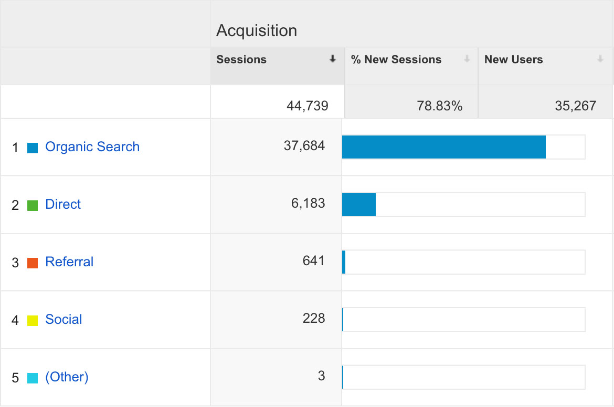
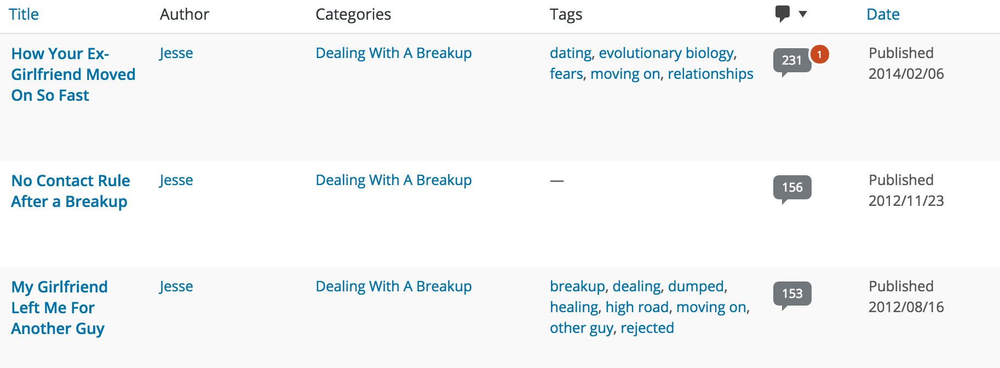
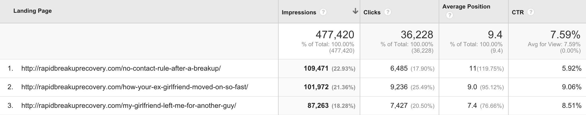
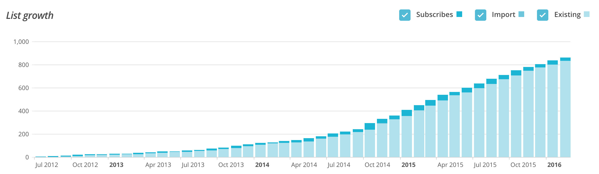
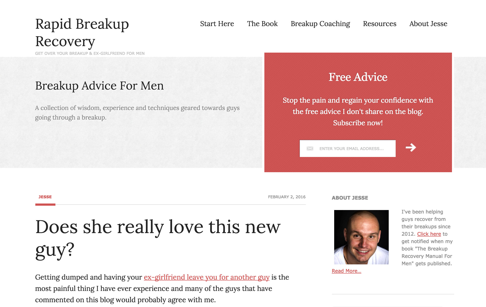

This is an introduction to one of my projects, [Rapid Breakup Recovery](https://web.archive.org/web/20161104234315/http://rapidbreakuprecovery.com/), a blog focused on heartbreak recovery for men, which I’ve been working on (sporadically) since 2012.

## A Brief History

Some time in 2012 I was reading up on how to start a successful online business. Going through one of the exercises on selecting a niche, I remember reading the advice “Do what you know.”

What did I know? At this point in my life, 25 years old, still in college, I did not feel like there was much I did know.

_I didn’t feel like an expert in anything._

It was only when I combined this advice with another piece of advice that I read coming from [Eben Pagan](https://web.archive.org/web/20161104234315/http://www.getaltitude.com/) which was to focus on a specific customer need – a real, palpable pain that people have.

It was 2012 at the time two years prior, my girlfriend at the time had broken up with me. A more accurate description of what happened is that *she left me for another guy*, and it was without a doubt the most painful and visceral experience I had ever experienced.

Two years on, I had found meaning to my life again and I felt recovered. But it had taken two years to get to this point.

I reflected on how I had gotten here, from being completely destroyed two years before, and I realized that there was value in the lessons learnt during my recovery which I could share.

“Do what you know” had been the advice, and *this* was something I knew. Moreover it seemed plausible there would people out there with a real, palpable need for this type of information.

So I started investigating the topic of “heartbreak recovery” with a focus on advice for men and found that there was very little competition.

I started immersing myself into SEO and generally any topic supporting my efforts in starting an online business.

I soon settled on a strategy of selecting a range of keywords I wanted to target and to write blog posts optimized for those keywords. This was back in 2012 when keyword stuffing articles still worked, sort of.

Again, following Eben Pagan’s advice, I settled on a name that (I hoped) was clear, memorable and that communicated a clear benefit that my target users were looking for: Rapid Breakup Recovery.

Rapid Breakup Recovery back in 2012.

My strategy of targeting low-volume keywords that seemed highly likely to correspond to my target audience, such as *“my girlfriend left me”* or *“girlfriend left me for another guy”*, turned out to be successful.

Traffic to rapidbreakuprecovery.com by channel (Jan 1, 2016 - Feb 27, 2016). Source: Google Analytics

The blog would slowly gain traffic, predominantly organic, and has done so consistently since. Even though my posts have been few and far between.

Traffic to rapidbreakuprecovery.com by channel (Jan 1, 2016 - Feb 27, 2016). Source: Google Analytics

Traffic to rapidbreakuprecovery.com by channel (Jan 1, 2016 - Feb 27, 2016). Source: Google Analytics

While initially my blog posts would get a small trickle of organic traffic by virtue of being the only ones targeting highly specific keywords – things evolved from there.

Some of my blog posts would elicit a slew of comments by readers, sharing their stories and commenting on one another.

Top blog posts sorted by comment count.

Google must have seen that these posts were highly engaging to readers and that these posts were getting periodically updated by new comments that it rewarded me with higher rankings.

This is how I started ranking for more competitive, and less focused terms, such as *“no contact after breakup”* and others.

Top organic landing pages sorted by SERP impressions.

Note: The posts with the top 3 amounts of comments are also the top 3 pages that generate organic traffic.

I put up an opt-in box from the first iteration with which I’ve successfully collected over 800 email addresses since 2012.

Rapid Breakup Recovery back in 2012.

I’m a bit ashamed to admit, however, that I haven’t been nurturing my list, *at all*. I suspect many of my subscribers are long recovered.

## The Current Situation

As of February 2016, RBR consistently generates around 22-23k visitors a month, predominantly through organic search.

Users can visit RBR and get in touch with me to set up a Skype coaching call. I’ve done a handful of these already. They’ve helped me understand my users and better develop my advice for them.

I am currently writing a book on [breakup recovery for men](https://web.archive.org/web/20161104234315/https://leanpub.com/thebreakuprecoverymanualformen), which has been quite challenging to say the least. I’m using [leanpub](https://web.archive.org/web/20161104234315/http://jessems.com:80/product-chronicles/rbr-introduction/www.leanpub.com) to publish it while it is still a work-in-progress. More on that in a follow-up post.

Current incarnation of Rapid Breakup Recovery.

Ultimately my goal is to create and sell a range of info products that help my readers recover.
