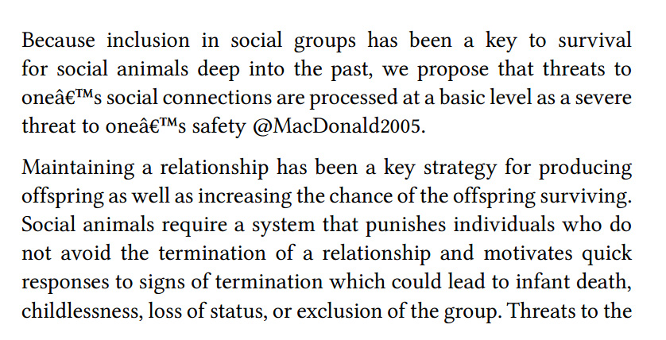
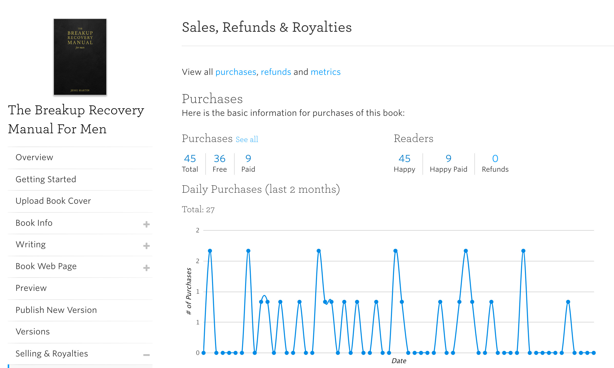
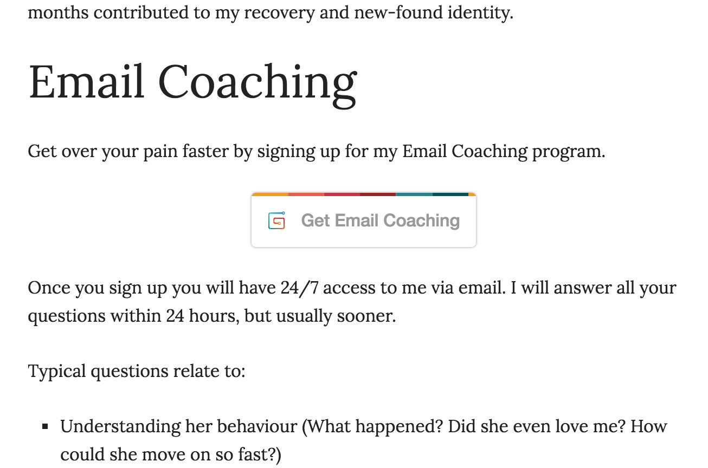

It’s been a while since my initial introduction to this project.

As has been the case in the past, I have found it difficult to consistently work on this project. There are several reasons for this:

1. It is not my favorite subject. Although I like the idea of helping others, digging into my own breakup (more than 6 years ago now), is not always easy. It’s hard to remember everything but also trying to remember the details of your sadness isn’t the most pleasant activity.
2. Writing a book is hard. The main thing I continue to work on is a breakup recovery manual for men. I’m afraid I’ve gone a bit overboard on the level of references I want and the amount of topics I want to cover. I repeatedly get lost in trying to organise ideas.
3. It feels like an area that I’ve explored already and therefore it doesn’t feel very exciting. I know this isn’t really true, because I haven’t turned this into a profitable business yet, but still I find myself being drawn to other areas such as web development or history.

## Book Draft

Following lean startup best practices I’ve published a rough, dirty, draft on leanpub, but I really am embarrassed at its current state. I haven’t even included half of the chapters I intend to include and many segments are just slapped together without considering the flow of the story.

An example showcasing the embarrassing state of the manuscript.

## Sales

The good news is that I have received a total fo 45 downloads, some of which are paid. I haven’t received any feedback yet, but also no complaints.

Leanpub purchases for "The Breakup Recovery Manual For Men".

## Email Coaching

I’ve now also added back the option to set up email coaching with me using gumroad. For \$20/month people are able to get unlimited email coaching from me. I had this option on my the website before, and 2 people signed up who ended up never answering to my emails.

Screenshot of the gumroad button linking to the salespage for email coaching on RBR.

## Next Steps

Next steps are to continue with the book and to slowly become more comfortable with the site’s code base.
