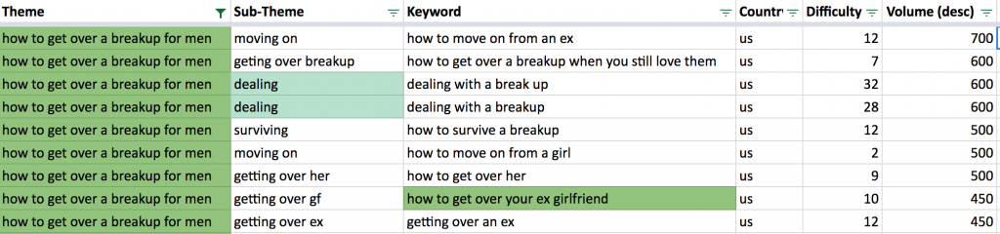
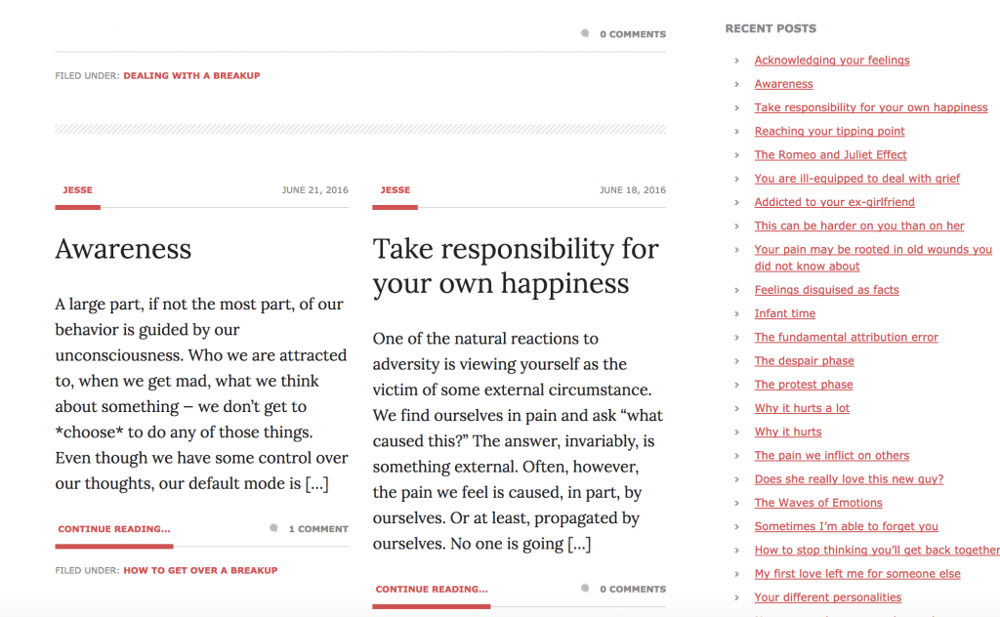
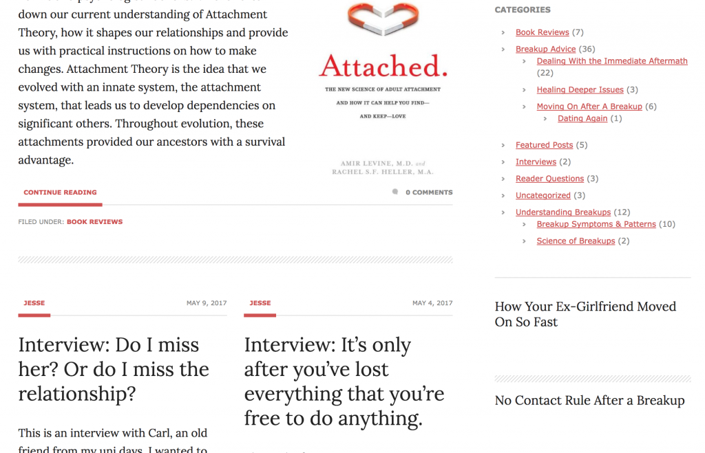
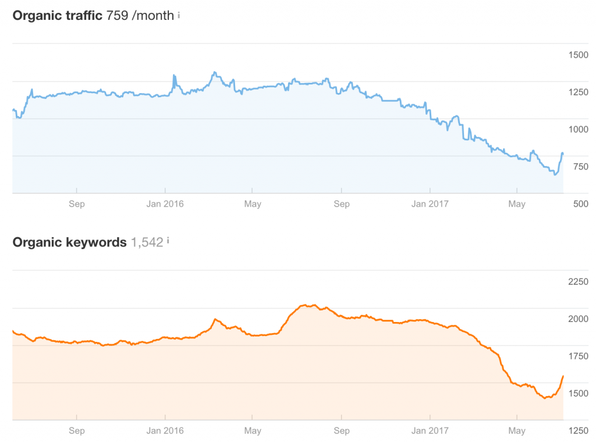

_This is a monthly update on my project of building a breakup recovery solution for men at [rapidbreakuprecovery.com](http://rapidbreakuprecovery.com)._

#### Summary

I continued to work on the structure on content of my website but lost focus. This month I had 2 sessions with 1 client and 13 book sales for a total of \$397 in revenue. That's a 29% increase compared to last month. I'm particularly happy about the book sales.

#### Introduction

I had set up a 7-day email course using Drip and an opt-in form using a Thrive Themes' Leads at the end of May before going on a mountaineering expedition in Peru for 2 weeks. When I got back to São Paulo I was pleased to see I had made several ebook sales. I hadn't set up conversion tracking correctly inside Drip, so I'm unsure if those conversions were a direct result of my email campaign.

Trying to follow the principle of essentialism I asked myself: "What activity will make the highest contribution to my goal?" I made an assessment of what the highest impact activities would be for the month and prioritised those in Trello. Based on what my competition and similar websites are doing I determined that the highest impact activity would be to get featured on certain Men's podcasts (I've since come to question that goal). There were certain intermediate steps to get to that goal, I identified those to be:

#### Goal: Get interviewed on men's podcasts.

1. **Clean up and re-organize site content.** _Background_: I consider quite a number of articles on my website to be low quality. I wrote some of them back in 2012 and they were highly optimized to the SEO standards of the time. Times have changed, but unfortunately many of my articles haven't. _Status_: Started, but turned into a bigger task involving keyword research and information architecture. If I'm honest, I might have let this snowball.
2. **Improve coaching salespage.** _Background_: One priority is to continue to talk to as many customers as I can and another is to earn income. One of the best approaches to address these priorities is to lead interested visitors to my coaching services. I'm still questioning this strategy, however. The alternative would be to primarily lead visitors towards my book. I've started to charge $100/hr for my coaching sessions, vs. $19 per book sale, but coaching requires a good internet connection, which isn't a problem now but will be once I start moving around more. _Status_: Not touched.
3. **Rehash personal philosophy.** _Background_: I imagined that during a podcast interview I would be asked about the core tenets of my philosophy. I'm still unsure what those would be, but I think it's something  should have clear. _Status_: I've started making a list of my breakup advice tenets in Trello.
4. **Run through the book.** _Background_: In the spirit of Eric Reis' Lean Startup "If you're not embarrassed about your first release, you've waited too long", I released my book in an embarrassing state. I'd very much like to revisit it and include the chapters that were still drafts. _Status:_ Not started
5. **Reach out to podcasts.** _Status:_ Not started
6. **Order a microphone.** _Status_: Not done

Cleaning up the site content snowballed into an exercise in information architecture (to determine ideal user flows through my site and content) as well as keyword research (to continue the steady stream of organic traffic and to improve on it).

I did not follow through on the goals I set above, instead here's an overview of what I worked on:

#### Keyword research, site architecture and link clean up

I redid all my keyword research, which was long overdue. Google used to have the go-to tool, the Keyword Tool which morphed into the Keyword Planner. Frankly, it's become a complete joke. The keyword planner is made for researching Google paid ads campaigns. Google deliberately did not make a tool for SEO. Not only that, but they recently started obscuring the keyword volume data in the tool forcing advertisers to buy keywords in the dark and spend more. Complete joke. Also, the figures they do provide are often questionable. The whole thing is a complete joke.

I ended up signing up for trials for some of the mainstream commercial alternatives out there. Although they seem to cater to slightly different sets of use cases, I found AHrefs to be the most useful and user friendly.

The end result is a spreadsheet with an extensive list of breakup related keywords. I segmented them based on user intent and have labeled those as themes and sub-themes. I'll be focusing mostly on the keywords that have mentions of "ex girlfriend" or "her" as I'm assuming they will more often correspond to men making those searches.

\[caption id="attachment_8" align="alignnone" width="525"\] My keyword research spreadsheet.\[/caption\]

Having an idea what people were searching for and making an assessment on what their intent could be, I could start thinking about content (new or existing) that I could use to target those theme-keywords. I was still left a bit confused, however, how my different pieces of content should work and link together. Also, should I just rely on links inside the articles, or should I give links in sidebars careful consideration.

I found myself Googling stuff like "ideal site architecture for SEO", but I found very little information. Many SEO websites have optimized content for this keyword, but hardly any of them answered any of my questions. The most useful post I found was [this one from Yoast](https://yoast.com/site-structure-the-ultimate-guide). He basically says: Create some "cornerstone" content -- your key strategic content pieces -- and pump out new blog posts that keep linking back to those cornerstone pieces. That's exactly what I plan on doing.

What's more, I also re-immersed myself into the SEO scene to get an understanding how the field has evolved since my last experience. I was trying to figure out if it was helping me or hurting me that I was linking to all my blog posts in my sidebar on pretty much every page of my website. Back in the day this had been the recommendation, akin to what Amazon does, but now it didn't seem any other blogs were doing it.

Indeed, I found out that if you keep linking to all your blog posts on all your pages you're diluting the "link juice" that Google attributes to those pages. So instead of concentrating that link juice on your cornerstone content, you distribute it across all your smaller, shittier posts. Not smart!

\[caption id="attachment_11" align="alignnone" width="525"\] Previous sidebar with a list of all blog posts.\[/caption\]

So instead I got rid of the entire list and only link to my category pages and my cornerstone content. I also used this as an opportunity to redo my category structure (still a work in progress) as well as clean up my broken links with Screaming Frog.

\[caption id="attachment_12" align="alignnone" width="525"\] New sidebar with updated categories and featured posts below instead of a list of all blog psots.\[/caption\]

This has resulted in an immediate uplift in my organic traffic and rankings. This was made evident by Ahrefs. See the uptick at the far end of both graphs below. Why is there a decline from end of last year to May this year? I'm not sure, but [Google did update their algorithm](https://moz.com/google-algorithm-change) several times at the beginning of the year and I think that negatively impacted RBR. I'm also not too concerned, because I haven't put any effort into SEO for a long time.

\[caption id="attachment_13" align="alignnone" width="525"\] Organic traffic and keyword visibility June 2016 - June 2017\[/caption\]

#### Ultimate guide

One of the conclusions that I've drawn after doing keyword research and revisiting my site's structure is that I need to be more explicit about what my cornerstone content pieces are. In that vein I've decided to create an ultimate guide targeting the main keyword groupings of "how to get over a breakup for men" and "how to get over your ex girlfriend". For one I will be employing Backlinko's [Skyscraper technique](http://backlinko.com/skyscraper-technique) essentially ensuring I have the best content out there. Secondly I started using a concept I got from Nathan Barry 's [Authority](http://nathanbarry.com/authority/) book where he tells you to go out and read your competitor's book to make sure you're covering the advice that they share. I intend to apply Nathan's technique to this ultimate guide as well as to my book. I've started scanning through the main breakup books out there and making an inventory of the concepts they put forward.

#### Competitor Research

While doing keyword research I used some of my known competitors' websites to generate keywords, but I also discovered some new ones. I did not discover any new direct competitors in the niche of breakup recovery for men, but a handful of female breakup coaches seem to have popped up. I'm interpreting this as market validation. Some things I noticed:

1. Various competitors are using facebook groups as a support group. I've joined one which is quite active. This format seems to work for people.
2. One competitor is getting a lot of traction on instagram. This is a channel I hadn't even considered, but posting inspirational quotes on instagram seems to give them good responses as well as leads.
3. More than one competitor has an online course for sale.
4. I've seen more than one competitor now quote scientific articles and bringing science into their message. This wasn't the case when I started.

#### 7-day email course

I rewrote some of my 7-day email course emails and I received some feedback on email 6. A reader said he really liked the emails but that the 6th email, which covers "How she could move on so quickly", had brought him back down. Essentially he said that he wasn't ready to hear the truth about why she had moved on nor was it the type of advice that he was looking for at the time.

This has made me think ever since. You could classify some of my advice as tough love and some of it as more kind or more uplifting. Perhaps there's a right time for a certain style and perhaps people respond differently to different styles. Perhaps I can allow my readers to indicate what type of style they like and would like to receive more of. Some readers might like to receive only tough-love, manly type of advice, while others might not want to hear about the science and might only want positive, uplifting advice. It seems plausible to me that something can be done in this area and I will continue to develop this idea in the back of my head.

#### Attached

I read and [reviewed](http://rapidbreakuprecovery.com/attached-amir-levine-m-d-rachel-heller-m/) the book "Attached" by Amir Levine, which was long overdue. I liked it, even though it was more of a practical guide and I was expecting an approachable survey of the literature. Either way, worth the read.

#### Customer Development

I had two clients in June. One old and one new.

One is a young professional who has initiated no contact, has no trouble keeping it, but is struggling with lingering sadness as well as incessant questioning of himself whether or not he could have done something differently. He wants to get over his feelings and doesn't want them to impact his professional life.

The other is an older guy who fell head over heels for a younger, very attractive but extremely unstable and troubled young lady. I've been helping him initiate and maintain no contact and deal with the ensuing obsessive thoughts and strong longing.

#### Revenue for June 2017

##### Consultations

I did 2 consultations at $100 and 1 at $50 for a total of \$250.

##### Book sales

My book was priced  as "pay what you want" and I made 6 sales totalling \$57.

##### Total revenue

\$307

#### Reflection & Conclusions

I'm happy with my revenue figure for June. It shows me that I'm able to find clients through existing channels and that I can get people to pay me \$100/hr for Skype consultations.

I'm a bit uneasy about not having worked on the things I had set out to be the most important. Looking back I think I've slowly come to the conclusion that getting featured on men's podcasts might not be the most practical thing while traveling. If I try to be present-minded and ask myself the same essentialist question: What's activity will have the highest impact? I don't find myself thinking about getting featured on a podcast anymore. At the same time, I'm not confident my answer to that question will stay the same throughout the month. Unsure what to do about that other than asking myself that question as often as possible and adjusting course as necessary.
