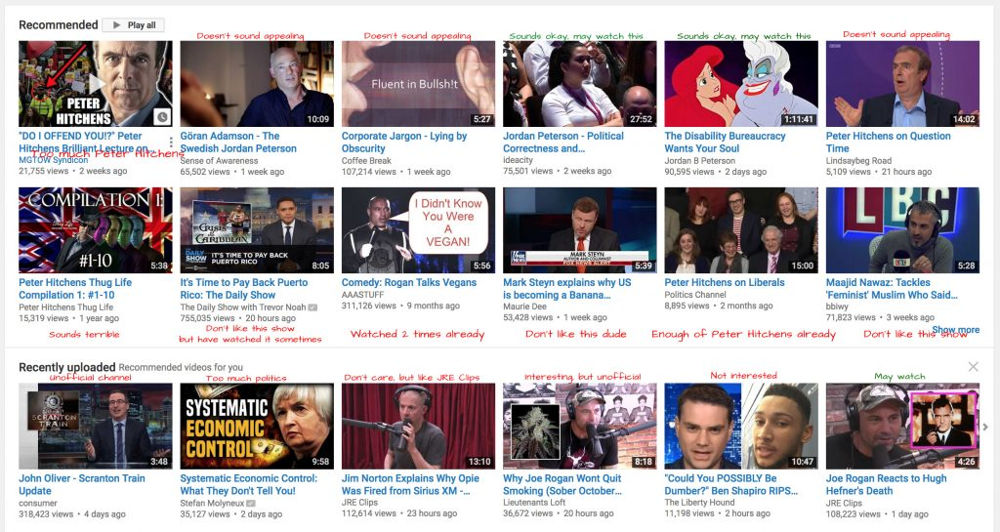

For years now I've been frustrated by how terrible the videos are that YouTube routinely recommends to me. Although they are reliably terrible, on occasion, I have also discovered life-changing videos and channels through these same recommendations. This makes the situation extra frustrating: This content discovery process has the capacity to change your life - but it's (intentionally or unintentionally) left broken.

\[caption id="attachment_33" align="alignnone" width="525"\] My youtube recommendations with my comments.\[/caption\]

(It seems like I'm not alone in saying this: [https://news.ycombinator.com/item?id=12568477](https://news.ycombinator.com/item?id=12568477))

That being said - my feeling is that the recommendations have gotten even worse recently. Here are some of my complaints:

1. Videos and channels are routinely recommended to me that, to me, are obviously not interesting.
2. The same videos and channels that I am not interested in are recommended over and over.
3. Videos I have watched in the past are recommended to me over and over.
4. A video which I watched (and liked) is recommended to me again but from a different uploader.
5. Sometimes a non-official uploader of an official source is routinely recommended to me. I would much rather be recommended the official source.
6. Sometimes I'm in a "discovery mood" and I can't find anything worth watching so I end up watching some terrible recommendation which then goes on to poison future recommendations.

More recently YouTube has gotten bad press for censoring Jordan Peterson and demonetizing videos created by Gad Saad, Pewdiepie and others. This is notable because

1. The reasons for the censorship are never mentioned
2. These videos contain nothing immoral or reprehensible
3. These videos DO often contain unpopular viewpoints which leave many people emotionally triggered and/or outraged

I have three main points of concern:

1. This culture of outrage is getting worse, making it harder and harder for people to hold unpopular viewpoints
2. Due to the nature of how we consume information today, the information that reaches us also tends to stay within the realm of those that share our viewpoints. As a result we're exposed to a decreasing variety of voices.
3. Google and Facebook have announced increased measures against whatever they deem "fake news." It seems the world we live in today is one where Youtube uses the tools at its disposal to censor and bankrupt the voices it doesn't want to be heard - I suspect their recommendation engine is another tool they use to achieve this goal.

## Validating the problem

First I wanted to validate that I wasn't the only one having this problem. I decided to put together a [google spreadsheet](https://docs.google.com/spreadsheets/d/1UsYoL9pTwqgyw1aRjkUvzsniMj9WKlrRCso4lp-H8EY/edit?usp=sharing) where anyone could add inspiring youtube videos. I shared this with my brothers and with the [wip.chat](https://wip.chat) community to see what the feedback would be.

There was little response. I was unable to find others that were experiencing the same problem as I was. But that's fine. This allowed me to put the idea to rest.
