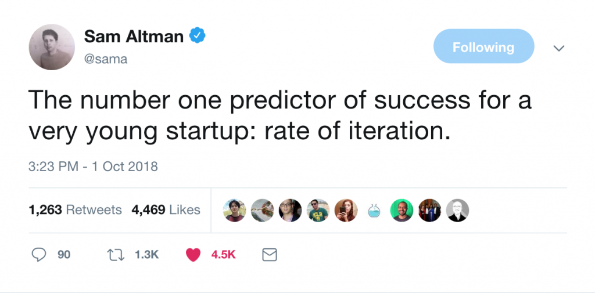

## Introduction

On November 17 an [online live-streaming event](http://24hrstartup.com) was organized where over 300 people participated by building a startup / product in 24 hours. I too participated in this challenge. In this post I've laid out my approach and included updates in reverse chronological order.

Although I was happy with my preparation leading up to the event, the day itself was a bit of a disaster for me. I had to deal with a terrible hotel internet connection, a Macbook that could only barely handle the live streaming software and a lot of difficulties (due to my own underestimation of the complexity involved) setting up a basic development environment. You can read my entire retrospective [here](http://jessems.com/24-hour-startup-challenge-retrospective/).

## Update: 24 hour startup: Challenge day

### Summary

On the challenge day my plan was to create a basic Alexa skill out of a podcast I had selected. This should not have been very difficult to do, but I ran into problems with setting up my development environment and figuring out how to debug the Alexa skill. In the end I wasn't able to even get the basic skill to work, so I just focused on creating a landing page.

### Stream

The entire playlist of all streams can be found here: [https://www.youtube.com/playlist?list=PL9EffBKUMi4qxK9vGSudatQo3ImoeGm9B](https://www.youtube.com/playlist?list=PL9EffBKUMi4qxK9vGSudatQo3ImoeGm9B)

The streams for the challenge day itself are here (they are broken up due to the connection:

- [Part 1/12](https://youtu.be/YJzHUH2uQTE?list=PL9EffBKUMi4qxK9vGSudatQo3ImoeGm9B)
- [Part 2/12](https://youtu.be/TKOyu5nGnGg?list=PL9EffBKUMi4qxK9vGSudatQo3ImoeGm9B)
- [Part 3/12](https://youtu.be/aiUL7K9jd0k?list=PL9EffBKUMi4qxK9vGSudatQo3ImoeGm9B)
- [Part 4/12](https://youtu.be/DTRO-2BlzAQ?list=PL9EffBKUMi4qxK9vGSudatQo3ImoeGm9B)
- [Part 5/12](https://youtu.be/e40kiAZ6_C4?list=PL9EffBKUMi4qxK9vGSudatQo3ImoeGm9B)
- [Part 6/12](https://youtu.be/VePh13256rY?list=PL9EffBKUMi4qxK9vGSudatQo3ImoeGm9B)
- [Part 7/12](https://youtu.be/EgqdtBBTRT8?list=PL9EffBKUMi4qxK9vGSudatQo3ImoeGm9B)
- [Part 8/12](https://youtu.be/QOp5AHEK9H8?list=PL9EffBKUMi4qxK9vGSudatQo3ImoeGm9B)
- [Part 9/12](https://youtu.be/yMzGUU_Ajmo?list=PL9EffBKUMi4qxK9vGSudatQo3ImoeGm9B)
- [Part 10/12](https://youtu.be/SbNELEY_Gtk?list=PL9EffBKUMi4qxK9vGSudatQo3ImoeGm9B)
- [Part 11/12](https://youtu.be/QZbDgI36fk8?list=PL9EffBKUMi4qxK9vGSudatQo3ImoeGm9B)
- [Part 12/12](https://youtu.be/n6q2x2u35Qs?list=PL9EffBKUMi4qxK9vGSudatQo3ImoeGm9B)

### Assets

[Google drive folder for challenge day](https://drive.google.com/open?id=1SW-n2PRfdqVSWsKM-orfWWKYgk0shuI0)

### Key achievements

- I didn't achieve much at all during the challenge. Read my retrospective [here](http://jessems.com/24-hour-startup-challenge-retrospective/).
- Got a better understanding for how Alexa skill development works
- Created a landing page for Voicast at [voicast.io](http://voicast.io)

## Update: Friday (1 day before) - Reaching out to podcasts

### Stream

[Friday (1 day1 before event) Part 1/1](https://youtu.be/-sD2jeGY8cw?list=PL9EffBKUMi4qxK9vGSudatQo3ImoeGm9B)

### Assets

Google drive folder for 1-day-before: [https://drive.google.com/open?id=1Jczx4be9_M_cnnTQU4ho9fH09p21F5SD](https://drive.google.com/open?id=1Jczx4be9_M_cnnTQU4ho9fH09p21F5SD)

### Key achievements

- Reached out to 57 podcasts: 4 meetings booked
- Had one interview with an “Aspiring Product Manager” user
- 0 pre-sales

## Update: Thursday (2 days before) - Reaching out to markets & testing assumptions

### Stream

- [Thursday (2 days before event) Part 1/5](https://youtu.be/CBd5sjGvjYQ?list=PL9EffBKUMi4qxK9vGSudatQo3ImoeGm9B)
- [Thursday (2 days before event) Part 2/5](https://youtu.be/wFuSJZ_ODcY?list=PL9EffBKUMi4qxK9vGSudatQo3ImoeGm9B)
- [Thursday (2 days before event) Part 3/5](https://youtu.be/DpUzVrNf7MA?list=PL9EffBKUMi4qxK9vGSudatQo3ImoeGm9B)
- [Thursday (2 days before event) Part 4/5](https://youtu.be/NJyJkZboxyw?list=PL9EffBKUMi4qxK9vGSudatQo3ImoeGm9B)
- [Thursday (2 days before event) Part 5/5](https://youtu.be/0dsc7miKiMg?list=PL9EffBKUMi4qxK9vGSudatQo3ImoeGm9B)

Assets

Google drive folder for 3-days-before: [https://drive.google.com/open?id=1xVURxl-4h3F5uHro1Q8oWFY1kACg_3ES](https://drive.google.com/open?id=1xVURxl-4h3F5uHro1Q8oWFY1kACg_3ES)

### Key achievements

- Conducted interview with a social media marketing agency
- Collected leads from 100 podcasts
- Started the gather email addresses

### Comments

None

## Update: Wednesday (3 days before) - Brainstorming & Testing assumptions about the markets

### Stream

- [Wednesday (3 days before event) Part 1/4](https://youtu.be/TdbtTwPEtMw?list=PL9EffBKUMi4qxK9vGSudatQo3ImoeGm9B)
- [Wednesday (3 days before event) Part 2/4](https://youtu.be/A-eFDwxOtt8?list=PL9EffBKUMi4qxK9vGSudatQo3ImoeGm9B)
- [Wednesday (3 days before event) Part 3/4](https://youtu.be/hEmeJud8b-s?list=PL9EffBKUMi4qxK9vGSudatQo3ImoeGm9B)
- [Wednesday (3 days before event) Part 4/4](https://youtu.be/VZ6kgV0Gsl8?list=PL9EffBKUMi4qxK9vGSudatQo3ImoeGm9B)

### Key achievements

- Booked 1 interview (Social media marketing agency)
- Joined many communities
  - Many not responsive
  - Many communities are active (e.g. FB ones), but don’t engage
- Cold email still seems comparatively quite effective
- Identified some potential areas for exploration

### Comments

Some things that were a bit surprising to me:

- Takes a long time to get accepted to certain communities
- Lots of spam groups that are barely useful
- It’s HARD to find an audience to interact with
- Even if you find a community, telling them you’re trying to solve one of their problems doesn’t really elicit a response
- Cold emailing & calling is probably better

## Update: Tuesday (4 days before) - Testing assumptions about the markets

### Stream

- [Tuesday (4 days before event) Part 1/2](https://www.youtube.com/watch?v=Dt_SOgD88f4&index=3&list=PL9EffBKUMi4qxK9vGSudatQo3ImoeGm9B)
- [Tuesday (4 days before event) Part 2/2](https://www.youtube.com/watch?v=q9EAJOJxemw&index=4&list=PL9EffBKUMi4qxK9vGSudatQo3ImoeGm9B)

### Assets

Google Drive Folder for 4-days-before: [https://drive.google.com/open?id=1WVDm8bZS0X5rA6Wc53BMjft_tSGgUf83](https://drive.google.com/drive/u/0/folders/1Wb33V5SvC0yOrG2yR-j6puBjmSsOOA5U)

### Key achievements

- Expanded market list to contain audiences that are active on slack/telegram
- Applied to join 10+ slack groups
- Reached out to 1 prospect in 1 market

### Comments

I really need to pick up speed, because the challenge is coming up and I haven’t had any conversations yet with potential markets.

## Update: Monday (5 days before) - Brainstorming responsive markets

### Stream

[Monday (5 days before event) Part 1/1](https://www.youtube.com/watch?v=MlElbYKkOcg&index=2&list=PL9EffBKUMi4qxK9vGSudatQo3ImoeGm9B)

### Highlights & Assets

Google Drive Folder for 5-days-before: https://drive.google.com/open?id=1WVDm8bZS0X5rA6Wc53BMjft\_tSGgUf83

List of high-potential markets

- Social media agency
- High frequency trading company
- Sales agency
- Private equity firms
- Public relations
- Translation agency
- Funds
- Legal services
- Funds
- Defense industry
- Think tanks
- Broadcast media

### Key achievements

- Brainstormed a list of markets likely to be responsive
- Clarified criteria for picking high-potential markets
- Scored markets based on new criteria

## Initial Post: Approach

I will be participating in the 24 hr startup challenge and I wanted to make explicit and public my approach.

When we make our commitments public we can leverage the sense of being held accountable by the people we share our journey with. We also become less biased when we are required to make our thoughts public and we know that they will be scrutinized.

I think the 24 hour startup challenge is a great idea as I’ve laid out [in this article.](https://www.indiehackers.com/@jessems/its-not-a-startup-the-evolving-definition-in-a-24-hour-live-streamed-bootstrapped-world-acb03ba9fe)

However I think it’s important to be clear on what your goal is for the challenge. My goal is the following:

**Arrive at a validated idea for a startup. (Or, to get as far as possible in that direction.)**

The 24 hour constraint, like many other types of constraints, promotes creativity and forces you to finish what you’re working on.

One way (and from what I’ve seen the most common approach) is to choose a problem that you personally have and to build a solution for that problem with 24 hours. That’s a fair approach.

However, by the end of the challenge if everything goes as planned, I’ll have one product that I can use to validate my startup idea. I think I can do better than that. :)

Former head of Y-Combinator, Sam Altman, recently tweeted this:

As a former product manager I think this is probably also true for products. Rate of iteration is key. Rate of iteration is key because every iteration you’re testing a hypothesis. Roughly speaking, the more hypotheses you’re able to test (provided they’re good hypotheses) the better shape you’ll be in.

When is a product idea validated?

A hypothesis can be validated or invalidated. Your product idea, before you talk to anyone, is just a hypothesis. It’s just a test. You should treat it as just a test.

The point of “getting out of the building” is to validate or invalidate hypotheses about your product, your market, your user, your business model etc.

Your product is validated when you’ve iterated on the hypotheses that define your idea and you’ve proven that they’re all true. You can do this _before_ you build the product.

The difficulty is that not every experiment yield a binary validated/invalidated result. If people sign up for your email list, does that mean your product is validated? The answer is: a little bit. Here is an ugly drawing of how I think about this.

If your friends like your product idea -- that doesn’t mean anything. If strangers give up their email address, that’s slightly better, but still not great.

What we’re trying to figure out, ultimately, is whether there’s a sustainable business model contained within this idea of yours. The holy grail of validation is of course: Getting people to pay. And you can get people to do this before you build.

That’s exactly what I’m going to try to do.

I’m leaning slightly towards products, as opposed to services, because I enjoy building things. So I will orient myself towards product ideas while keeping my eyes open for services and productized services.

So the goal is to arrive at a validated startup idea and I will measure this by the amount of pre-orders I generate.

To increase my odds of achieving the goal, the approach I want to leverage is to maximize the amount of iterations I can do.

Most participants I’ve seen are going to build a product during the 24 hr period and @patwalls has said that doing some research prior is okay. So I think it’s okay to do some validation prior to starting.

So instead of starting with one idea, I want to test out different ideas before I start the challenge. In order to maximize the amount of iterations I can do I want to:

**Target markets where I can iterate quickly**

What do I mean by that. I want to target people with whom I can easily jump on a call with or chat with in the build up to the 24 hr challenge and especially during the challenge itself.

Here’s an ugly drawing of how I’m thinking about this currently:

If I were to target a certain type of market with certain problem, but it would take me a week just to get them on the phone, I won’t be able to iterate quickly.

I’d rather select my target market beforehand based on which target market can I iterate quickly with. These need to be people that by virtue of what they do for a living are very responsive, often online etc. Perhaps salespeople? I’m not sure. That’s one of the first steps to figure out :)

My ideal scenario is that I start the 24 hour challenge with some pre-orders in my bank account and some of my pre-order clients a phone call away to iterate on the product with me.

There are some more criteria I have for my target market to increase my odds. For that I encourage you to tune in to my live stream later today where I’ll go over these criteria and brainstorm market ideas.

I will start a stream today some time after 1 PM UTC. Stay tuned!

https://www.twitch.tv/jessemsz
