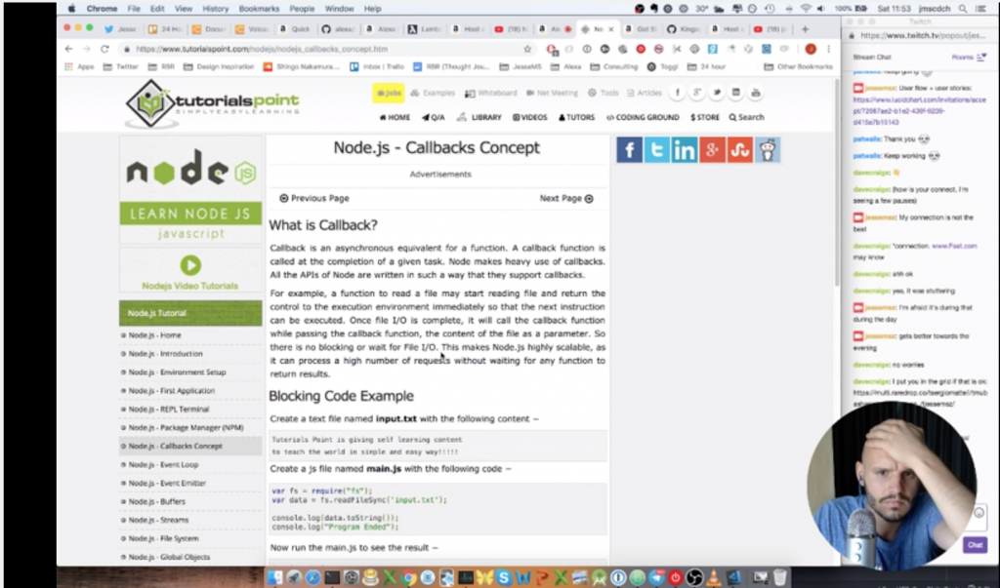
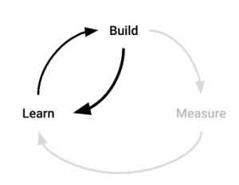

On the November 17 I participated in the 24-hour startup challenge where I live-streamed the (attempted) development of a product. The day itself turned into a disappointment for me as I wasn't able to achieve much. My Macbook was very slow, my connection was poor, I underestimated the work involved and how fast I would learn and I simply didn't end up achieving much of anything.

I felt quite disappointed and demotivated, but I thought it would be instructive for me to at least do a proper retrospective on the experience.

### What went well?

- I wrote [an article](https://www.indiehackers.com/@jessems/its-not-a-startup-the-evolving-definition-in-a-24-hour-live-streamed-bootstrapped-world-acb03ba9fe) leading up to the challenge about the definition of startups. I believe it was well-received, it got some traction and I enjoyed writing it.
- I was forced to get some practice doing self-promotion. This was a great benefit. I gained a handful of twitter followers and met other indie makers in the space.
- I was forced to try to develop something and release it. In the end I failed to develop something meaningful, but this showed me that I was underestimating how difficult this would be for me and how much time it would take.

### What did not go well?

- In the end I wasn't able to achieve much. I think it's attributable to the following causes:
  - I underestimated how much time it would take to set up a development environment for the technology I intended to use. I never reached the point where I understood how to get debugging information on why my application wasn't working.
  - I underestimated how much time it would take to get up to speed with a tech stack I had no experience with (node.js and AWS Lambda). I was much too overconfident and ended up spending hours going over tutorials.
  - Leading up to the challenge, I underestimated how long it would take to find and get in touch with a responsive market.
  - My internet connection was poor and unstable, which made everything about the challenge more difficult.
  - The Macbook I was using is a bit old and it could barely handle the live-streaming software which slowed down all other things I was doing.
  - The audio on my stream is not very good. I think the mic was picking up the Macbook taking off due to the extra load of the broadcasting software.

\[caption id="attachment_173" align="alignnone" width="525"\] Me, struggling during the 24 hour startup challenge\[/caption\]

### What should I continue doing?

- Continue to participate in events like this.
- Continue to do retrospectives.
- Continue to improve my development skills.

### What should I stop doing?

- Stop assuming you can reach a meaningful level of competence in a new language/skill in a very short amount of time. You can learn fast, but you're underestimating how much there is to learn.

### Insights & Provoking Questions

#### How might I leverage the honesty effect of streaming?

Streaming puts you in a situation where you assume you're being watched, even with 0 real-time viewers. This changes your behavior and I suspect it keeps you a bit more honest than you otherwise would have been. I can't prove this, but I felt like I needed to be careful with my words in constructing my arguments for why I was doing what I was doing. How might I leverage the honesty effect of streaming to become a more successful at efforts like this?

#### How might I methodically go through the product discovery process?

Below you'll find three iterations I've done (after the fact) using the Lean Business Model Canvas. If you look through the iterations you'll see that my idea has evolved somewhat. I've moved away from the thought of doing a productized service. I think a self-service app where you can enter your podcast feed and generate an Alexa skill perhaps makes the most sense. What would be the benefit over, say, a universal Alexa podcast player such as Anypod? Not much, provided the experience is good (and based on the reviews it seems to be okay). I think there's one angle that's worth exploring and that's whether you can capture email addresses of listeners with Alexa. Many podcasts have CTAs with the goal of capturing email addresses. If Alexa can do that directly, that could be interesting. But here we enter the realm of solution-looking-for-a-problem which is always dangerous.

<iframe src="https://docs.google.com/presentation/d/e/2PACX-1vReqS-mZhJgxzigWVLyE71AmR4O14EMwJsDB-lGpr4DrmCYgQI9wDUQJbpMNilva6WwNtxGPw1S3kmG/embed?start=false&amp;loop=false&amp;delayms=3000" width="480" height="389" frameborder="0" allowfullscreen="allowfullscreen"></iframe>

An overarching point needs to be made, though, which is that it's difficult to come up with a way to methodically make your way through this process of product discovery. How do you surface and map out assumptions? Which do you test first? What areas can you ignore in the beginning? I'm not satisfied with the approaches I've seen so far online and I will keep my brain primed on finding a better solution.

#### How might I assess whether it's worthwhile to continue with this idea?

The fact I was able to book 4 podcast hosts for interviews based on an email alone indicates to me that there's potentially something there. I will conduct all the interviews and report back on my findings. My first interviewee told me that he's come to expect SaaS apps to be almost free. He was interested in talking about an Alexa app, but he did not immediately see the benefit over the use of Anypod. He seemed most interested in getting discovered by more listeners, which would be a nudge towards going down the route of creating a universal player (aka an Anypod clone). I don't see immediately see how I could create an unfair advantage over Anypod (although an in-app CTA which captures emails might be worth exploring). I don't see a clear argument in favor of continuing with this idea at this point.

#### How might I maximize my rate of iteration?

My approach was to maximize my rate of iteration. I focused primarily on finding a market that would be highly responsive so I could iterate with them quickly. I assumed that building the application would not be the slowest link in the chain. In the end this is what bogged me down. (That's not to say that the learning step *would* have been fast.)

\[caption id="attachment_171" align="alignnone" width="300"\] Figure 1: The Build-Measure-Learn cycle with a conceptual shortcut going from Build to Learn.\[/caption\]

My assumption was that the learning step would be the most time-intensive and thus the bottleneck to my rate of iteration. I did no anticipate that _building_ would in fact be much of a hurdle. Seeing the other participants whipping out cool functionality within hours, I realize that I need to learn how to build apps fast in order to make sure this does not become the bottleneck to my rate of iteration. The two questions I'm asking myself now are:

1. How might I rapidly *build* prototypal apps? (e.g. what tech stack is best suited for apps-as-prototypes?)
2. How might I rapidly *learn* with a market for my prototype (e.g. what's the best way to find a responsive, suitable market?)

I believe the first problem has been solved by any one of these amazing young developers that whip out fully functional apps within hours. So if I want to improve the Build component of my iteration strategy I need only learn what they're using.

The second question, however, I haven't seen approached by anyone. What I *have* seen is people iterating quickly _within_ a market to which they belong, or a single market they've found themselves (perhaps by accident). I haven't seen anyone iterate across markets quickly, or find markets based on their responsiveness. I'm also not entirely convinced of my approach here. Looking for responsive markets might not be the best way to maximize your rate of iteration. For instance, any market may be experienced as being responsive, provided you have enough warm contacts one phone call away. I need to reflect on this a bit more.

#### The rise of indie product development streaming

There was a lot of hype around the 24 hour startup challenge. A lot of people were streaming and I can only assume quite a few people were watching as well. While preparing my stream I slowly discovered the world of Twitch and all the gamers that have been streaming for years. They've really made inroads into this space and there are a lot of tools on the market and established best practices. I expect this to take off more. If your hardware can handle it, streaming an easy to step to make solo product development more exciting and more social. I think this will lead to more supporting software to be developed, like Twitch plugins specifically for developers. I also think that some indie makers are going to figure out how to make money while streaming like many gamers seem to have figured out now as well. Lastly, I don't think the indie maker community has converged on solution for making watching streaming attractive. I don't find myself compelled to watch anyone else stream and hour-long streams don't seem very watchable to begin with. I expect some indie makers will start to figure this out as well, making their streams more fun and more consumable.
