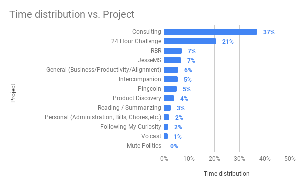
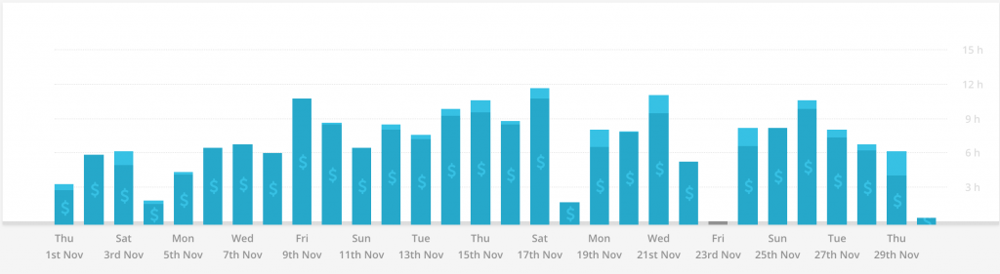
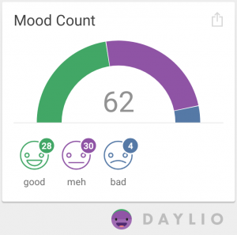

This is my retrospective for the month of November and also my first public retrospective.

## Time Spent

In November I logged **~209 hours**.

\[caption id="attachment_187" align="alignnone" width="600"\] Time distribution vs. Project (November 2018)\[/caption\]

I spent the plurality (37%) of my productive time on my Consulting project, in which I'm taking steps to set up my own consulting business. Another 5% was spent on Intercompanion, which is an initiative spun out of my Consulting project where I'll be launching a podcast focused on Intercom Tips for Businesses.

I spent 21% of time on my participation in the [24 hour startup challenge](http://jessems.com/24-hour-startup-challenge-retrospective/) and another 1% on [Voicast](http://voicast.io), which is the product that spun out of my challenge.

7% on [Rapid Breakup Recovery](http://rapidbreakuprecovery.com) and 7% on this blog.

5% of my time was spent on Pingcoin, which is now in public beta on the [Google Play store](https://play.google.com/store/apps/details?id=com.pingcoin.android.pingcoin&hl=en).

7% was spent on General tasks, such as my morning routine and this retrospective.

3% of my logged time was spent reading, but I wasn't completely consistent with tracking this. The real number would have been a bit higher.

I tried to adhere to the policy of taking one day per week off (as in completely off my computer). This is surprisingly difficult, especially because certain activities on my computer feel perfectly relaxing (like taking on online course). Also, doing administrative work, such as my personal accounting, didn't really seem like work to me. As you'll see in the graph below, not every week contains a day of 0 logged time.

\[caption id="attachment_190" align="alignnone" width="525"\] Time per day (November 2018)\[/caption\]

I tend to log close to 7 hours a day, with some days shooting over and some days falling short.

## Revenue

In November 2018 I generated \$200.9 in revenue.

### Rapid Breakup Recovery

- Coaching calls: \$143.9
- Ebook sales: \$57
- Total: \$200.9

I ran a sale with my email list offering 3 hours of coaching for \$100. Only one client took me up on this offer, which was a valuable wake-up call. My list is very cold, and I will probably want to purge it in December.

### Grand total

\$200.9 in November 2018

## Happiness

Using Daylio I tracked 45% good, 48% meh and 6% bad moods in November. October was 40% good and September was 15% good, so I've seen an upward trend.

## Overall

### Overarching Goals

- **Become financially independent**
  - Verdict: Good. Took the step to move to Chiang Mai for this purpose, even though I will be spending my time in Europe from December onward. I was very productive towards this goal.
- **Be full of love and surround myself with others that are full of love**
  - Verdict: Neutral. Lived a fairly solitary life-style in Chiang Mai.
- **Maintain physical fitness be a jiu jitsu fighter and be able to defend myself and my family**
  - Verdict: Neutral. Picked up a good 3x/week gym habit, but failed to go to BJJ training more than once.
- **Don't postpone happiness & making an impact**
  - Verdict: Good. Visited the Doi Suthep temple, did a meditation retreat, got a massage. Did some offline stuff for me.
- **Travel the world and continually expand my frame of reference**
  - Verdict: Good. Lived in Chiang Mai all of November.
- **Explore my mind, my unconscious and integrate my shadow and become at peace with myself**
  - Verdict: Neutral.
- **Read more to expand my frame of reference and support my other goals**
  - Verdict: Good. Started reading more. Still working on
- **Write to clarify my thoughts and to connect with other minds**
  - Verdict: Good. Wrote 2 RBR posts and multiple posts on this blog as well as a post on Indie hackers

### What went well?

- Time tracking went well. I was very consistent
- My weekly retrospectives have been going well
- Met some cool people in Chiang Mai that are also indie makers
- Read more than last month
- I did a lot of outreach to obtain consulting clients
- This retrospective went quite well
- Expense tracking -- I tracked all my cash expenses for November

### What did not go well?

- I did not plan my month and I had no specific goals for the month
- Spent a lot of time on the 24 hour challenge without producing anything
- Summarizing the books I read
- Did not spend much time on RBR
- I did not secure any new consulting clients
- I set out to write 2 RBR blog posts per week, but I discovered I cannot produce two quality articles in a week
- Accounting -- I did not do any accounting in November
- Sleep tracking -- The android app I was using isn't reliable. Thinking about getting a fitbit for this purpose

### What should I stop doing?

- Don't dive into a project like the 24 hour challenge while underestimating the work involved with learning a new skill set

### What should I start/continue doing or do more?

- Be more consistent with summarizing the books I read
- Plan the next month
- Create a reading-summarizing workflow and stick to it
- Publish 1 high quality RBR article per week
- Keep in touch with the people I met in CM
