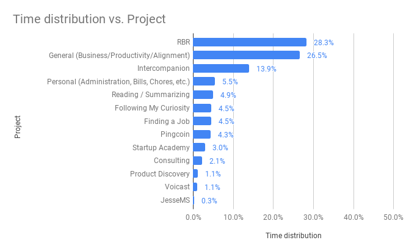
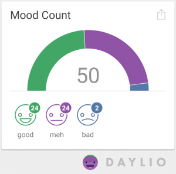

## Key accomplishments

### Rapid Breakup Recovery

- Got a local WP environment running with a proper git setup
- 2 new blog posts
- Created a list of podcasts to outreach to for a RBR podcast tour

### Intercompanion

- Recorded 4 podcast interviews
- Set up the Intercompanion website

### Pingcoin

- Fixed a bug which made the app crash on older Android devices
- Made a nicer placeholder [website](http://pingcoin.com)

### General

- Did my November 2018 retrospective (first monthly retrospective)

### Personal

- Moved back to Switzerland and moved in with girlfriend
- Imported all my accounts into my accounting software

### Other

- Reading: Finished Start With Why by Simon Sinek (terrible book)

## Monthly goal check-in

- **Writing**
  - _I only wrote 2 articles for RBR, but I was happy about their quality. Here I clearly set out to do too much._
    - 4 articles for RBR (failed, 2)
    - 1 article for Jesse MS (failed)
    - 2 articles for Intercompanion (failed)
- **Financial independence**
  - _I only made \$161.75 in December, all from RBR. I believe that the problem is that the objectives I set (below) for the month were not unambiguously going to lead to revenue. Going forward I will maintain a yearly target that I will check every month._
    - \$1000 income in December (failed)
    - Get up to speed with my accounting (failed)
    - Redesign RBR (success)
    - Outline a course (success)
    - Start a podcast tour (failed, only made a list of potential podcasts)
    - Launch Intercompanion podcast + website (failed, only launched the website)
    - Validate my positioning (failed)
    - Move from Drip to Intercom (failed)
    - Blog post about moving to intercom (failed)
    - Explore other opportunities (success)
    - Edit and publish old interviews (failed)
    - Create a consulting video (failed)
- **Full of love**
  - _Did well here, although not everything is reflected in these objectives._
    - Stay in touch with Indiehackers (success)
    - Stay in touch with friends (failed)
- **Seize every day**
  - _Found a gym and have been doing the 5x5 routine 3x a week_
    - Figure out gym (success)
- **Reading**
  - _I'm trying to read more and more, but I haven't come up with a workflow that works for me yet. Overall I'm surprised how slow my progress is through any given book._
    - Come up with and stick with new reading / summarizing workflow (failed)
    - Read & summarize 4 books (failed, only finished 1)
    - Summarize past read books (failed)
- **Explore my subconscious and integrate my shadow**
  - _I was feeling very tense around money and sustaining myself in Switzerland. I explored this tension in my mind and I realized that  the worst possible scenario I could imagine would not be to run out of money, but to never actually be able to earn a reasonable amount of money. Speaking with one of my best friends he probed me further and helped me realize I was attaching feelings of being a failure to this scenario. The idea of never being able to make money has been making me feel tense because it makes me feel like a failure in the most profound sense of the word. Once I realized that, a lot of the tension disappeared. Now, I've probably landed my first client for my own product development business._
    - Daily reparenting exercise (success)
    - Daily shadow integration exercise (success)
    - Daily tapping exercise (success)
- **I am strong (physical strength)**
  - _Did well here_
    - Stick with 5x5 routine
- **Travel**
  - N/A

## Time Spent

Total: 104 hours (-50.2%)

_Wow. I was really surprised to see that I logged 50% less hours than in [November](http://jessems.com/my-november-2018-retrospective/). November was my most productive month in Chiang Mai and in December I had to move back to Switzerland, get settled in with my girlfriend and I spent considerable time away from my computer during the holidays._

I spent my 28.3% (up from 7%) of my time on [RBR](http://jessems.com/current-projects/). I'm happy with this amount as I wanted to focus more on this project in December.

I spent 13.9% (up from 5%) of my time on [Intercompanion](http://jessems.com/current-projects/). I'm also happy with this amount as I've decided to focus more on this strategy for establishing a consulting arm.

_I'm still a bit unsure how to approach the time tracking results. I've started doing time budgeting (setting a time target per category) on a weekly basis. I will start doing the same on a monthly basis starting in January._

## Revenue

### Rapid Breakup Recovery

- Coaching calls: \$47.75
- Ebooks sales: \$114
- Total: \$161.75 (-19.5%)

### Grand Total

\$161.75

## Happiness

_I recorded 48% good moods (+3), 48% meh (+0) and 2% bad (-4). I continue to see an upward trend in my mood, albeit very slightly. I was interested to see how my monthly mood average would change going from being single and financially comfortable in Chiang Mai in November to being in a relationship and financially more strained in Switzerland in December. Even though my material quality of life has decreased, I'm happy my mood has remained stable._

## Overall

### What went well?

- Setting monthly goals
- Doing podcast interviews is fun and it's a great way to build relationships with others in your industry.

### What did not go well?

- Achieving my monthly goal
- I set too many goals / objectives for the month
- Failed to catch up on my accounting
- I set a goal of achieving \$1000 in independent revenue in December and I fell quite a bit short of that. I even reviewed this goal almost every day, but I still didn't reach it.
- Failed to write and publish 4 articles for RBR
- Looking over this retrospective I feel my time was spread over many different projects. Although I enjoy working on different things, I can't help but think that I would accomplish more if I could focus.
- Scheduling podcasts was a bit of a pain

### What should I stop / not start doing?

- Lower my estimates for the amount of tasks I think I can get done in a single month
- Always have a podcast going

### What should I start / continue doing?

- I need to change my approach with regards to setting a monthly goal. Simply setting a goal and reviewing it is not enough for me. In other areas of my life when I set a goal I know more or less how I'm going to get there. In this case, I had no idea. I think revenue is still the right indicator to look at, but perhaps setting a 0-to-\$1000 goal (without a clear idea how to get there) is not the right approach. Instead I will be setting a yearly revenue goal in my yearly planning and I'll be checking in with that goal on a monthly basis.
