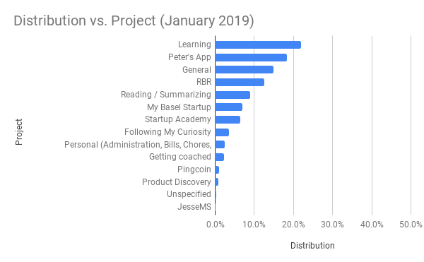
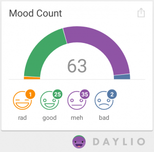

## Key achievements

### Rapid Breakup Recovery

- Recorded the first RBR podcast
- Learnt about podcast editing and started the editing process

### Intercompanion

- No progress

### Pingcoin

- No progress

### Other / Personal

**I'm starting an agency!** While looking for consulting opportunities I hit it off with an investor in Basel who wants to work with me on developing an app and also help me bootstrap a product development agency. The app will be aimed at helping NGO's do their bookkeeping and aid them in their relationship management of their donors. The agency will take on all kinds of digital product development assignments. Super excited about both the app and the agency.

**Web Development Bootcamp** I made my way through most of a very long and thorough web development course on Udemy. I'm really enjoying the course and it's filling in some missing pieces in my haphazard self-taught programming education. It also helped me settle on a tech stack (all JS).

## Monthly goal check-in

I'm still in the process of writing up my goals for 2019. I've been using my 2018 goals until then as they're still valid.

- **Writing (5/10)**
  - Apart from daily journaling -- no progress here.
- **Financial independence (7/10)**
  - Found my first client who also wants to help me bootstrap a product development agency!
- **Full of love (7/10)**
  - Did okay. Daily meditation and self-parenting.
- **Seize every day (5/10)**
  - No particular achievements here
- **Reading (10/10)**
  - Finished reading About Face, Atomic Habits, Hello my name is awesome, Ignore everybody and one chapter I selected from Midas Touch (as it came recommended)
  - Started reading The Overwhelmed Brain and listening to Big Magic
  - I'm still behind on summarizing the books I've read.
- **Explore my subconscious and integrate my shadow (8/10)**
  - Consistently meditated, journaled, shadow ritual and did EFT when necessary
- **I am strong (physical strength)**
  - Was consistent in going to the gym 3x a week following the 5x5 program
- **Travel (N/A)**
  - Note: My travel goals have changed.

## Time Spent

Total clocked hours: 150:51 _Back at Chiang-Mai levels of clocked hours. This is probably also due to the fact that in January I was consistently clocking my time spent reading._

This month I spent the plurality of my time on Learning because I enrolled in a Udemy class on web development called the Web Development Bootcamp. It's been a lot of fun and incredibly useful.

I spent around 18% of my time on Peter's app which is the code name for the NGO app. This time was mostly spent doing research and understanding the problem space.

The "General" category is what I use for time spent on my morning routine, on my retrospectives etc. At this point it's getting a bit unwieldy. I will look at splitting it up into different categories (e.g. work ON systems and work IN systems).

After general, the highest category is Rapid Breakup Recovery, which is mostly due to the fact that I spent time recording and editing the podcast.

## Revenue

### Rapid Breakup Recovery

- Ebook sales: \$38
- Coaching calls: \$0
- Total: \$38

### Grand total

- \$38

## Happiness

41% good or rad (down from 48% last month). _I'm still not sure how to report on this. Although I have a lower relative amount of good moods, I logged 25 good moods in January compared to 24 in December. It doesn't feel like this month was much different than the one before. I would like to get a daily average with a standard deviation, but that doesn't come out of the box._

## Overall

### What went well

- Found a first client for the development of an app who also wants to help me build a product development agency!
- Found a new coach for both personal and business-related issues.
- Web development bootcamp (24+ hours)
- Reading and tracking reading. I tracked pretty much all of my reading and I did a lot of reading.

### What did not go well

- I waited a long time before setting my January goals and doing my yearly retrospective.
- It's taking a long time to come up with a name for the agency.
- My monthly retro has slowly expanded and it's been taking up more time. I believe it's time to start automating certain elements of it.

### What _can_ I do differently?

- I will be naming this category "What *can* I do differently" as opposed to "What _should_ I do differently" to emphasise the fact that it's not feasible to implement all improvement points in the next iteration. Points of improvement should be added to my backlog. I should select some of these points for the next iteration during my planning phase.
- Do my retrospectives & planning within 2 days of the new month
- Somehow I spent no time on the Intercompanion project. In retrospect this makes sense, I was focused on other things, but I'm coming to the realization that shifts in time spent on projects on the month-level (and greater) are difficult to be aware of.
- Find time to summarize and ankify the books I've read
- Start automating my retrospective / planning systems
