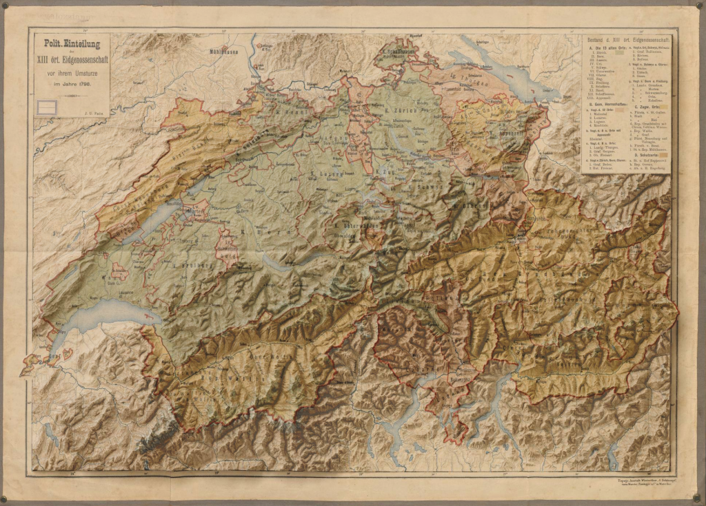

I came across the maps of [Scott Reinhard](https://land.copernicus.eu/) on Twitter and I fell down the rabbit hole of the art of combining old maps with modern 3D elevation data. This is what I was able to create playing around with QGis, Blender 3D and Photoshop:

Inspired by the work of [Scott Reinhard](https://www.scottreinhardmaps.com/).

Thanks to [Daniel P. Huffman](https://twitter.com/pinakographos) for the tutorial that got me started, and to [Andrew Tyrrell](https://twitter.com/TyrrellMaps) for his hint towards georeferencing.

[Original map](https://www.e-rara.ch/zut/content/zoom/11752725)

Elevation data from [Copernicus Land Monitoring Service](https://land.copernicus.eu/).

Made with QGis, Blender3D and Photoshop.
