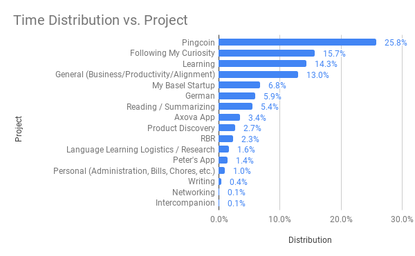

You can find a description of the projects mentioned on my [Projects](http://jessems.com/current-projects/) page.

## Key achievements

- (Pingcoin) Met with a Swiss coin dealer to speak about a possible collaboration. To be continued.
- (Learning) Completed the web developer bootcamp Udemy course
- (My Basel Agency) Got a verbal go-ahead for my second client for my (still nameless) agency

## Other/personal

- I've decided I want to reach native level fluency in German. This will help me in running my business here in Basel, Switzerland. This will be reflected in my goals for 2019.

## Monthly goals check-in

- **Writing (5/10)**
  - Started writing longer pieces in my daily journal
  - No other writing
- **Financial independence (8/10)**
  - Found two clients that have agreed to first project together for my Basel Agency
- **Full of love (7/10)**
  - Did okay. Daily meditation, gratitude journaling, EFT
- **Seize every day (5/10)**
  - No particular achievements here
- **Reading (6/10)**
  - Finished the Startup Owner's Manual
  - Finished Emotional Design
  - Started The Overwhelmed Brain
- **Explore my subconscious and integrate my shadow (7/10)**
  - Daily journaling and shadow ritual
- **I am strong (1/10)**
  - I broke my routine here after getting sick. Haven't been to the gym since Feb 7.
- **Travel (N/A)**

## Time spent

Total: 167:55 hrs

The plurality of my time was spent on Pingcoin, which had been more or less my plan. I'm working on an onset annotator in javascript, but it's taking me a bit longer than expected.

A considerable amount was spent on the Following my Curiosity category. This is mainly due to the 18 hours I clocked working on the [antique map with 3D relief](http://jessems.com/digitally-rendered-3d-elevation-1798-political-map-of-switzerland/). This was not planned, but I felt such strong curiosity and motivation that I felt I had to work on this. I've been trying to make it a policy to trust my subconscious and let it pursue anything that gives me energy. Next step? No idea. I'm really pleased with the end result though.

## Revenue

### Rapid Breakup Recovery

Ebook sales: $38 Coaching calls: $50 Total: \$88 _I removed Drip and thereby my 7-day email course. This has impacted my sales as I haven't taken the time to replace it with anything else yet._

Grand total: \$88

## Overall

### What went well

- Clocked a lot of hours
- Finished the web dev course
- Got my second client

### What did not go well

- I have still not edited the RBR podcast episode and the 4 Intercompanion podcast episodes. I am struggling to balance my desire to focus with keeping existing projects alive. This month I tried to focus on Pingcoin (which you can see by the time that was spent there). However, in order to do so, I neglected other projects. I can't help but wonder if I'm approaching this correctly
- I still haven't laid out my goals for 2019.
- I'm behind on my personal accounting

### What can I do differently

- Do my accounting at the beginning of the month
