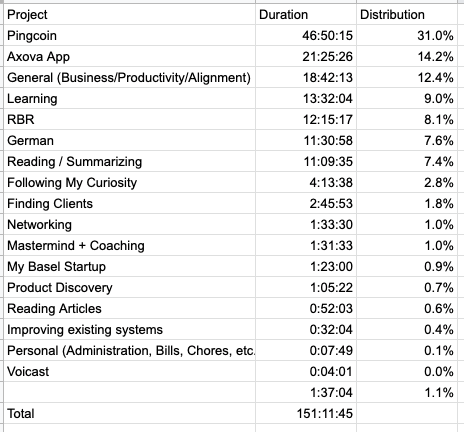

_After reading Results: The Agile Way, I've decided to switch up my retro format a bit so it's more in line with the book._

### What are 3 things that went well?

- Brought the app for my client, Axova, to a presentable level and presented it. Now waiting for their dev to get in touch with me so he can set up an API to communicate with.
- Finished editing and launched [the first RBR podcast episode](https://www.buzzsprout.com/279895). Super happy about that!
- Shipped a Submit Coin feature for [Pingcoin](http://jessems.com/current-projects/) which allows users to submit coin recordings themselves.

### What are 3 things I need to improve?

- Exercise more. Only averaged 2x a week this month.
- Find a new client.
- _\*\*Private\*\*_

Although I'm happy with the progress I made in launching the RBR podcast, the Axova app and the new Pingcoin feature, I haven't gained any ground financially this month. Next month this will really have to take center stage and I'll either need to focus on finding a new client, or something else.

### What did I not achieve and why?

I've been putting off setting my yearly goals since, well, the beginning of the year, because I felt tremendous resistance towards it and I didn't feel like I had the right framework. I think after reading Results: The Agile way I'm ready to do it.

I didn't find any additional clients because I didn't spend much time looking

I didn't participate in the local Basel incubator Startup Academy because so far I've not felt energized to go through with it.

I didn't finish the Axova app yet because I'm dependent on their dev, who I've not been put in touch with yet because he's busy.

### Time Distribution

### Rapid Breakup Recovery

#### Key achievements

- Published the first episode of the RBR podcast

#### Revenue

Ebook sales: \$19

Total revenue: \$19

_Ebook sales have been down ever since canceling Drip and not moving to an alternative. This is a bit counterintuitive because my understanding of the analytics was that my free 7-day email course wasn't generating much sales. Perhaps I was mistaken in that._

### Pingcoin

#### Key achievements

- Launched a Submit Coin feature

#### Revenue

Total revenue: \$0

_Right now I'm waiting for people to submit coins and plan to add them to the database as soon as they do._

### Monthly Planning for May 2019

- One new client signed
- All founding documents for the founding of my company sent to the attorney
- \*\* Private outcome \*\*
