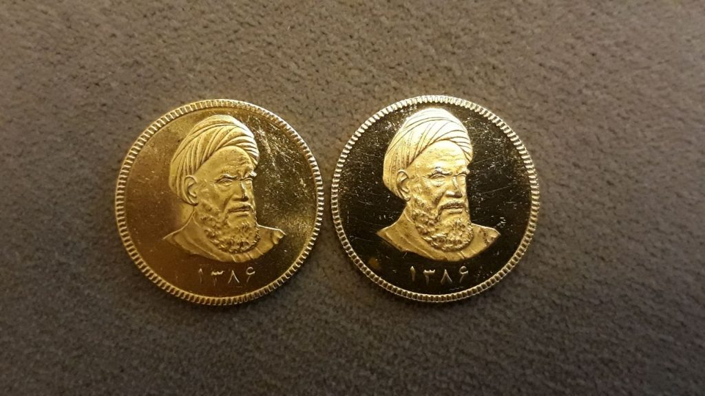
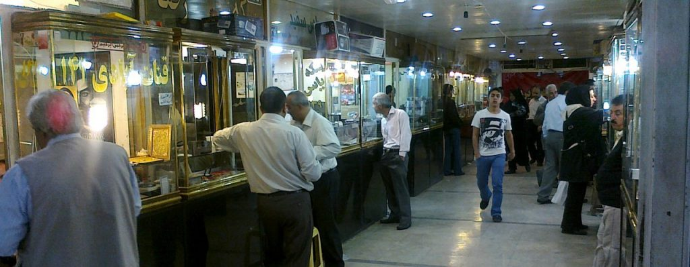

After publishing a [new feature](https://play.google.com/store/apps/details?id=com.pingcoin.android.pingcoin&hl=en) for [Pingcoin](https://jessems.com/current-projects/) where users can submit coin recordings for addition into the app, I've seen users submitting coins every week. This is incredibly encouraging. The only drawback to this situation is that although the system is getting more coverage (e.g. more coins) it's not getting necessarily more accurate (e.g. more recordings per coin). I've been thinking about how to solve this.

It's worth noting that I've received two recordings from Iran so far from the Bahar Azadi coin. A young trader has reached out to me and has been kind enough to explain to me a bit more about the situation in Iran. For one they've recently been hit by a market crash which sent the value of the dollar and gold plummeting.

\[caption id="attachment_317" align="aligncenter" width="525"\] Two gold Azadi coins submitted by a user in Iran\[/caption\]

He's told me of the situation in Iran where there is a 8% markup above spot price for gold coins from the Iranian mint. This has given counterfeiters the incentive to mint their own coins of correct composition, to capture this markup value. One of his questions was whether or not the ping test would be able to catch these types of counterfeits.

\[caption id="attachment_318" align="aligncenter" width="525"\] Iranian plaza where gold coins are bought and sold (image submitted by my new friend in Iran)\[/caption\]

My answer is probably not, but I'm willing to do some more research with him. Like a musical instrument, the sound of a coin depends on its shape and its material. If you manage to mimic both, you will mimic the sound as well. Thus a counterfeit coin which uses the correct composition would sound the same as a genuine one. I suspect there might be some differences at the microscopic level (e.g. differences in crystallinity) between different minting processes, but whether or not these will be great enough (or predictable enough) to detect a difference, I don't know.

I know from doing some research into the German Reich 20 mark coins, which were minted by numerous mints, that some differences were detectable between the mints. The distributions for each resonance frequency was centered on distinctly different frequencies. The problem, however, was that the distributions themselves overlap. So although there would be some coins which you could tell apart, many of them you would not. I would expect a similar situation for the Azadi coins.

Having said so much about the domain specific things within Pingcoin it's worth making a meta comment about what's going on here. My goal with releasing this feature was to initiate a user feedback loop. I wanted to get in touch with users. To better understand them and to iterate on the product. This is now happening and it's great for more than one reason. For one it's great because it's satisfying and motivating on a human level. I am talking to people across the world that (apparently) value what I'm doing. That's amazing. It's especially nice to hear that my product is making a difference since it's not an industry I'm deeply embedded in myself and because I had honestly given up on that hope much earlier. The reason I got this far has more to do with an unshakable compulsion to finish what I started, rather than some clear value-driven mission.

Secondly, it's great because it's teaching me more about my users, their use cases and the context of their use of my product. For instance, my Iranian friend mentioned that he trades coins in 10 packs and that trades happen quickly, making it difficult to do a manual test for each coin. This information will inevitably feed into the product and improve it. These two elements, motivation plus direction from the market, are what I was missing the last time I was working on this idea (2012-2013). It's incredibly gratifying to find these here now.

It's also interesting to note that my process for improving the app is quite slow. Even though I created the submit-a-coin feature as quickly as I could, I tend to think carefully about the problems I'm trying to solve and their solutions. I really let the problem marinate in my head and try to come up with various solutions in my head (which I also often sketch out). I'm not deliberately slowing down the product development process (perhaps because I'm not devoting 100% of my time to this idea), however, my sense is that it takes time to arrive at a solid idea. Often I'll have a good idea with some drawbacks, followed by another good idea with some drawbacks, and then through the marinating process I'll combine them into a super solid idea, without drawbacks. Reading Kolko’s while I'm doing this is also just perfectly on point:

> Design is slow and not just because it takes longer. Because it’s reflective, contemplative, and methodical, design encourages marinating and stewing, exploring and dreaming.
>
> \-Well Designed by Jon Kolko

What's marinating in my head right now is how to move to a situation where my app is getting progressively more accurate due to the data it collects. This is made difficult by several factors:

- I don't have access to many coins myself
- I can ask users to contribute coins, but I am not able to verify whether these are authentic or not
- I've asked dealers (who would be able to verify coins) to contribute to this cause, but so far they've not been very interested
- Even if someone is interested, it could be a bit cumbersome to upload a 5MB .wav file every time you try to do a quick test
- Even if you're willing to upload a recording, I need additional information about the coin to be able to add it to my database (e.g. year of minting). This can be cumbersome to enter.

Meanwhile there are some usability issues that also need to be resolved, most notably the onset detection part of the coin testing flow (e.g. detecting the moment a coin gets flicked). This is also something that has been marinating in my head and for which a first solution is already fairly clear (a web-based onset labeller). More on that as I progress.

I remember the app being in a semi-finished state and feeling torn about whether or not to proceed with it. Initially I chose not to, but it kept bugging at me. Then I revisited it, but did not build a submit-a-coin feature (instead routing users to a web form with a recording option). It was only after seeing that users were trying to send me coin recordings that I realized it would probably be worth building the feature properly. I can only say, I’m glad I did.
