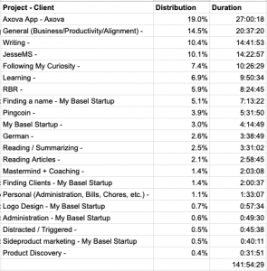

## 3 things that went well

- Spent a lot more time writing
- Succeeded in creating a mock api with Google Sheets
- Found a new name for my agency

## 3 things that I need to improve

- Do more German
- Exercise more (did not reach 2 workout sessions per week on average)

## What did I not achieve and why?

I set out to find one client last month, but I didn't find any. To be honest, I didn't spend much time looking. I spent my time coming up with a new name for my agency, writing a lot and learning some new technologies which I'll be needing (like Angular and RxJs and Firebase).

I did manage to get all the documents sorted for the founding of the company. We decided to change the name last minute. The name of the agency will now  be: Pocket Revolutions.

## Time distribution

The time spent on JesseMS was actually also time spent writing. So in total I spent a little over 20% of my time writing this month!

## Pocket Revolutions

- Changed the name of the agency (previously Studio Click) to Pocket Revolutions. I'm very happy with the new name. Post about the naming process is upcoming.

## Rapid Breakup Recovery

- Published 1 blog post
- Started coding my own CMS for RBR

### Revenue

Ebook sales: \$38

Total: \$38

## Pingcoin

- 5 coin recordings were submitted by users and were added to the app
- First blog post about Pingcoin was published here

## Monthly Planning

- Sign 1 new client
- Launch the Pocket Revolutions website
- Publish a portfolio piece on Pingcoin
