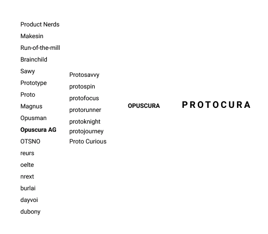
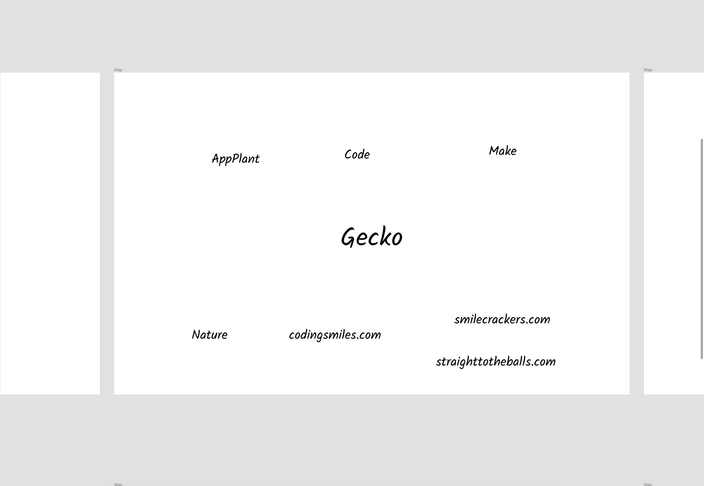
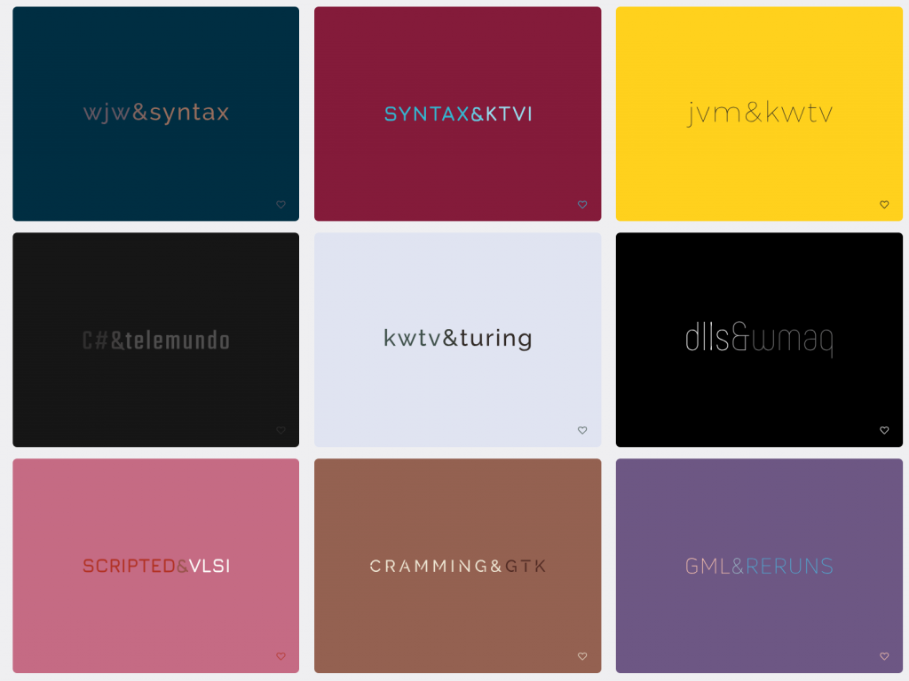

## Background

As of this writing I am in the process of founding a product design & development consultancy in Basel, Switzerland. To register your company with the commercial registry you need a name. As a _brand_ you need a name that works well for your business.

As eager as I was to rush the process and get started with actual business, I knew that picking the right name could end up making a big difference.

This was complicated by the fact that I am founding the company with a friend who is financing the whole endeavour. I wanted us both to be happy with the name, but as we discovered, our brains work very differently from one another.

## How I started

Before I started brainstorming I suggested a name that I had already come up with beforehand:

Product Nerds

I thought it communicated the right things. I'm focused on digital “products” and ”nerds“ conveys that we’re good at what we do.

My friend saw things differently.

As he's not familiar with the world of digital products the word “product“ to him conjured up imagery of a classical factory-produced product. And nerds, for a German speaker, doesn't have the same expert/funny connotation as it does in English. In German a nerd has a derogatory charge (one of the dictionary translations translates back to English as “asshole”). So although I still like the name, it became clear it was the wrong name for this situation.

Then, I just started brainstorming lists of words. I tried to seed my brainstorming with words that sounded nice and which I thought were related to my industry, such as "prototype". And then I started looking up the latin translation for certain words. Why? I'm not sure, I think I thought it sounded professional. I documented my process in Figma and here you can see a screenshot.

Opus is Latin for work and cura is the Latin word to heal. I thought that they sounded cool together and my friend is also the founder of a NGO that helps children in Thailand (healing work I guess?) so I thought it was fitting. Then I tried to combine it with prototype and I arrived at Protocura.

I thought that was pretty cool. The people I asked responded luke-warm. My friend didn't like it that much. He thought it sounded like Prokura, which in German means something like having signatory power in a company. Not quite the what I wanted to convey.

So I decided to read a book on the subject. I decided to read "[Hello my name is awesome](https://www.amazon.com/Hello-My-Name-Awesome-Create/dp/1626561869)" by Alexandra Watkins.

## I read a book on coming up with a brand name and here's what it taught me

The book was illuminating. First of all, it made me realize I hadn't put too much thought into what a really good name sounds or looks like. Luckily the author had several of her own that she had come up with. One of my all time favorites?

Gringo Lingo — as a name for a language school in Latin America.

What an amazing name.

In her book Alexandra Watkins tells us to stay away from Latin names, as well as trying to sound cool by sticking stuff to the end of names e.g. -ly and -r.

Interestingly Alexandra emphasizes that getting the .com domain name is actually not THAT important. Getting the right name is key, and you can come up with a clever domain name after that if the .com isn’t available.

I was doing the opposite, for every name checking if the .com was available.

Once I dropped that requirement, new options started opening up. In her book Alexandra presents a framework and a process for coming up with a name. Her framework is as follows.

A name should be:

**Suggestive** - It needs to evoke something about your brand **Meaningful** - It needs to resonate with your audience **Imagery** - Visually evocative to aid in memory **Legs** - Lends itself to a theme for extended mileage **Emotional** - It moves people

Alexandra also provides some rules to avoid bad names:

**Spelling challenged** - Stay away from names that aren't spelled the way they sound **Copycat** - Don't choose a similar name to a competitor **Restrictive** - Don't get locked into a name that you may outgrow down the road e.g. diapers.com **Annoying** - Don't choose a name that annoys customers **Tame** - Uninspired names e.g. Cloud Net **Curse of knowledge** - A name that only insiders get e.g. Eukanuba (pet food) **Hard to pronounce** - e.g. Sur La Table

In additional to these rules, Alexandra has a whole process you can go through which she lays out in the book, which she calls your brand roadmap. I went through this process and you can view my brand roadmap in the presentation [here](https://www.figma.com/proto/d3Mh61ZECesvc7693GQ8Z44s/Name?node-id=24%3A21&scaling=scale-down-width).

Going through Alexandra’s process surfaced some good candidate names. Here are some of the names we arrived at that are worth mentioning.

### Hello World Studios

“Hello World” is a reference to the output statement you usually learn first when learning a new programming language. It's also an upbeat name, easy to pronounce. Unfortunately the .com was taken by a small German web development agency who didn't reply to my emails.

### Happy Path Studios

In UX jargon the Happy Path is a sequence of envisioned steps a user can take as they move their way through your product which leads to the desired outcome. This name checked many of our boxes but the "th" sound in English isn't easy for German speakers to pronounce (one of our requirements) and it requires insider knowledge.

### Flowability

A reference to the psychological state of "flow" in which someone feels in-the-zone and loses track of time. This may be what you want to design your product to accomplish. Also a loose reference to ”user flow”, a UX term for the conceptual path a user may take to navigate through your product. And lastly, also a loose reference to usability, another UX term which aims to capture how easy it is to use a certain product.

### Studio Click

Because the agency would help make things "click" and also because my girlfriend was planning on integrating some of her photography work into what we were doing (and camera shutters \*click\*) and we wanted to reflect that in the name. (This, by the way, is an example of how the requirements for the name evolved a bit as we were going through the process.) Although the .com was taken, the .ch was available and it sounded authoritative. We almost went ahead with this name, mostly out of impatience. We decided to abandon it when my friend’s wife told us it was shit.

### Finger Food Studios

A great name for a digital product agency. Finger food is a funny way of referring to apps as they represent software experiences that are accessible through our fingers. Unfortunately others came to the same idea and Finger Food Studios is an innovation studio in Canada. But I took this to mean that the process was working, we were coming up with good names.

## More brainstorming was needed

Regarding brainstorming Alexandra has some very valuable advice: Do it alone and do it on your computer. The group brainstorms we had weren't very productive. It was much better to do the brainstorming alone. Her brainstorming tips are really good.

Let starter words seed your imagination. After that, follow you curiosity. Type a word into google, try the urban dictionary, try a name generator. Some words might tickle your interest, save those, and move on.

Tools I used

- [Namelix](https://namelix.com/) (Great AI driven name generator. Can give you ideas for names as well as ideas for new seed words)
- [Instantdomainsearch](https://instantdomainsearch.com/) (Great for a quick check of domain availability
- Urban dictionary to find jargon related to my industry
- Google searches such as "digital product jargon"
- I used [Figma](https://www.figma.com) to create artboards for each seed word and then put the words it seeded in the artboard. This lets you easily zoom in and out and the word clouds you're generating in the brainstorming process.
- [Powerthesaurus](https://www.powerthesaurus.org/). Probably the best thesaurus out there. Great for coming up with tangential words based on a seed word.

### Some other notable strategies

Since the name needed to be pronounceable by German speakers, we tried starting with words that are known English words that have been adopted into the German language. These are so-called [Anglizismen](https://de.wiktionary.org/wiki/Verzeichnis:Deutsch/Anglizismen) and there's a nice list of them on Wikipedia. This gave some interesting seed words.

We also tried starting with so-called "compound words" in English, like finger food. These are words that consist of two separate words. This also gave some interesting seed words and led to the cool name: Finger Food Studios (unfortunately [taken](https://www.fingerfoodstudios.com/)).

Plugging a word like "programming" into Namelix will surface a bunch of different words related to programming that go beyond synonyms. E.g. it will surface words like "syntax" and "modeling".

## Finally we landed on...

We finally landed on the name **Pocket Revolutions** inspired by this [article](https://rbs.io/2019/05/a-revolution-in-your-pocket/).

How does it square up against Alexandra's categories? Here's my take based on the feedback we've received so far (bear in mind this subjective). It's suggestive because it evokes the idea that we're doing something revolutionary, and that someone that works with us can start a revolution of their choosing.

It's meaningful and evokes imagery because most people understand the link with "pocket" and the the reference to a technological revolution. It has legs as we're thinking about calling ourselves revolutionaries and inviting clients to start their revolutions.

It's emotional because aren't all revolutions bursting with emotions? Both pocket and revolutions are easy to pronounce for German speakers and they sound quite playful together.

One of the notable differences with the other names we came up with is that Pocket Revolutions really seems to convey a brand. My buddy said it best when he said \[about the name\]: ”that’s really a brand”. I feel the same way.

## Some lessons learned

### Finding a good name can be really, really hard

It really helps to know and feel what a good name looks and feels like e.g. Gringo Lingo or Key Values. It's also worth realizing that working more or working harder doesn't translate into progress. I would brainstorm for 3 hours and come up with a handful of mediocre names.

### Brainstorming is best done alone and using your computer

Although you can bring some methods to bear, in general it's a very random walk type of process. You need to let certain things inspire you and save the things that draw your attention onto a big canvas for later contemplation.

### “Letting it go” doesn’t always result in ideas

In some other creative endeavours "letting it go" helps you come up with new ideas. Somehow your subconscious goes to work when you stop focusing on the problem you're trying to solve. This didn't happen for me in this case. All my ideas came while spending conscious effort on it.

(Note: Although the title says "I", coming up with the name was ultimately a team effort and I would like to take the opportunity to give credit to my business partner. Extra credit goes to his wife for calling us out on the name we were peddling before.)

Let me know if any of this was useful. I'm [@jessems](https://twitter.com/jessems) on Twitter!
