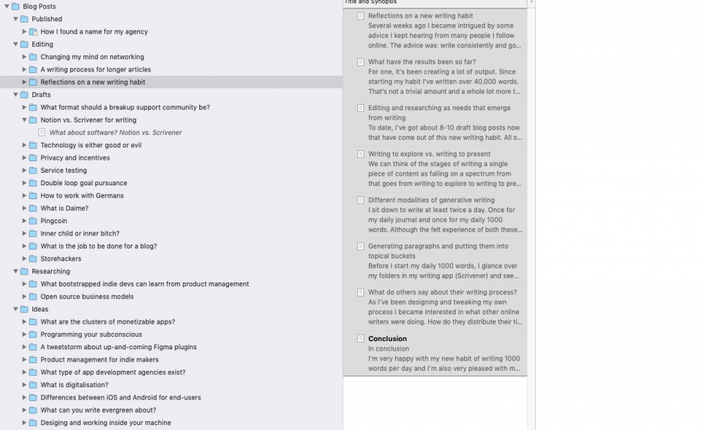
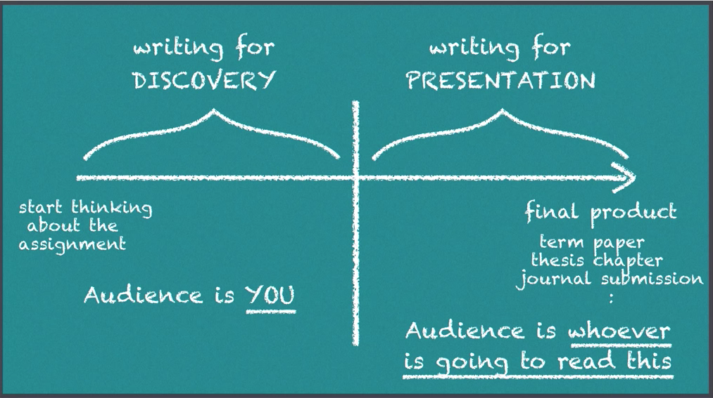
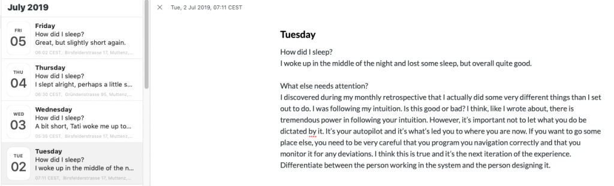
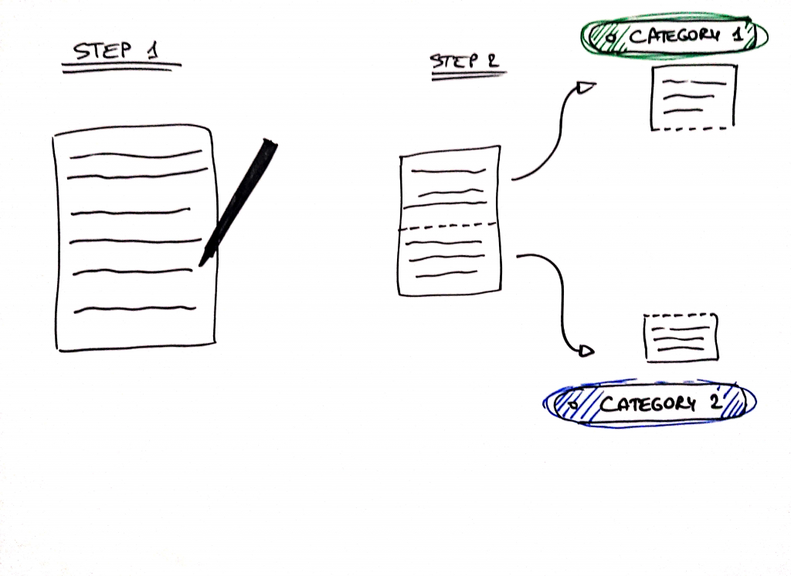

Several weeks ago I became intrigued by some advice I kept hearing from many people I follow online. The advice was: write consistently and good things will happen. I suspected there was a profound meaning to those words which I wasn’t fully appreciating. So I decided to dig a bit deeper.

I [laid out](https://jessems.com/on-writing-at-all/) what I believed was the underlying meaning of what they were all saying in subsequent blog post. What I believe they were saying is that one should write regularly because writing clarifies our thinking (and consistently clarifying your thinking leads to all kinds of positive outcomes). Since then I’ve implemented a daily writing habit which I’ve been consistent with. In this article I’d like to take a moment and reflect on this new habit.

**What have the results been so far?**

For one, it's been creating a lot of output. Since starting my habit I’ve written over 40,000 words. That’s not a trivial amount and a whole lot more than I’ve written in any period leading up to it.

Having said that, I haven’t \*published\* 40,000 words. And there’s a key discovery for me in this process:

_Simply generating writing does not result in publishable content._

Duh, right? You still need to edit and you often discover that you also still need to do more research.

**Editing and researching as needs that emerge from writing**

To date, I’ve got about 8-10 draft blog posts now that have come out of this new writing habit. All of them still require significant editing. Some of them require more research. Both editing and researching are not covered by my habit, but it’s become increasingly clear that those steps are necessary. Since then, I’ve iterated on my habit by including blocks of editing and researching into my weekly calendar (with mixed results).

\[caption id="attachment_345" align="alignnone" width="525"\] Some draft blog posts sitting in my Scrivener folders\[/caption\]

I’m less surprised by the need for an editing step as I am about the need for a _researching_ step. Call me crazy, but I thought I could grind out more cohesive and valuable thoughts without having to defer to a book.

Let me give you an example. After talking to an old friend (a software developer) who was about to embark on a new project with German clients, I was reminded that individuals from different cultures often face challenges in working together. Working with Germans happened to be an area where I felt I had some experience, so I decided to write my thoughts on how to work with them ([ze Germans](https://www.urbandictionary.com/define.php?term=Zee%20Germans)).

I started off by writing from experience, but quickly I felt I was running out of ideas and my language did not feel very precise. I became interested in what research literature might be out there about this topic, e.g. cultural differences at the workplace.

Then I discovered there are (at least) [two](https://www.goodreads.com/book/show/22085568-the-culture-map) [worthwhile](https://www.goodreads.com/book/show/466760.Cultures_and_Organizations?from_search=true) books that have been published on the topic. I then began to realize that the insights I had intended to publish would likely appear trivial in comparison with the body of research that _apparently_ existed.

There was still _some_ value in my personal experience and in my anecdotes, but scanning through the literature on the topic made me realize that some of the conclusions I was arriving at were likely flimsy and heavily influenced by my own inherent cultural bias.

Not having the time to immediately devour these two books, I was left with a slab of text — not yet edited — and some open questions waiting to be researched.

Clearly, to turn this text into something coherent, valuable and readable, I would have to do some more reading and pass over it again. It made me realize that there are different stages in the process that are necessary to bring a piece of writing to completion.

The most useful mental model I’ve come across for thinking about this process comoes from a guy called [Kevin DeLaplante](https://www.youtube.com/channel/UCFLCAm7HCyw6DEY9jvOMTvA) on youtube, who, in one of his videos makes the distinction between [writing to discover and writing to present](https://www.youtube.com/watch?v=ExxpV_aXvWg). (I hope you follow my recommendations, because [youtube's own recommendations suck](https://jessems.com/idea-validation-better-youtube-recommendations/))

**Writing to dsicover vs. writing to present**

\[caption id="attachment_346" align="alignnone" width="1013"\] Kevin DeLaPlante's diagram of writing to discover vs. to present\[/caption\]

We can think of the stages of writing a single piece of content as falling on a spectrum that goes from _writing to discover_ to _writing to present_. In general, when we start with a new piece, we start off by writing to discover. In this stage we’re not evaluating what we’re writing. Instead we try to pull in different pieces of relevant information and try to explore our thoughts on the topic. At this stage we might not yet know how we think about a topic. The audience for this type of writing is _you_.

As you explore the topic a structure may slowly start to emerge but and you can start to knead and prune your piece. As your piece becomes more defined you simultaneously become more evaluative and you’ve entered the domain of writing for presentation. When you’re in the presentation stage, your audience becomes the person that is going to read your writing.

My daily writing habit puts me in a generative mode. I’m generating writing and postponing any evaluation to a later editing mode. Usually this means I’m on the side of writing for discovery, but occasionally I’ll know what to say and It will feel closer to writing to present.

My writing habit covers the generative step of the process but rather than resulting in publishable content on the first pass, it instead often surfaces areas that require me doing more research.

Interestingly, even within the act of generative writing (if we can call it that), I’ve found a noteworthy distinction between different modalities of generative writing.

**Different modalities of generative writing**

I sit down to write at least twice a day. Once for my daily journal and once for my daily 1000 words. Although the felt experience of both these routines is often similar, usually they are quite distinct.

During my daily journaling routine I simply try to empty my head and express my emotions. I start with a question such as “What needs attention?” and I simply let my fingers generate words. It’s often a dialogue with a wise version of myself and it’s almost always a very insightful process. It feels like this puts some daily grease on the hinges of the door between my subconscious and conscious mind.

\[caption id="attachment_347" align="alignnone" width="525"\] A screenshot from my journaling app Day One and a typical entry\[/caption\]

When I sit down to write my daily 1000 words, I usually manage to get into a different mode. I try to explore an idea and figure out what insight I have on a given topic and where my knowledge is lacking. Sometimes it takes a lot of effort and it’s slow. Sometimes my fingers can barely keep up. Usually it’s very conceptual and it doesn’t veer far from the topics that pertain to my day-to-day challenges.

I’ve noticed that there’s sometimes overlap in these two activities. Sometimes the things I write in my journaling session are exactly the type of things I am hoping to write in a writing session. Sometimes the opposite also happens and a writing session becomes infused with emotions and self-inquiry. The common factor between both modalities is that I’m clarifying things that exist in some form in my mind.

I’m not sure yet if should insist on the separation. For now I try to keep my journaling as a place where I can express emotions and thoughts, empty my mind and have a therapy session with myself. In contrast, I try to keep my daily writing habit about the things I’m exploring in my projects, or meta-observations about how I’m progressing towards my goals.

**Generating paragraphs and putting them into topical buckets**

Before I start my daily 1000 words, I glance over my folders in my writing app (Scrivener) and see what pieces could use some more thoughts. Sometimes I’ll find a topic that resonates with me on that particular day, but often I’ll just start without a prompt of any kind.

After writing my 1000 words I take the resulting text (usually spanning 1 or 2 topics) and then I copy and paste it into a fitting folder inside Scrivener.

I maintain a separate Scrivener file for my agency, one for my coin testing app and one for my breakup advice website. Within each file I maintain folders for the topics I’ve been writing about so far.

\[caption id="attachment_348" align="alignnone" width="525"\] Conceptual diagram of my daily writing and categorization process\[/caption\]

But as I mentioned before, the texts that sit in my Scrivener are mostly unfinished pieces. In some cases they need editing, in some cases they need more research, but in most cases I don't know what they need or if they're even candidates for a standalone piece of content. It's unclear to me.

What I’m working on right now is to see if I can turn into a routine the process of editing and the process of researching. The main worry I have is that together with writing these habits will take up too much of my time. Although I enjoy every bit of the process so far — I also need to get my agency up-and-running and make some money!

Another thing I’ve started to experiment with is to use my reading time to read books that help me with my writing research (something I understand [Nat Eliason](https://www.nateliason.com/blog/productive) does as well). Up until now I was simply reading whatever I felt like reading. This has been made easier by following advice on reading books from [Naval](https://hackernoon.com/everything-i-knew-about-reading-was-wrong-bde7e57fbfdc). After that I’ve given myself license to read more books in parallel as well as doing more skimming for new ideas.

I’ve experimented (and so far failed) with a weekly publishing deadline for this website as well as for Rapid Breakup Recovery. After failing initially I’ve introduced editing and researching blocks in my calendar for both (I’m writing to you during one of those blocks). I hope to share with you how this all pans out.

**What do others say about their writing process?**

As I’ve been designing and tweaking my own process I became interested in what other online writers were doing. How do they distribute their time between writing, researching and editing? There is no shortage of generic advice you can find which boils down to this:

1. Write no matter what. Do it daily. Probably in the morning.
2. Have an editorial calendar where you commit to publishing on set dates
3. Brainstorm your ideas beforehand

There is however, surprisingly little specific advice on how to incorporate a researching and editing phase into your writing schedule. I only found Rosie Leizrowice who talks about [her writing process](https://www.rosieleizrowice.com/blog/writing-process) in these terms. What I like about what she says is that she has a specific research phase for every article.

Based on that, the process I intend to move towards looks something like this:

1. Braindump + generate article ideas
2. Evaluate ideas (e.g. look for highest SEO potential)
3. Plan ideas (editorial calendar)

Then, per idea, the following tasks should probably exist:

1. Research, determine books to be read
2. Outline
3. Draft
4. Edit
5. Finalize
6. Publish

This system seems like it could work for shorter articles, but what about the longer ones? This is one of the questions I’m pondering next.

**In conclusion**

I’m very happy with my new habit of writing 1000 words per day and I’m also very pleased with myself that I’ve been able to stick with it. Having gotten this far has made me realize that to translate the writing I’m generating into publishable content, I still need to introduce regular editing and researching sessions. Doing this much writing I’ve also started to appreciate nuances between the different modalities of writing, such as writing in my journal vs. writing my 1000 daily words. I haven’t quite figured out yet how to publish regularly, or how to approach longer articles, but I’ve got the feeling that with some more tweaks I’ll figure it out. I’ll keep you all in the loop on how things progress.
