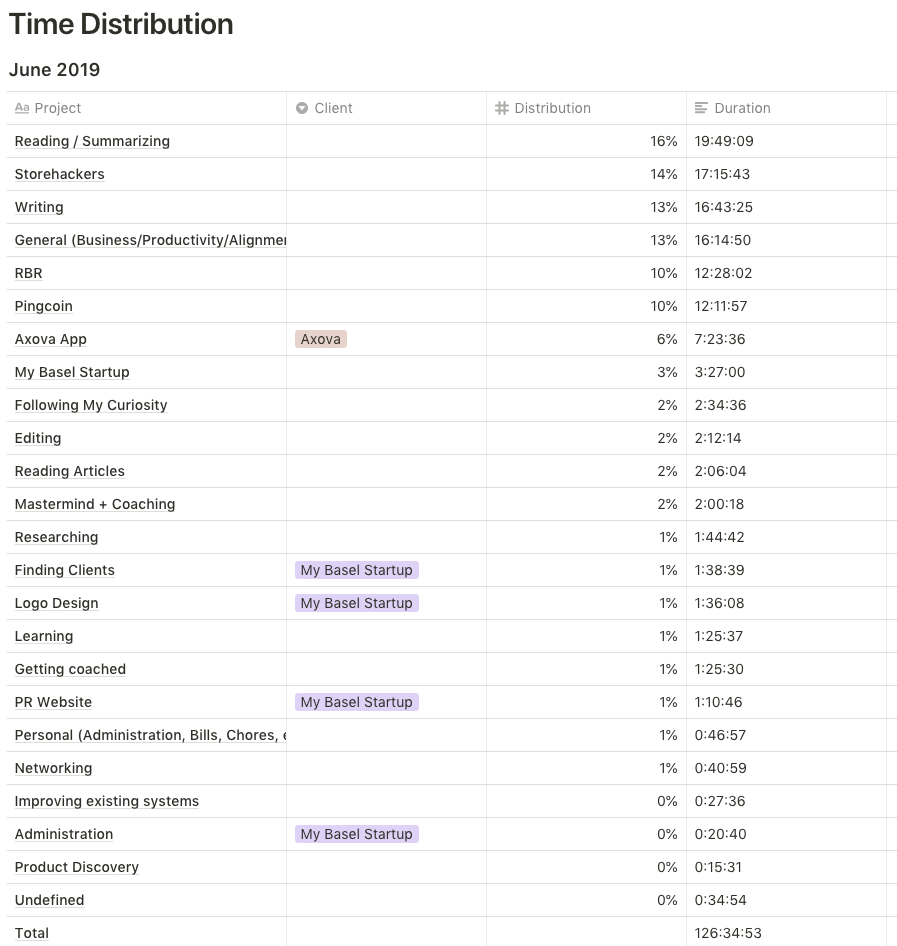

## Time Distribution

### Comments

It's interesting to see that I spent so much time reading (16%) without having planned for that. After reading about how Naval reads multiple books in parallel, I gave myself license to do the same. The books I _started_ to read where:

- Dig your well before you're thirsty (Finished)
- The overwhelmed brain (Finished)
- Manufacturing consent
- Content everywhere
- You're a badass at making money
- As a man thinketh (Finished)
- Can't hurt me
- Elements of user experience (Finished)
- Refactoring UI (Finished)
- Love and addiction
- The controversy of Zion
- A new male sexuality

I also spent a good deal of my time (13%) writing. This is because I've been consistent with my new writing habit, however, I haven't been able to design my habit in such a way that it is leading to a consistent publishing schedule as well. This is undoubtedly the next step. I published a [blog post](https://jessems.com/reflections-on-a-new-writing-habit/) going into a bit more detail about this.

# Key Accomplishments

## Rapid Breakup Recovery

**Time spent**

12:28

**Revenue**

Ebook sales: 0

Total: \$0

**Comments**

My time was mostly spent answering questions in the facebook group. This is time consuming and I'm not really seeing any immediate returns for it. It's interesting to see the revenue dip to 0 now. As I've said in a previous monthly retrospective, this is primarily because I no longer have an email sequence set up. Since a convertkit subscription is less than \$50 a month, it's an obvious win. I just need to find the time to implement it. Instead of spending any more time on my current Wordpress setup, however, I've decided to migrate the blog to GatsbyJS. The remainder of my time has gone to this migration.

## Pingcoin

- Implemented a ping-tracking feature to collect data on incoming pings
- Added incoming pings to the database
- Did initial analysis of incoming pings
- Did a usability test with my dad

**Time spent**

12:11

**Revenue**

\$0

**Comments**

After doing a usability test with my dad it became clear that there are still some serious usability issues with the app. Having said that, I'm also seeing continuous usage in the Firebase analytics. Setting up analytics for incoming pings has allowed me to look at the distribution of the resonance frequencies of coins. This is something I need to write a separate blog post about.

## Pocket Revolutions

- Agreed with Axova to implement an API

**Time spent**

3:27

**Revenue**

\$0

**Comments**

Our project with Axova will pick up now that we were able to agree to implement an API for them instead of waiting for their contractor to do it in their in-house system. This is good news because the project had been on hold for a while.

## Monthly Goals

_Did I achieve my goals? If not, why not?_

Figuring out how to bring in clients short-term & long-term.

- One new client signed
- Pocket Revolutions website up and running
- Pingcoin as a portfolio piece on the PR website

I did _not_ reach any of the 3 monthly goals.

### FAILED: One new client signed

The main reason I didn't reach this goal is probably that I didn't spend time on it. I did read two books on the topic of networking (which isn't counted in the above overview). I also did go to a Toastmasters event and met some people. One of my weekly goals was to get out of the office more and meet people.

### FAILED: Pocket Revolutions website up and running

I've been researching different technologies that I could use to run the PR website. I've landed on Gatsby for Rapid Breakup Recovery and I intend to start using it for my personal blog as well as for the PR website.

I also spent some time researching what webdesign experts say about the process one should follow to design a website. Because I want to position myself as a technology expert I believe it's important that my website is impeccable. So although I thought this task would be much quicker, it's taking longer than expected.

Another reason it's been taking longer is that in wanting to prepare Pingcoin and RBR as portfolio pieces for the website, I've dove deeper into them. I published some improvements to Pingcoin and I started migrating my RBR blog to Gatsby. On the one hand I'm splitting my time (as opposed to focusing), on the other hand I am polishing these projects up to serve as good portfolio pieces.

### FAILED: Pingcoin as a portfolio piece on the PR website

Again, here I failed to turn Pingcoin into a portfolio piece, but I did spend considerable time on the project. Were these absolutely essential tasks? Probably not. But they are things that sooner or later needed to be done.

### Comments

It's somewhat confusing to see that I set out to find at least one client the past month and to publish my website, and I've not managed to do either. Not only that, but it seems that I haven't spent that much time on these tasks directly. Why is that? What's going on there?

_(Bear with me as I think out loud. What follows is a recollection of how the month evolved for me. Incidentally this type of introspective writing is representative of the type of writing I do in my journal. You can read more about my writing habits [here](https://jessems.com/reflections-on-a-new-writing-habit/).)_

At the beginning of the month I realize that to find clients (the goal of the month) I need to have a strong network. How does one build a network? I wasn't really sure, so I started reading about it. I read two books on the topic and made some notes.

One of the things I realize is that I need to get out of the office more, so that's what I do. I attend two networking events and meet some people.

At the same time I feel the pressure to start building my company website so I want to start with that. Then I realize I want to do a very good job at it, so I start reading about this topic.

Then I start looking at the projects I want to showcase as portfolio pieces and I see things that really need improving. So I jump in and start improving them case in point: Pingcoin.

Before you know it, it's the end of the month and I don't have any new clients, don't have a website and haven't turned Pingcoin into a portfolio piece.

Have I just been doing busy work?

I don't think so, but I'm not 100% sure. I think what I've been doing is low pressure work. I improved several different areas and I did some careful research. I wasn't sprinting towards the outcome I set. Instead I was carefully laying bricks.

Should I be sprinting instead of laying bricks? I _think_ the answer is no.

Said differently, should I be pushing myself harder to just achieve the goals I set, or should I allow myself to get carried away with inspiration and curiosity?

In thinking about this I'm also reminded of Ray Dalio's book Principles in which he says that you should distinguish between the "you" that _designs_ your machine (your system to achieve your goals) and the "you" that _works in it._ I suspect that I'm allowing myself to get emotional and intuitive while I'm inside my machine. I'm then taking those emotions and allowing them to determine my strategy. As a consequence I'm not allowing my machine to behave very machine-like.

I think a better way of looking at the interplay between intuition and rational goal setting is that your intuition is sort of like the output of a finished process that was run by your subconscious. Your subconscious has a lot more processing power, a higher bandwidth for incoming data, access to more resources than your conscious faculties. And in general it has the capacity for coming up with answers that are much higher quality answers for your problems (taking more levels of your being into account). One challenge is that it is not always clear _when_ it's speaking or _what_ it's saying. It takes practice to get in tune with it and to dispatch questions to it to be answered.

The weaves of your subconscious also constitute your blind spots, your traumas, your pains, your limiting beliefs and a lot of neurological manifestations that will basically work against you achieving your goals.

It should be obvious that we should definitely be consulting this vastly more powerful processor with more resources, higher bandwidth and direct access to our bodies whenever we're pondering difficult or impactful questions. But we probably shouldn't be listening to it all of the time and in any situation. In other words, letting your intuition guide your weekly (or even monthly) strategy in the middle of the week is probably not the right thing to do.

Consult your intuition during the "machine designer" phases. This is where you're zoomed out and you're trying to objectively look at you the worker. This is also the perspective you want to have when you are designing the solution. However, I've come to believe this is not who you want to be when you're doing the work. When you're doing the work itself, have faith in the design. If you doubt it, make a note, and change it the following week. Don't change it during the week. This will force you to be much more careful with planning, but it will be easier to determine whether or not a given design change produces the desired result.

_(The above could be a good start for a new blog post. Agree? Let me know @jessems)_

## Yearly Goals

_Am I on track to achieve my yearly goals? If not, why not?_

### 1 month of >10k CHF revenue

It's hard to say where this money should come from, so it's hard to say whether or not progress was made. Materially, no, no progress was made. In fact, reaching $0/month on RBR for the first time in a while actually constitutes regression. Having said that, 1 or 2 good clients with Pocket Revolutions would get me to $10k a month. My final verdict would have to be: MORE-OR-LESS

### 120 hours of self-study German

It's somewhat strange to see this goal up here. I spent 0 hours studying German this month. Even though I'm also surprised the actual number is 0, in May it was only 4 hours, 11:30 in April and 22 in March. So it seems I've slowly been deprioritizing this topic. I'm not _too_ bothered by that. German does feel less important right now and perhaps I should deprioritize it as a yearly goal as well. I will be setting more conservative weekly goals for German and see how I feel next month. Verdict: NO

###

...

## What went well?

1. Spent a lot of time reading after identifying this as an area where I wanted to spend more time
2. Spent a lot of time writing
3. Published a Pingcoin analytics feature

## What should I do differently?

1. Turn more of my writing into published content
2. Set goals that are more in line with how I truly feel about things (and don't change them mid-week or mid-month)
3. Get out at least once a week meeting people \[track people met\]

## Determine Kaizen

- Turn more of my writing into published content
