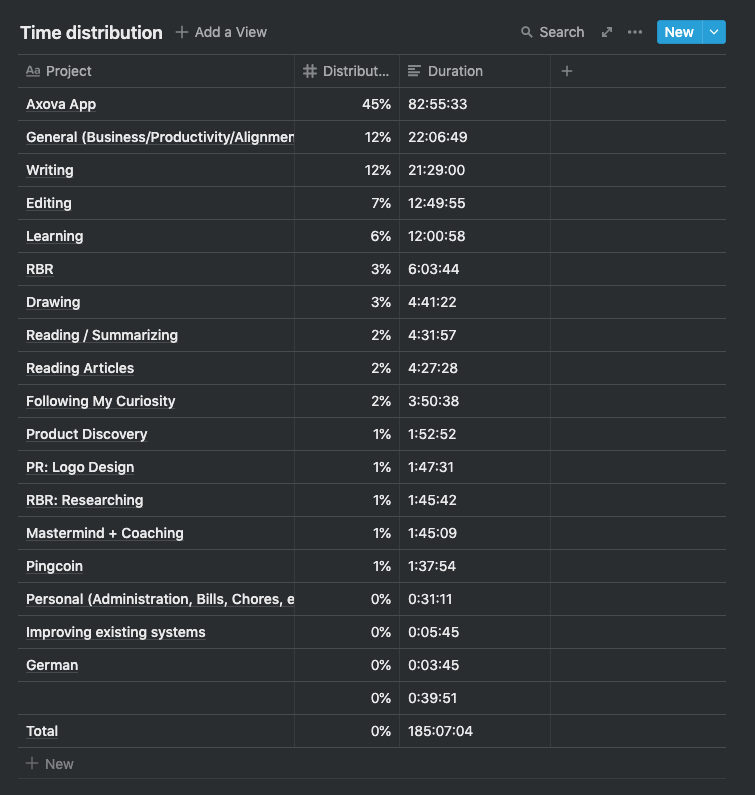

### Time distribution

### 

### Comments

Spent quite a bit of time writing, but not much new published material. It's also unclear to me how much I've published in the month. This should be an easy to track KPI.

### Overview by Project

### Pocket Revolutions (Product Agency)

**Time spent: 1.5**

**Comments**

- Spent time reviewing the logo concepts

### Axova (Pocket Revolutions Client Work)

**Time spent: ~90**

**Comments**

- Setting up an API to communicate between the app and the client's in-house system
- Connecting the app to the API

### Rapid Breakup Recovery

**Time spent: 6:03**

**Revenue: \$19**

**Comments**

- Spoke with some veteran members about the idea to set up a support group for recovered men. Three responded positively. I'll be setting up something shortly.
- No revenue, mostly due to the lack of an email automation system.

### Pingcoin

**Time spent: 1:37**

**Revenue: \$0**

**Comments**

- Just some time spent researching onset detection.

### Monthly Goals (did I reach them?)

**Finish Axova App** — Not quite. Although I do see a sustained focus for every week in the month, I didn't end up finishing this task. I do believe I made considerable progress though.

**Turn pingcoin into a portfolio piece** — Wasn't able to start because I hadn't finished the axova app

**Finish the PR website** — Not able to start because I didn't finish the axova app

I didn't reach my monthly goals, but I was able to stay true to the monthly theme of keeping focused. I think the focus was beneficial, but it turned out to be more work than I anticipated. I spent 80 hours on Axova, which is an _okay_ amount for the month considering I clock about 40 hours for a week.

### Yearly Goals

_Am I on track to achieve my yearly goals? If not, why not?_

My yearly goals are:

- 1 month of >10k CHF revenue
- 120 hours of self-study German
- The first goal, it's hard to say. If I find some clients for my agency work and I'm able to charge a decent amount.
- The second goal feels like it needs to be changed. German hasn't been a focus for the last several months now. And although I would like be more fluent, it doesn't seem that important to me anymore right now.

### What went well?

1. Focus on Axova app went fairly well
2. Switch to wacom tablet went fairly well
3. Interactions with on Twitter based on my tweets

### What dit not go well?

1. I completed 0 out of 3 outcomes for the month.
   1. I am taking this to mean that I am being overly ambitious and I should scale down my desired outcomes. This seems to be a recurring theme throughout all my planning.
2. Not publishing enough. It's not visible to me how much I'm publishing.

### What should I do differently?

1. Underestimate your goals for August. Make sure what you set is what you hit.
2. Make published articles a KPI that's visible

### Determine Kaizen

_From the Could-do-differently backlog, determine your Kaizen for next month. A Kaizen is more process-oriented whereas a goal is more outcome oriented._

- Underestimate my goals for August
