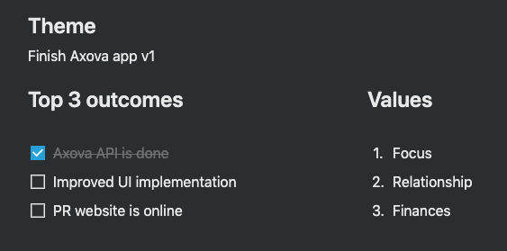
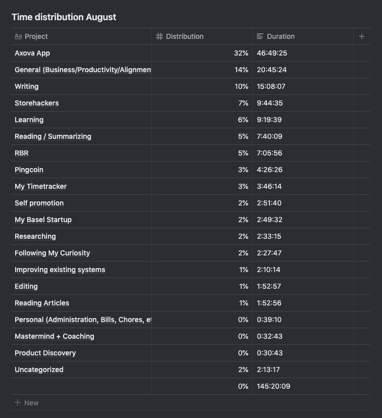
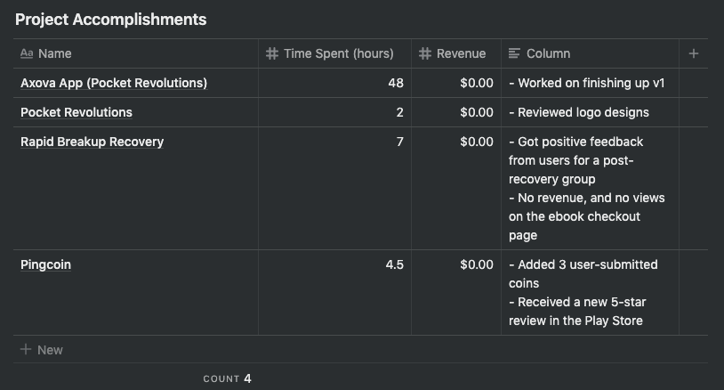

# Goals & Time Distributions

_Did I achieve my goals? If not, why not?_

**Axova API (Backend for a Pocket Revolutions client)** — Pretty much done. I'm mostly making smaller cosmetic tweaks now. One analogy that comes to mind is this idea of a painting where you start with the rough broader strokes, and quite quickly it starts to look like a mountain. But then you need to start filling in the details, which takes much longer. The problem is that with the painting you see the details — with an app, you often don't.

**Improved UI Implementation** — Not done. Not really started because the other stuff was more important and not done.

**Pocket Revolutions website is online** — Not started. Did not finish the Axova app yet!

Even though I deliberately under-estimated my goals for August, I still didn't reach them

This month I spent 32% of my productive time on my main focus: The Axova App (the app for my first client). In my experience with time tracking so far 50% is a good target to have for my main focus. If I fall below 50% I know I wasn't truly focused on it. 50% may sound low, but it takes into account that I spend 14% on General tasks such as writing up this retrospective and 10% on writing.

The lack of focus on the Axova App this month is due to mainly 2 unplanned initiatives: Storehackers & My Timetracker. These are both side-projects that I felt compelled to work on.

I have had an ongoing difficulty in dealing with waves of motivation for working on ideas that are _not_ part of my main focus. On the one hand I feel like I shouldn't work on them. On the other hand I feel completely justified working on them, because:

1. They're not whimsical. These are product ideas that have occurred and re-occurred to me over a longer period of time.
2. They scratch my own itch
3. They are excuses for me to code more (which is what I want)

# Project-Based Results

# Yearly Goals

_Am I on track to achieve my yearly goals? If not, why not?_

**1 month of >10k CHF revenue** — Hard to say. Revenue was \$0 in August. But at the same time there is revenue that will come in from the Axova project.

**120 hours of self-study German** — This goal does not seem relevant anymore and I should probably change it formally for next month.

# What went well?

1. 5-star review for Pingcoin on the Play Store
2. Meeting with Axova went well showcasing the app so-far
3. Refactoring the Axova app went well

# What did not go well?

1. Sticking to my publishing schedule of 2 posts per week
2. No revenue across all projects
3. Overestimated how much I could do this month

# What should I do differently next month?

1. Figure out how to stick to a publishing schedule for RBR and Pocket Revolutions

# Determine Kaizen

Figure out how to stick to a publishing schedule

# Discussion

On the one hand things look a bit bleak when I take my goal into account of having a \$10k+ month this year. On the other hand, if I sign one client with my agency, I've achieved that goal.

Also, the \$0 revenue for RBR seems like a negative result, but a lot of my time writing the last months has been for RBR. I have many draft articles and many snippets of usable content. Producing content has not been the problem -- turning it into publishable content has. Simply saying: "I will publish an article on Thursday" has not worked for me. This is why next month's Kaizen is to figure out how to come up with a publishing system that works for me.

That there's no revenue for Pingcoin is not surprising. Here the goal is not to generate revenue but to iterate on the app until I have something that people are really, really happy with. There's a big update which is overdue, which is to improve on the onset detection system. That is, to make sure the app doesn't pick up random sounds as if they are coin "pings". This requires me to build an onset annotator first -- in order to generate reference data which I can use to optimize my detection algorithm.

Since writing the previous paragraph I've come to believe that I'm actually over-engineering my approach and I can probably get away with doing manual onset detection. This would mean opening up every coin ping recording, find the onset location and save those locations to a .txt file. One for each recording. This is tedious, and not sexy, but it's not *that* big of a deal.

This touches on a general theme I'm noticing in my work: I get bogged down in non-essential tasks that seem relatively useful, but not *greatly* useful to my main goals. This is something that I'm digesting currently: How can I become more focused on only the few important tasks that need to get done. I believe it's Warren Buffet that's known for warning you about your good ideas because they are at the highest risk of distracting you from your great ideas.
