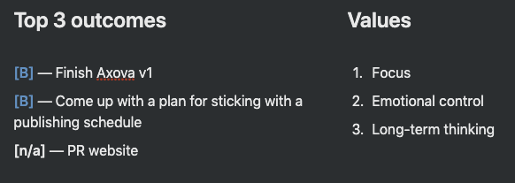
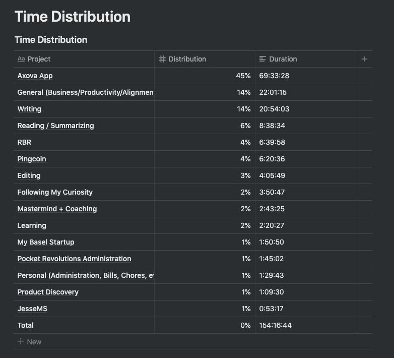

## Summary

September was a month where I truly tried to focus on one thing: Finishing the first version of my first client's (Axova's) app. This was reflected in the main goal of the month (Finish Axova v1) as well as in the values I was targeting for September (Focus, Emotional control and Long-term thinking). The result is a \[B\] grade. I spent nearly 50% of my time on the Axova project, 50% being the highest measure of focus I've been able to achieve. (This figure is much higher when compared only to time spent on other side projects). The resulting grade is not an \[A\] because I didn't end of finishing v1 (which admittedly has more to do with my estimation abilities).

September was another month where I spent a lot of time (20+ hours) doing generative writing in the mornings. Unfortunately this has again not resulted in published writing. As of this writing (mid-October) I've reduced my daily writing to 500 words and have included a 30 minute daily editing habit. I suspect the lack of an editing habit has prevented me from turning my writing into publishable content. With this in mind I've graded my goal of coming up with a plan for sticking with a publishing schedule as a \[B\], because although I did not come up with a plan, I did carefully consider the topic throughout the month.

Lastly, the Pocket Revolutions website, I need to refrain from giving this task a rating. Because my primary focus was on the Axova app and because this task was not finished, I did not get to the PR website. As of this writing I've released v1 Android with the client, and v1 iOS is in the works. This will free up the time I need in October to make a v1 for the PR website.

Having said all that, the logical corollary to focus is a lack of attention to other things. As such I've successfully neglected (I like that term! "successful neglect") my other projects. I had 1 coaching call for Rapid Breakup Recovery and I added some submitted coins for Pingcoin.

**Yearly goals** Reflecting on my yearly goal of raking in $10k/month in income, I am essentially at $0/month. Having said that, I have yet to send out Pocket Revolution's first invoice and of all projects PR is the most likely to yield such an income in the short-term. So although I will probably not hit my target, I don't feel like I should change course right now. A primary focus on Product Revolutions AG seems warranted.

**Next month** Even though I was being mindful of my tendency to overestimate my monthly goals, I managed to overestimate my ability once again in September. In October I will try again to underestimate what I will get done.

## Goals and Time Distribution

### Comments

- 45% time on Axova, is so-so. Wanted to focus.
- Surprised still 6 hours on RBR (mostly FB group)
- Spent 20 hours writing, that seems like a lot. I need to translate that into something.

# Key Accomplishments by Project

### Pocket Revolutions

**Time spent: 1:45**

**Revenue: \$0**

**Comments**

Did not spend much time on this.

### Axova App

**Time spent: 69:33**

**Revenue: N/A**

**Comments**

Spent most of my time on this client project

### Rapid Breakup Recovery

**Time spent: 6:39**

**Revenue: \$100**

**Comments**

Had 1 coaching call. Increased my rate to \$100 / hour. Most of my time was spent on the facebook group.

### Pingcoin

**Time spent: 6:20**

**Revenue: \$0**

**Comments**

Spent some time adding coins, which is okay. Spent some time working on an Angular admin interface for Pingcoin, which can be seen as a distraction.

## Yearly Goals

_Am I on track to achieve my yearly goals? If not, why not?_

\[F\] — 10k / month revenue by December 2019 — Not really. I'm still at essentially 0 revenue. I haven't found any new clients because I haven't finished the first project with the first client yet.

## What went well?

1. Strong focus on the Axova app
2. Themed days
3. Charged \$100 for a coaching session

## What did not go well?

1. Didn't finish the Axova app
2. Overestimated how much I can do in a month — again
3. Building Android release

## What should I do differently?

1. Publish 1 article

## Determine Kaizen

- Underestimate your goals for October
