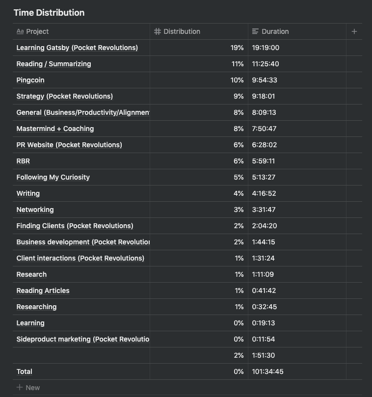

## Summary

_(I'm posting this retrospective in January of 2020. Although I conducted a retrospective for the month of November in 2019, I felt so demotivated about my progress that I decided against writing it up for public consumption. I'm revisiting this month to retroactively correct for that decision.)_

## Results

### Goals and grades

#### Yearly goals

Goal: 1 month of >10k CHF revenue \[Financial\]

Unfortunately, I'm not on track to achieve my yearly goal. The main reason, I still believe is that, given the path I've chosen, it's going to take longer to get to \$10'000 in monthly revenue.

### Time

I spent 19 hours learning Gatsby. Wow! That sounds like a lot. While doing it I didn't realize it was adding up to so much time. What I do remember is that it felt much more difficult to learn than I had anticipated.

I'm really happy with my 11:25 hours reading. My Kaizen for this month was that I should focus again on tracking my reading time and I'm happy I was successful!

I spent 9 hours working on my positioning and strategy for Pocket Revolutions.

I spent nearly 10 hours on Pingcoin, mostly adding coins and coming up with a design for next steps.

### Side projects

**Rapid Breakup Recovery** Time spent: 6% Revenue: \$0 - Facebook group moderation

**Pingcoin** Time spent: 10% Revenue: \$0 - Laying the groundwork for onset detection

## Commentary

### Positioning

I've been thinking a lot about how to position myself with my agency, Pocket Revolutions. Working on the website this month has forced me to make certain decisions about what header to display and what copy to use. It's been surprisingly hard to make a decision.

Initially I was planning on positioning myself as an app development agency. But then I came to realize that it would be better to differentiate myself from the other app development agencies out there. Lately, two things have been going through my mind:

1. Position myself as a digitalisation agency
2. Position myself as a digital product strategy agency

Towards the end of the month that which resonated the most was positioning myself as product strategist. This is what I would do if money wasn't an issue. The challenge is: I don't know if it's feasible.

### Found a new mastermind!

I'm currently in a small accountability group, but I've always wanted to be in a proper mastermind. I got lucky this month as someone I had reached out to in the past for coaching reached out to me with the offer for me to join a mastermind he was setting up. My answer was "Yes, of course!"

We've started meeting and will continue to do so every week. There's 5 of us (3 USA based, 1 India and myself). Our businesses vary widely, but the atmosphere so far has been great.

### Clothes make the man?

While reading Million Dollar Consulting the author stresses the importance of owning and wearing professional looking clothes. The lesson is that you need to treat yourself as a million dollar consultant to be a million dollar consultant.

I remember hearing the same lesson in the context of Benjamin Franklin (or perhaps some other historical figure) who decided to buy new clothes before making any sales in his new business.

Somehow hearing that lesson again, and having my girlfriend reiterate it, has now convinced me to buy a new wardrobe, even though I didn't want to spend money before bringing in new clients.

### Wardley mapping and Ben

I dug into Wardley mapping again, an incredibly insightful way to map out a strategic challenge and I came across the work of Ben Mosior ([hiredthought.com](http://hiredthought.com)). I decided to reach out and we had a very fun Zoom call talking about product strategy, Wardley mapping and other things.

## What I learnt

**I consistently overestimate how much I can do and how much I am able to focus.** This is the 3rd month that I've set as a goal to finish the Pocket Revolutions website. On the one hand I'm underestimating the time it takes me to figure out the technical implementation. On the other hand I suspect I'm being overly perfectionistic. This is why for January I want to focus more on a bias towards action.

**Reaching out to people that inspire you is feasible and fun!** I really, really enjoyed the conversation I had with Ben.

## Goals for next month

