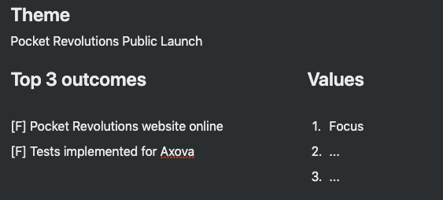

## Summary

_(I'm posting this retrospective in January of 2020. Although I conducted a retrospective for the month of November in 2019, I felt so demotivated about my progress that I decided against writing it up for public consumption. I'm revisiting this month (and December) to retroactively correct that decision.)_

Although I planned on focusing on the Pocket Revolutions Website, I spent a significant portion of my time setting up a forum for Rapid Breakup Recovery alumni (with mixed success) and binge consuming Seanwes' material.

## Results

### Goals and grades

Two F's this month. Although I made some progress with the PR website, I wasn't as focused on it as I could have been. This contributed to my not being able to finish this task this month.

The second objective I had set for November was to implement tests for the Axova app. I didn't get to this objective as I didn't finish the first.

#### Yearly goals

Goal: 1 month of >10k CHF revenue \[Financial\]

Unfortunately, I'm not on track to achieve my yearly goal. The main reason, I still believe is that, given the path I've chosen, it's going to take longer to get to \$10'000 in monthly revenue.

### Time

My total productive time this month is a bit low compared to other months, but I went on a short vacation which accounts for most the discrepancy. The main surprise was the lack of focus on the PR Website. Instead of achieving a 50% on this topic, I only achieved 30%.

Something else worth noting is that I have no logged reading time in November. Although I did read less in November than usual, the lack of logged time is due to me forgetting to log my time reading. I find time tracking while reading to be the most difficult activity to time track. Next month I plan to do better.

### Side projects

**Rapid Breakup Recovery** Time spent: 15% Revenue: \$0 - Set up a forum for RBR alumni

**Pingcoin** Time spent: 5% Revenue: \$0 - Set up a Google collab notebook for onset detection

## Commentary

### A forum for recovered men

For Rapid Breakup Recovery I run an Facebook support group where I, and a few others, help guys that are looking for support after breaking up with their partners. One of the challenges I've perceived is that members will join the group, benefit from the advice given, and then leave and never return. It's a breakup recovery support group after all, and once you've recovered there's little appeal to sticking around.

To address this, and to reward those few guys that \*have\* stuck around I thought of creating a forum for recovered guys. On this forum, I imagined, we would have the same principles of openness and honesty, but we could discuss a wider range of topics.

I had been playing around with this idea for a while, consistently agitated by the poor experience that Facebook groups provides. I was going back and forth in my mind whether to attempt to build the solution myself or to go with an off the shelf solution such as Discourse. I ended up doing the latter.

In the span of a few hours I spun up a Digital Ocean droplet and installed Discourse. I invited a handful of guys from my Facebook group, told them about the idea and encouraged them to participate on the forum. The response has (understandably) been luke warm. I'm happy I was able to set it all up that quickly however. In any case, that's where some of my time went this month.

### Binge consuming Seanwes

This month I discovered Seanwes' content and decided to become a member of his site. I devoured his most recent book and 2 or 3 of his courses. I made copious notes doing so. I thought this was justified because a big part of what he teaches is being prolific online (which I want to do) and his style of teaching really resonates with me.

### A meeting with a potential client with just an idea

I got put in touch with a woman that was interested in making an investment, or starting some kind of venture in the online clothing space. As my positioning is still evolving I agreed to meet and facilitate a strategy session. The session itself went quite well. We narrowed down what she wanted to achieve.

### More writing without publishing

Another month where I was able to spend quite a bit of time writing (12:48), but alas, nothing got published again. Writing for myself is not the hard part. It is writing for other people that seems to be the challenge.

## Goals for next month

Next month there is only one goal: Getting the Pocket Revolutions website online!
