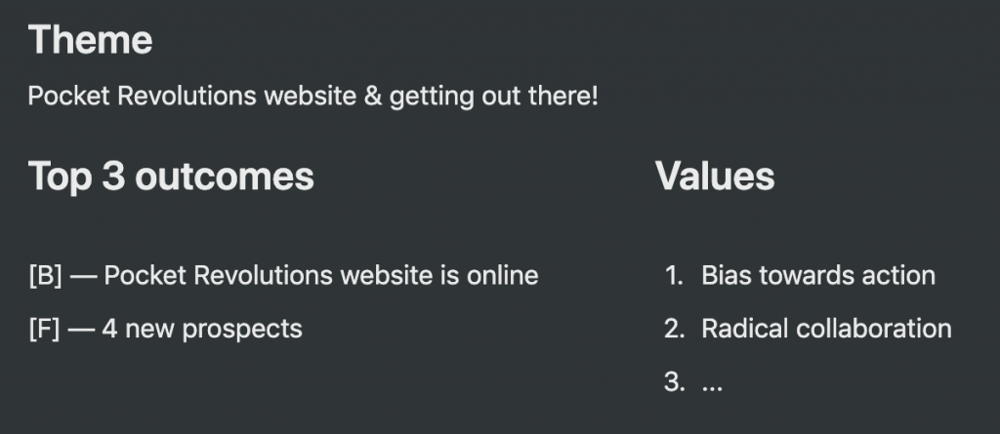
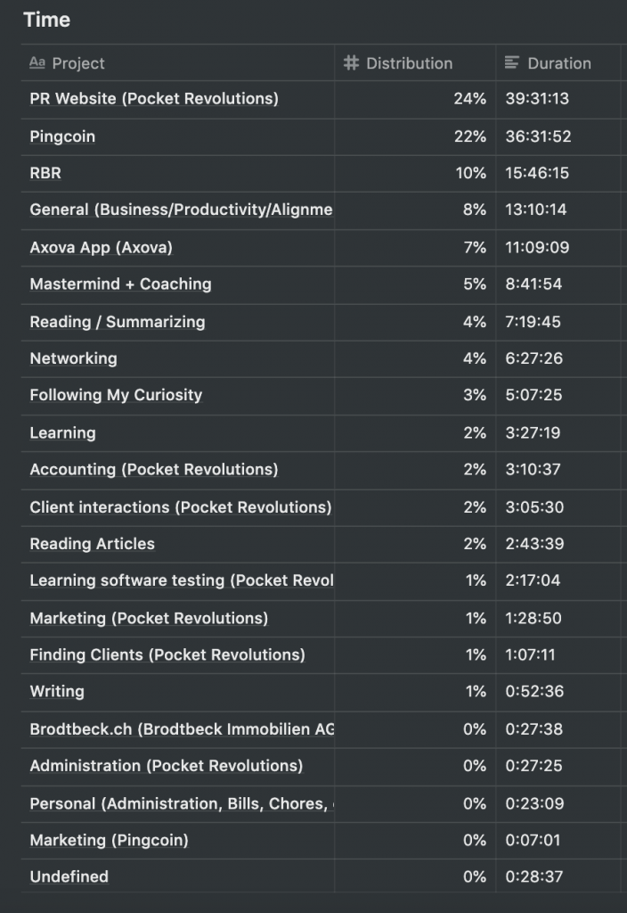
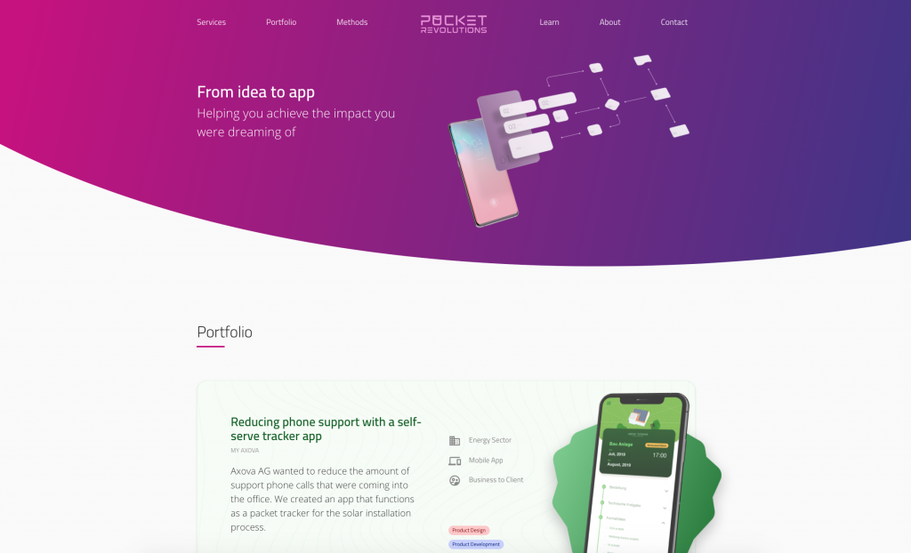
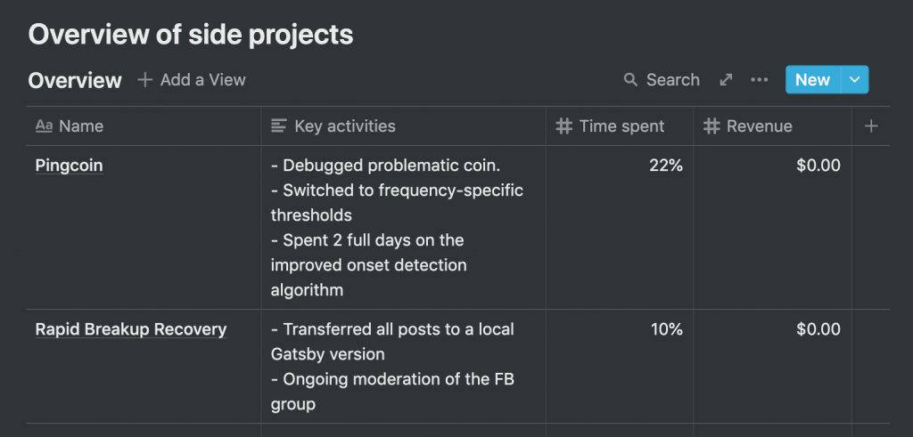
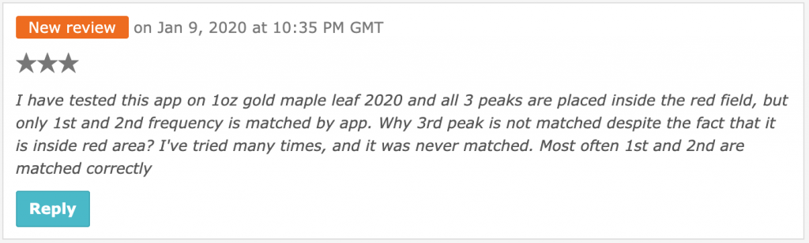
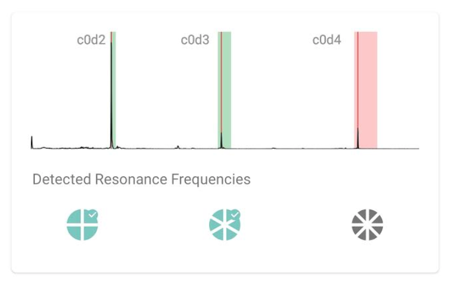
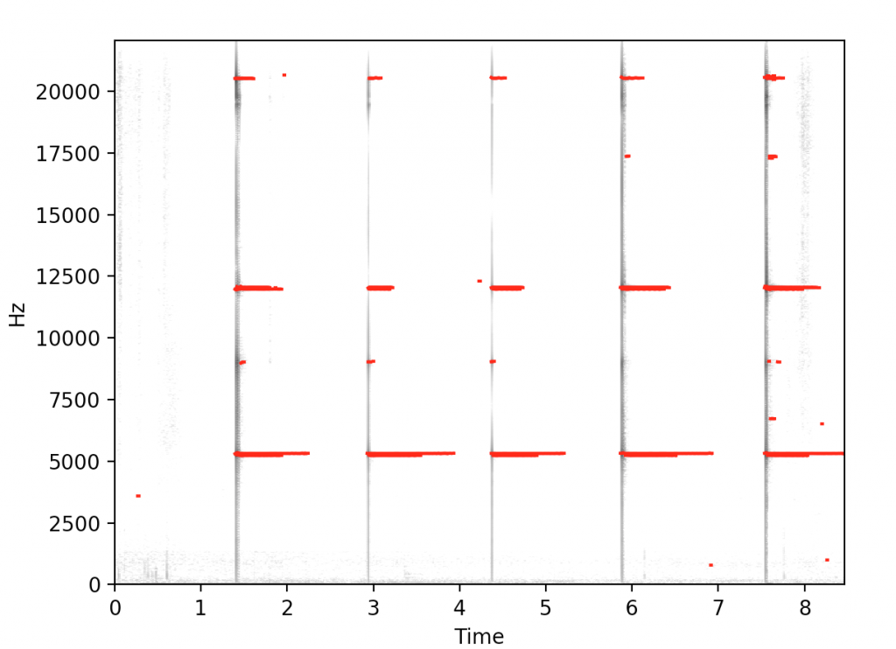
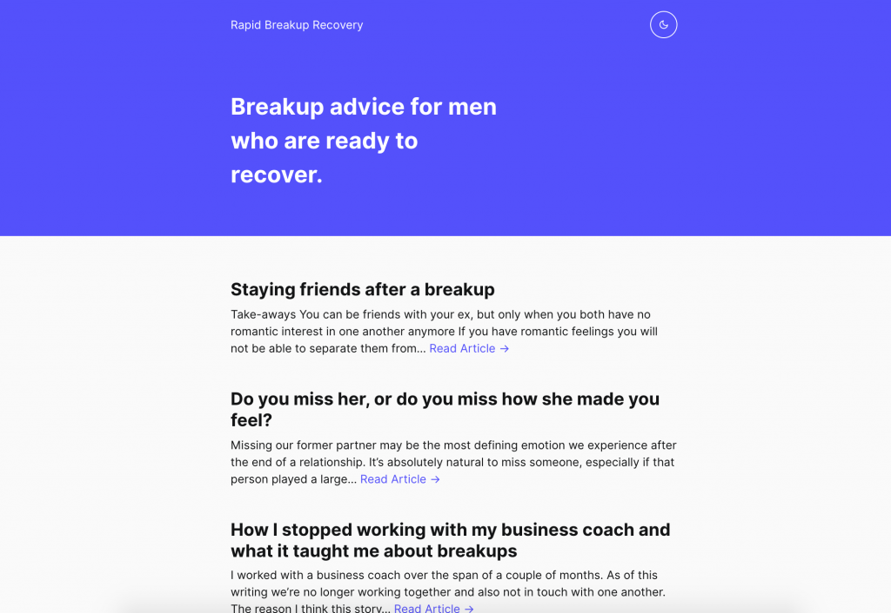

#### What is this and what am I trying to achieve here?

_My goal is to build and run 1+ successful online (software) businesses. Until one of my side-projects is able to support me financially, I have decided to do product design & development consulting as a boutique agency (Pocket Revolutions) in Basel, Switzerland. These monthly retros cover my journey to success for my agency/consulting as well as for my side-projects._

## High-level overview

### Goals & Grades

_(Did I achieve my goals? If not, why not?)_

## 

My theme for January was "Pocket Revolutions website & getting out there!" by which I meant, I wanted to launch a first version of my agency's website as well as meeting new people to find new clients.

#### (Goal) Pocket Revolutions website is online – Grade: B

I'm proud to say the Pocket Revolutions website is now online. It runs on Gatsby and is hosted by Netlify. Having said that, it's a vastly stripped down version of what I had in mind. Keeping in the spirit of the lean startup (and cutting down my time to launch) I decided to publish a "skateboard" version of the website. I intend to periodically update it when I do get the chance. As a mastermind buddy of mine told me: "websites are always works in progress." I completed the objective, albeit with reduced a scope, and decided to grade it with a B.

#### (Goal) 4 new prospects – Grade: F

I found 0 new prospects in January and also did not follow through on the steps I set out at the beginning of the month. Although I reviewed this goal almost every day of the month, I completely forgot to review the sub-tasks I had come up with that would help me reach this goal. They were (1) Reaching out to 20 people on LinkedIn, (2) Reaching out to 10 people in my network and (3) Go to 8 meetups. Sadly this is a theme throughout my retros: I set goals that I don't end up achieving, largely because (I believe) the steps towards achievement are largely unclear to me (e.g. What? Find 10 new clients, How? Undefined). The recurrence of this pattern this month led me to seeing for the first time a form of procrastination I was participating in of which I had no previous awareness. More on that below. Because I failed to find even one new prospect my grade here is an F.

### Check-in With Yearly goals

_Am I on track to achieve my yearly goals? If not, why not?_

_(Note that these are draft versions of my yearly goals. As of this writing I haven't yet completed my 2019 yearly retrospective or my yearly plan for 2020.)_

- **200k revenue with Pocket Revolutions – Not on track**

To get 200k in revenue I envision I would need to secure something like one or two $50,000 projects and one or two $100,000 projects. Currently I'm still working on generating prospects so a new project seems far away (but who knows :))

- **24 blog posts – Not on track**

To reach 24 blog posts at the end of the year I need to publish an average of 2 blogposts per month. I haven't published any yet, so I'm already a bit behind here. This retro will be my first post of the year.

- **Get involved with 5 apps – On track**

To achieve an involvement in 5 apps I need to get involved with 1 new app every 2.4 months. Being only one month into 2020 I'm still on track with this goal.

### Time distribution

## My main gig (Pocket Revolutions, a product design & development agency)

### In-depth update

#### Launched v1 of the Pocket Revolutions website

I launched the first version of the [Pocket Revolutions website](http://pocketrevolutions.com). It's only one page, it's bare bones, but it contains the most important elements of an agency website.

#### Featured on the Help'n'Trade podcast

After visiting a local entrepreneur meetup I was asked to come on a podcast called Help'n'Trade which is connected to the similarly named platform. The platform aims to facilitate the barter (trading) of skills between individuals, thereby creating easier pathways to entrepreneurship. I've never been on a podcast before so it was exciting to take part in. You can listen to the resulting interview below. We ended up talking quite a bit about my counterfeit coin detection app, Pingcoin.

<iframe src="https://w.soundcloud.com/player/?url=https%3A//api.soundcloud.com/tracks/749487634&amp;color=%23ff5500&amp;auto_play=false&amp;hide_related=false&amp;show_comments=true&amp;show_user=true&amp;show_reposts=false&amp;show_teaser=true&amp;visual=true" width="100%" height="300" frameborder="no" scrolling="no"></iframe>

## My Side-Projects

### High-level overview

### In-depth Update: Pingcoin

#### Turning a 3-star review into a supporter

I got a new review on the Play Store for Pingcoin, a 3-star review. Unfortunately it seems that Android users have become accustomed to using the channel of Play Store reviews as means for reporting bugs. There's an option within Pingcoin to contact me directly via email, yet I get reviews like the following:

I promptly posted a reply, apologising for the inconvenience and encouraging the user to reach out to the pingcoin support email. I'm happy to say they reached out. I got to meet Tomasz, a young coin collector from Poland, and we were able to debug his issue via email.

The issue Tomasz was reporting was that the measured frequency peak seemed to fall within the allowed threshold, yet the verdict that was being displayed was negative. He was kind enough to supply a screenshot. As you can see below it seems that for the 3rd frequency the frequency should have been detected.

It turns out Tomasz helped me uncover two issues with Pingcoin. For each coin I maintain an internal threshold for each frequency. If the frequency measured by the user's device falls within the threshold, the corresponding frequency's tolerance bar (initially red) will turn green.

The width of the tolerance bars is supposed to coincide with the width of the tolerance. Apparently this wasn't quite the case. They seem to have been displaying slightly wider than they should. This is what was causing problems on Tomasz' end.

His coin's 3rd frequency fell *outside* my tolerance for the 3rd frequency, but, because the tolerance bars were drawn wider than they should, it *appeared inside*.

Why did his coin fall outside the threshold? This depends on the coin recordings the app uses for its predictions. Small changes in the coin's minting process can produce small deviations in the frequencies.If it hasn't "seen" any coins from 2020 and a user pings such a coin, it might fall outside the threshold. In Tomasz' case, however, this wasn't what was going on.

On doing some investigation I could see that Tomasz' coin actually fell within the app's threshold for that specific coin, *had the thresholds been set correctly*. I discovered this wasn't the case for this coin. Luckily it was an easy fix.

The other thing I needed to fix was the fact that the threshold's visual width did not map onto its actual width behind the scene. This too was easily fixed.

I promptly fixed both issues and got back to Tomasz and invited him to join the beta program. He agreed and deleted his previous review. He had this to say in response to testing the fixes on the Beta track:

#### Prototyping in Python

The biggest issue with the Pingcoin app right now is the fact that it too easily picks up spurious sounds, rather than only being activated by the sound of a coin. This problem is more pronounced on some devices than other, but it's an issue across the board.

Although it would seem relatively trivial to come up with a simple algorithm which is able to detect the onset of a coin's ping (this is called onset detection in the literature), every attempt I've made has only led to marginal improvements.

Part of the challenge is that the environment in which I was coming up with new onset detection algorithms was inside the Android code base itself. This is a problem where I want to easily plot information to get feedback on what the algorithm is doing, to easily swap in different approaches and to set up a robust cross-validation pipeline. Android and Java did not seem like the correct environment for this type of prototyping activity.

As such, I had the long-standing idea of creating this environment in Python, where many of the requirements I have are more easily met. With the caveat that it would require a lot of upfront work to set it up.

I'm happy to say that by devoting slightly over two days to this task, I now have an environment set up where I can easily load up coin recordings, plot their spectrograms and swap in onset detection algorithms. A result of one such algorithm can be seen below. Spread out across the y-axis you see vertical lines corresponding to coin strikes with the sustained "pinggg" sounds as horizontal lines starting at each strike. The red lines are the ping sounds that are extracted by the algorithm I'm using. Setting up cross-validation is the next step.

### In-depth Update: Rapid Breakup Recovery

#### Moving to Gatsby

I transferred all of my Wordpress posts from rapidbreakuprecovery.com to a local Gatsby installation. I am tired of feeling restricted by the needless complexity of Wordpress development and maintaining a Wordpress site under source control. I'm familiar now with javascript and the node ecosystem, so Gatsby sounds like it will offer easier maintenance, easier customizability and also a cheaper hosting bill (if any!) Although there are ways to automate the migration process I opted to do it manually as the amount of posts I have is limited.

There are some tweaks that still need to be made to the theme, but after that I will be ready to launch a new version of Rapid Breakup Recovery. A version I will hopefully be able to iterate on more quickly.

## Insights

#### I discovered I procrastinate with worthwhile tasks

I achieved my objective of getting the Pocket Revolutions website online, but I had to strip down the scope. I failed to achieve my second objective of finding 4 new prospects. When I look at my time expenditure (to find out the cause for this), one thing jumps out at me: I did not spend much time on prospecting activities (e.g. Networking 5%). When you don't put in the time to find clients, you probably won't find any (duh). Why didn't I spend more time networking though? We'll get to that later.

The plurality of my time went to development of the Pocket Revolutions website and is in line with my expectations. What is surprising, however, is that I spent 22% of my time on my side-projects Pingcoin and 10% on RBR, _even though neither was represented in my monthly goals_.

As I will detail in the side-projects section, my time spent in these side-projects was well spent, and upon first analysis I don't regret spending it the way I did. What I do feel funny about is not being able to foresee this expenditure to begin with. Why, for instance, did I decide to spend time porting the RBR site to Gatsby this month? I'm not sure I have a good answer to that question other than that it seemed a good idea at the time (yet somehow not good enough to surface during my monthly planning).

To some extent what I'm doing here reflecting on my results and time entires feels like an exercise in analyzing hours logged by someone else. I don't remember what I was thinking at the time of clocking these hours, nor do I remember precisely what I was thinking when I made a forecast at the beginning of the month.

This strikes me as a potential area of improvement. It would take minimal effort to write a short argumentation for my forecast as well as an argumentation for any deviation thereof. I could then include those in my retrospective and perhaps achieve more focus on my monthly objectives or gain more insight into the reasons for my deviations.

What feels like a red flag here is the realization that I have two conflicting beliefs. On the one hand I believe the initial objective is reasonable and worthwhile (i.e. get 4 new prospects), _but I also believe the same about the unrelated work I ended up doing_ (i.e. port the RBR website to Gatsby). Critically, if I had to choose between the achievement of 4 new prospects (the initial goal) or the porting of the RBR website (what got done), it's obvious – I would choose the 4 new prospects (the initial goal).

The moment I wrote the above paragraph it dawned on me that something was wrong. I was saying I was happy with how I spent my time, yet if I could choose between spending it the way I did, or spending it the way I intended, I would _clearly and overwhelmingly_ choose to spend it the way I intended.

It seems I've identified a form of procrastination I participate which was completely invisible to me before: I avoid a planned task that is valuable and urgent by working on an unplanned task that is also valuable, but slightly less urgent.

The problem with the word "procrastination" is that I associate it with being lazy and/or avoiding something unpleasant. I don't see myself as someone that does that. Hardly ever. Besides, on the face of it, there's nothing about finding 4 new prospects that seems unpleasant to me. This led me to suspect there was more going on below the surface. I have some suspicions why I might have avoided this task unwittingly.

For one, although the objective is clear (find 4 new prospects), how I'm supposed to get there definitely is not. As I mentioned above, I forgot I had identified some sub-objectives to complete. When I include the sub-objectives, the goal of finding 4 new prospects feels somewhat clear and surmountable – without them, it's completely blurry. Not _difficult_, mind you. It doesn't _feel difficult_. Perhaps if I were to take a deeper look at it, the difficult aspects of it would emerge. On the face of it, however, it simply seems uninteresting, inexact, unimportant even – but not difficult.

Secondly, the reason procrastination never came to mind for me was that I wasn't avoiding work. I was _doing_ work and I was doing important, useful work. Every time I looked back at what I did, I could justify the time I spent, even if I deviated from the tasks I had set out to do.

A quote from Richard Feynman comes to mind:

> The first principle is that you must not fool yourself and you are the easiest person to fool.

In this case I was fooling myself. I've been avoiding doing the tasks that are most valuable and most urgent in exchange for doing tasks that are also valuable but less urgent. The question that uncovered this self-deception was: "Would I choose this result if I could choose between it and the objective I had originally set?" The answer to that question was a clear no.

## What I learnt

- I discovered that I procrastinate by doing things that feel worthwhile both in the moment as well as after the fact – except when compared to the original task I set out to do
- You can convert a bad review into a supporting user
- The Pingcoin codebase probably needs some love
