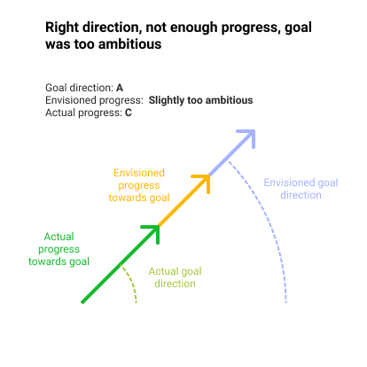
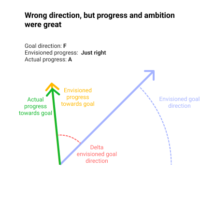
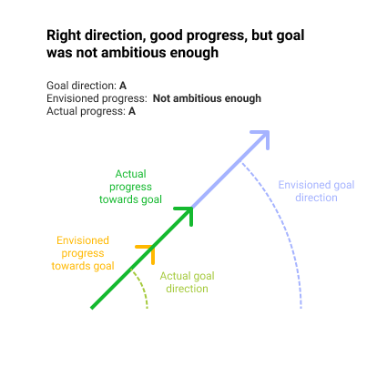

As with any aspect of a routine you keep executing on, you also keep iterating on the implementation details. I started off reviewing my goals by simply looking at whether I completed them or not. This was amounted to a binary analysis of my progress. Did I complete the task, yes or no? Any nuance or important context would be lost.

The binary analysis reflected how I was working with my goals. I would set them, have them show up as tasks in notion (now Roam), and I would tick them off when (or if) I completed them, at which point they would disappear from my list. The task was either pending or gone.

This works fairly well when you're trying to keep track of what you set out to do, and how far you've come along. It's not a very good system to reflect on what got done, and where you can improve.

I was inspired by Cory Zue's retrospectives where he gives each goal a grade. This gives a much needed nuance – shades of grey if you will – to the simple binary method.

Perhaps you've done a lot of work towards a goal and you're really happy with your progress, but you haven't completed it per se. Such a case would show up as incomplete in the binary method, even though the outcome is quite positive. You can more accurately reflect this positive result by giving the goal a grade – a positive one in this case (e.g. A).

I like how grades give the goals more nuance without making it overly complicated. At risk of doing just that (adding more complexity), I've started experimenting with a 3-dimensional grading mechanism.

Although I value the simplicity and the added nuance, I was still facing difficulties grading my goals. To be more specific I was encountering the following problems:

**Problem 1**: I would set a goal and realize mid-month that it was the wrong goal to set in relation to my longer-term objectives. If I were to complete it anyway, is this an A because I completed it, or an F because it was the wrong goal?

**Problem 2:** I would set a goal and still be happy with it mid-month (e.g. it's the right direction in the grand scheme of things) but I simply underestimated how much work was involved. If I only got 1% done, but that's a good effort, is that an A for effort or perhaps more like a D for results?

One solution, in my mind at least, involved seeing this as a vector (or 2 vectors to be more precise). A vector is defined by a direction and a magnitude.

In the case of a goal, the direction is the direction of your goal. You can set a goal which is in service of your overarching goals. In this case both will have he same direction.

Then there's the magnitude. If you set an ambitious goal, it would have a large magnitude, an easy goal a small one. You can map your actual progress along this same vector.

As with any solution, it's important to connect it back to the problem is purports to solve. In this case the problem is the following:

#### Problem definition

I want to achieve my long-term goals (e.g. yearly), in order to do that I want to keep track of my progress towards my intermediate goals (e.g. monthly, weekly) and periodically reflect on whether I can improve my approach. Keeping track of completed / not completed goals does not give me any insight beyond whether the goal was completed. Grading my goals adds some important nuance (e.g. 90% completion would be an A, rather than "not completed"). Grading still falls short in two important areas: goals might be set in the wrong direction and goals might be set too ambitiously (or naively).

#### Solution: Goal vectors

Goal vectors is an attempt to solve that with grading the goal direction, the  goal's magnitude (estimation of progress) and the actual progress that was achieved.

This leads to some different scenarios explained in the figures below:

In the above case we set a goal (yellow) which is perfectly in line with our long-term goals (blue). The only problem is that we haven't achieved as much progress (green) as we had hoped. The lesson here would be to set a slightly less ambitious goal.

In the above case we've achieved just as much progress (green) as we had hoped (yellow), but the goal turned out to be the wrong one. It's not in line with our long term goals (blue). The lesson here would be to more carefully consider our overarching goals.

In above case we've set a goal which is in line with our long-term goals, but it looks like it was much too easy. The progress we've achieved is greater than what we estimated. The lesson here would be to set more ambitious goals.

---

The above is just an idea I'm going to experiment with. Perhaps it's too complicated to work in practice, but it's where I've caught my mind repeatedly going to.
