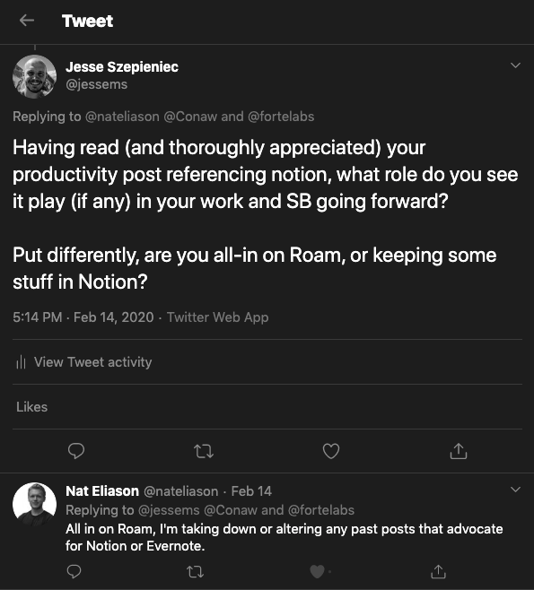

#### What is this and what am I trying to achieve here?

_My goal is to build and run 1+ successful online (software) businesses. Until one of my side-projects is able to support me financially, I have decided to do product design & development consulting as a boutique agency (Pocket Revolutions) in Basel, Switzerland. These monthly retros cover my journey to success for my agency/consulting as well as for my side-projects._

## High-level overview

### Goals & grades

(Did I achieve my goals? If not, why not?)

(I'm experimenting with a different way of grading my goals. See a short elaboration [here](https://jessems.com/grading-goals-with-vectors/).)

#### Goal: PR website is client-ready

Status: **Started** Grade for goal direction: **F** Grade for estimated progress towards goal: **Too ambitious** Grade for actual progress towards goal: **B**

[Last month](https://jessems.com/my-january-2020-retrospective/) I was happy to report the launch of v1 of the Pocket Revolutions website, believing it would be enough to shift my focus towards lead generation. Based on some initial feedback I've received I had to conclude it wasn't entirely client-ready. Mainly due to some cosmetic glitches I had ignored and the lack of any real content.

I spent the first portion of the month trying to resolve this. I was hoping to finish my intended improvements while leaving enough time to finish implementing tests for the Axova app. Unfortunately I wasn't able to finish either.

With hindsight, I should have worked on the Axova app first, until it was finished as I had verbally committed to finishing it by the end of February. I had to call my client and tell him this wasn't the case. This was quite painful.

This is a case where the goal I set (make the PR website client ready) was the wrong goal to set. (This happens quite often and is the reason why I've moved away from simple goal grades. More info [here](https://jessems.com/grading-goals-with-vectors/).) With hindsight, it seems clear that my time should have gone towards finishing the app first, and the PR website second. For this reason I grade the goal direction with an F (although I'm pleased with my progress there (B)).

#### Goal: Reach out to my network

Status: **Started** Grade for goal direction: **B** Grade for estimated progress towards goal: **Too ambitious** Grade for actual progress towards goal: **D**

I reached out to some individuals. When I set these goals, I was feeling okay with the state of the Pocket Revolutions website. But some feedback I received during the month made me believe it was perhaps _too_ minimal. So mid-month I adjusted my goals to include a slight expansion of the website. This caused the whole topic to take longer, and not get finished.

### Check-in with yearly goals

_(Note that these are draft versions of my yearly goals. As of this writing I haven’t yet completed my 2019 yearly retrospective or my yearly plan for 2020.)_

- **200k revenue with Pocket Revolutions – Not on track**
  - Hard to say if I'm behind or on track at this point. My feeling is that the website needs to be client-ready (which it almost is) and I need to adequately display my first project on there (which is almost done) before I can shift my focus fully on to lead generation.
- **24 blog posts – On track**
  - 24 is an admittedly low figure considering I publish a monthly retrospective which I'm counting, but I've been burnt in the past with overly ambitious goals, so I'm aiming for 1 retro + 1 post per month. I've [published](https://jessems.com/grading-goals-with-vectors/) a short post on goal grading this month and I've got another idea sizzling in the background – so I believe I'm on track.
- **Get involved with 5 apps – Not on track**
  - Achievement towards this goal will likely go hand in hand with the revenue goal. New projects would be new apps and new projects would also lead to more revenue.

### Time distribution

## My main gig (design & development agency Pocket Revolutions)

### In-depth update

#### Adding a case study section to the website

Last month I thought I had put together an MVP for my agency website (it being a one page website), but after some feedback from peers and friends I came to the conclusion that perhaps it was \*too\* minimal.

I decided to spend some time designing and implementing the pages for individual case studies where I plan to showcase the work I've done for clients. I only managed to do (most of) the designing part this month, as I switched back the focus to my first client's app (more on that later).

Here's a screenshot of the design so far.

#### Business cards

One of the things I've held back on was ordering business cards. It seemed like one of those conventional things you do when you start a business that doesn't really do much besides make you feel good (along with spending too much time on the logo + name (which I also did by the way)).

Having no business cards started to feel silly, however, when I started visiting local meetups. After getting asked for my business card multiple times, and having received many others, I decided to bite the bullet and order them.

I thought I'd be able to ask the design agency I work with to design some business cards and print them within a week or two. With the back and forth it took much longer (6 weeks I believe). In the end I'm also not 100% happy with them – but I needed something sooner rather than later, to give out.

Also, it looks like something went wrong in the design or paper-cutting process, because the logo is not aligned. Ah well, better next time!

#### Learning javascript testing and Angular testing with Ionic

The main thrust for this month was implementing tests for my first client's app. I had never written tests before.

That's right 0 tests written.

My coin testing app Pingcoin is completely test-free. But the more I learnt about coding, the more it seemed like the right thing to do. I became particularly convinced after reading Extreme Programming Explained by Kent Beck.

I purchased Kent C. Dodds Testing Javascript course collection on the company credit card and decided to dive in. The course is okay, although it goes over some important basics and helped lay my foundations, it left out some critical topics for me. One was "what should you test?" and the other was "how do you test Angular / Ionic?".

The former I was able to find some good resources on online. [One blog post from Kent himself](https://kentcdodds.com/blog/how-to-know-what-to-test/) is particularly good on this topic.

With regards to Angular / Ionic, there's not much of an answer – anywhere. Angular was allegedly architected in a way to make testing easy. I can see how that's the case. For a basic Angular app, testing is straightforward. The only qualifier I would add is that it quickly becomes more complicated when you've got a handful of dependencies being injected.

Where it gets out of hand is with the combination with Ionic. There is little to no documentation on testing Ionic, very few blog posts written on the topic and many dead ends in the official support forums. [Here's an example](https://forum.ionicframework.com/t/cannot-unit-test-click-event-nativeelement-is-not-updating/139760) of a community post about an issue I also ran into: there seems to be a bug with triggering click evens on ionic elements.

The Angular architects seem to have had testing in mind when designing the platform, the Ionic architects unfortunately seem to have treated it as an afterthought.

The result has been that it's taken a reasonable amount of time to get up to speed with testing in javascript and testing in Angular specifically, but an unreasonable amount of time to get up to speed with testing in Ionic.

## My side projects

### In-depth update: Pingcoin

I'm happy to say that due to my focus on my main gig this month, I spent almost no time on Pingcoin. I received one 4-star review in the mean time, someone requesting I add a particular coin. Which, again, leads me to the conclusion that it needs to be easier to send me feedback through the app, because having your customers use your Play store reviews sections as a support desk is a nightmare!

### In-depth update: Rapid Breakup Recovery

I recorded a new podcast with a long-term member of our Facebook community. I wanted to focus solely on the PR website and my first client's app, but this was a commitment I had made the month prior. You can listen to it here: [https://www.buzzsprout.com/279895/2892901-02-finding-your-self-worth-with-gus](https://www.buzzsprout.com/279895/2892901-02-finding-your-self-worth-with-gus)

## Commentary

#### Roam

After reading Nat Eliason tweets about Roam (specifically his reply to mine stating he's going all-in) and watching [a video of him pulling together an article](https://www.youtube.com/watch?v=RvWic15iXjk), I became intrigued by this new knowledge management application.

Since then I've not only experimented with it, I've also gone all in with it.

With Roam I believe the founders have stumbled on something like a new interaction paradigm. Sort of like what Workflowy did with their project, but taking a much bigger leap than they did.

If you imagine the notes you make as your attempt at creating an external brain. Roam is both an update to the interface with that brain as it is that brain itself.

There are some core ideas at play that make it so interesting, and I plan to write a blog post about this as well this month.

One idea is that every unit of text is styled is treated as an entity (like blocks in Nothion). It is styled with a bullet point similar to Workflowy.

Unlimited indentations of child blocks can live underneath a parent block. Any block can be uniquely referenced or embedded into other blocks.

Within each block you can effortless label something with a #Tag

Once you do, your tag will become a hyperlink to a page dedicated to this tag. On this page you will find references to all other blocks mentioning that tag (if any). If it's the first of its type, there will only be the reference you just created.

There is no top-down structure. This promotes a dynamic where the structure of your notes comes from the bottom-up through tags and the bi-directional links they create.

This sounds to me much more like the brain works and would help explain why it feels like using a high bandwidth neural connection to your brain.

I'm very excited about Roam and expect to use it heavily in the near future.

#### Follow up on my battle with procrastination

After discovering last month ([to my complete surprise](https://jessems.com/my-january-2020-retrospective/)) that I am a frequent procrastinator, I became very interested in the topic. I've cracked open a book on the topic (which has helped open my eyes even further), I've become more aware of my behavior and I'm trying to make more conscious, long-term decisions.

My task for this month was to focus on the website (which I would later regret) and then focus on finishing my first client's app. It wouldn't take long for this ideal scenario to fall apart. Before discovering that I am a procrastinator, I had made a commitment to record a podcast episode for one of my side-projects, RBR. As fate would have it, my interviewee confirmed our appointment at the beginning of the month and I felt like I had no way out. I hadn't recorded a podcast episode in a while, so I could be sure to expect a significant time investment in re-familiarizing myself with podcast editing and the editing itself.

The recording + editing took me 6.5 hours, and I'm still not completely finished.

**Lesson learnt**: Be very, very careful with the commitments that you make.

#### Pomodoro

In my quest to get a handle on procrastination I came across all standard recommendations: Get rid of distractions, write your todo list the day before, and – yes – the pomodoro method.

This silly sounding method, allegedly based on some Italian guy in the 1980s is based on just a few simple concepts.

1. When you start your work you set a timer for 25 minutes.
2. After 25 minutes you take a 5 minute break.
3. After 4 sessions of 25 minutes you take a longer 15 – 30 minute break.

That's it.

I had come across the method before but I had dismissed it out of hand. Why? Because it sounded like it was designed for people that had trouble focusing for 25 minutes. That was never my problem.

Now that I've tried it, I've come to a different conclusion.

Perhaps it helps people focus that otherwise have trouble focusing. That's not what it does for me though.

What I feel it helps me do is turn my intellectual activities from a collection of full out sprints, into a better-managed marathon run. The forced breaks after 25 minutes, almost invariably come too soon – or so it feels. But probably thanks to them coming so soon, I rarely find it hard to complete a 25 minute stretch. As a result, I almost never find myself gassed out or brain foggy.

I also make sure that during the 5 minutes I don't do anything besides making tea, drinking tea and looking out of the window (or going for a walk on my bigger breaks).

I suspect that stopping before your willpower is completely depleted, and sticking to a timeboxed short break in which you do nothing interesting, drastically reduces the odds of finding a reason to procrastinate.

I will write a post about this this month.

## What I learnt

- Writing tests is not a big deal and it's rewarding work. Writing tests in Angular can get a little complicated. Writing tests for Ionic is a pain in the ass.
- Pomodoro seems to be working for me, not as a way to focus for 25 minutes, but to ensure I don't get distracted in between working sessions (and possibly also during).
- Note to self: Be extra careful with commitments you make.
