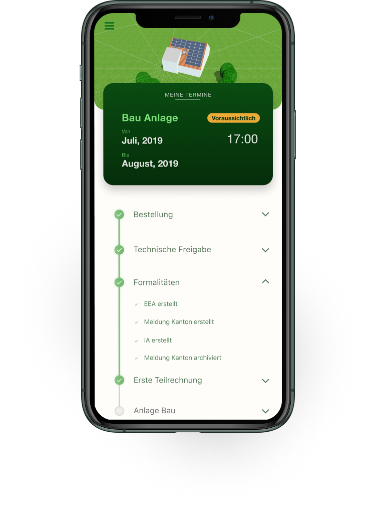

As readers of this blog will know, my goal is to build one or more successful software companies.

I didn't (and still don't) have the financial cushion to spend most of my productive time figuring out how to do that just yet. So my strategy has been to first establish a somewhat stable income.

Unfulfilled by my previous stints as an employee and unable to support myself with my side-projects, I was looking for ways to do contracting work.

I assumed (and still do) that you're most likely going to find work as a freelancer/contractor when you focus on what you're good at.

My experience and my skills were in the product management domain and it wasn't clear to me how I was going to find clients doing that. Although useful skills to have, product management as a role isn't typically something that gets outsourced.

This is one of several influences that led me to consider whether to reposition myself or re-educate myself.

At the same time I was growing frustrated with my lack of ability to create stuff ([especially quickly](https://jessems.com/24-hour-startup-challenge-retrospective/)). As a product manager having worked with many developers, I had always been in awe of the things they were able to create.

This led to me playing with the idea of diving deeper into software development.

I mentioned my tentative desire to do more programming to a friend of my girlfriend's who responded by telling me he wanted my help to build an app. I agreed. There was only one problem. At the time, I was in between legal residences and I was unable to charge him as a non-resident freelancer in Switzerland.

One thing led to another and this friend ended up funding a Swiss business entity for me so I could help him bring this app into being.

With a Swiss business entity and a first client I was off to the races. I decided to say embrace this opportunity in the biggest way I knew how and decided to establish myself not just as a coder for hire, but as an agency.

I didn't know what kind of agency at first, but when my second project turned out to be another mobile app, and considering my side-project Pingcoin is an app, it made sense to position myself as an app agency.

This is what led to the name [Pocket Revolutions](http://pocketrevolutions.com) (technological revolutions in your pocket).

While the first project lost momentum, the second project kept moving along. My client for the second project, Axova AG, a Swiss solar panel installation service provider had two goals in mind when they conceived of the app.

Firstly, they wanted to reduce the amount of customer support their customers seemed to require of them. This seemed do-able, since most of the customer's questions were answered by quick look-ups in their internal CRM. Information, in other words, that could easily be passed on to their clients in an automatic or self-serve way.

Secondly, they wanted to produce an app that would help them differentiate themselves from their competition. I've been told it's hard to distinguish yourself as a solar panel installation service company, so a more innovative company image could convince potential clients to work with Axova.

After diving deep into the problem space, the concept I came up with is analogous to a package tracker. It's a one screen app where you can, at a glance, view what steps in the solar panel installation process have been completed and what's left. Additionally, any upcoming appointments are prominently displayed on the home screen.

\[caption id="attachment_436" align="alignnone" width="743"\] The one-screen Axova status tracker\[/caption\]

As I was working on this project, I was thinking about the next steps for my agency and how to get my next client.

Several things were clear in my mind.

### I needed a way to differentiate myself

If I were to position myself as an app agency, and nothing else, I would be competing with other app agencies. I have a relatively short track record in both development and design and putting myself in the same category as agencies with people dedicated to those domains seemed like a bad idea. I knew I would need to differentiate myself.

### Niching down made sense

I also knew that niching down would probably be the best way to differentiate myself. Jonathan Stark, who makes a living teaching software developers how to charge more and structure their consulting businesses also likes to tell his readers and listeners that niching down is important. He talks about two strategies, niching down vertically (e.g. I'm an expert in technology X) and niching down horizontally (e.g. I do a wide range of work, but only within industry Y).

I considered niching down vertically, e.g. approaching other companies in the solar/energy sector. I also considered niching down horizontally, e.g. specializing in digital transformations, or more commonly known as digitalization here in German-speaking Switzerland (German speakers have strange habit of incorporating English-sounding words into their language, see also "Handy")

One way I was reflecting on my skillset was that I could take a deep dive into a business, understand their processes and workflows and help them make things more efficient by leveraging software. This is how I was interpreting digitalization. Unfortunately there seems to have been so much hype around this word in the German speaking world, that I have found it to have become almost meaningless.

There are many consultants that thrive in an environment of hype and meaningless words, but I don't like it at all. So, positioning myself as anything to do with "digitalization" didn't sit well with me (although helping companies better leverage technology did make a lot of sense).

Another aspect I was drawn to within the topic of digitalization was that I believed it might be also be ticket to a very interesting conversation. Talking to businesses about their problems (to be solved at an hourly rate) would also put me in a position where I'm hearing a lot of business problems. This might surface ideas for a SaaS business (my main goal, remember?)

Not sure what to do, I ended up half-heartedly committing to digitalization. Verbalizing "digitalization" made me sick to my stomach, but on paper it seemed like a good idea.

This changed on a recent mastermind call I had. On this particular call our mastermind facilitator [Paul Colaianni](https://theoverwhelmedbrain.com/authors/paul-colaianni/) had invited a guest. His name is [Jeff J. Hunter](https://jeffjhunter.com/) and he's an expert at LinkedIn marketing.

On the call Jeff gave me feedback on my business and encouraged me to think in terms of: what other industries could use what I had built? Thinking in this way would allow me to leverage what I had built in the past.

Jeff suggested that I could do the same thing I had done for the solar panel installation company for _any_ service provider. He mentioned the example of landscapers and how he would sometimes get caught off guard by his landscaper coming to work in his garden, disrupting his conference call with the sound of his mowing machine.

What he was saying was that he would have loved to have known exactly when his landscaper was going to come by. A very similar problem to what my solar panel installation tracker was solving.

This led me to start googling to see if I could figure out if this was a "thing". "Is there a company providing services in this space?" I asked myself. I didn't find much (which is good news!), but [this article](https://www.nngroup.com/articles/status-tracker-progress-update/) by the Nielsen and Norman group stood out.

A status tracker, according to NN, is: "an online or app-based feature for tracking the progress of the delivery of a product or service." They differentiate this from what they call "progress updates" which are "notifications sent by the company or service provider when the status of the delivery has changed — such as when an item has shipped or a decision on an application has been made.

Both provide information about the status of a delivery but the status tracker information gets _pulled_ by the user and the progress updates get _pushed_ to the user. They advise companies offering one to also offer the other.

Coming across the article by NN group, having them define the terms I was intuiting and having them say: "Status trackers and progress updates are so prevalent now, that users expect them." transformed my thinking. It helped crystallize in my mind the idea that I could focus on providing services around developing status trackers. I could become a status tracker expert. I could approach other companies in Switzerland (but also beyond) by showing them what I've already done (the solar panel status tracker) as a case study.

This made a lot of sense. One way in particular that it made a lot of sense was that it seemed to satisfy my needs for a short-term and a long-term plan.

### Short-term

Firstly, I have a way to position myself, to differentiate myself and to specialize. I won't portray myself as product management consultant, an app developer or a digitalization consultant. Instead, I will say I make status trackers and progress update services. As evidenced by my client and what the NN/g is saying, there's a market for this.

### Medium-term

If I get more experience with building status trackers and progress update applications, I'll be building more and more re-usable component and compounding my experience. I can start to think about productizing the service.

### Long-term

The evolution of technology tends to go from custom-built to being commoditized. If we apply this lens to the custom status tracker I built, I suspect there might be possibilities for a fully automated e.g. SaaS solution as well. Imagine you're a landscaping agency and you sign up for my SaaS WhatTheStatus. You've got a no-code interface that allows you to connect the app to your company's CRM and configure the type of statuses you'd like to show your clients. You tell your clients to download the WhatTheStatus app and scan the QR code you send them, which gives them access to updates on the status of your landscaping work on their property.

Another benefit is that this is a multi-disciplinary challenge. There will be development work, design work, UX work etc. And that excites me. So this is it, this what I'll be focusing on for now. Until I obtain more information.

### Here is my strategy in brief

My short-term goal is to achieve financial stability.

I believe the best way to do that which is aligned with what I enjoy, what I'm good at and what the market wants is as an independent consultant.

To raise my profile I will niche down and specialize in developing status trackers and progress reports for medium-sized service providers.

I will continually invest in improving and automating my service offering. I believe this will allow me to productize my service (medium-term), and with time, it may allow me to automate it completely as a SaaS business (long-term).
