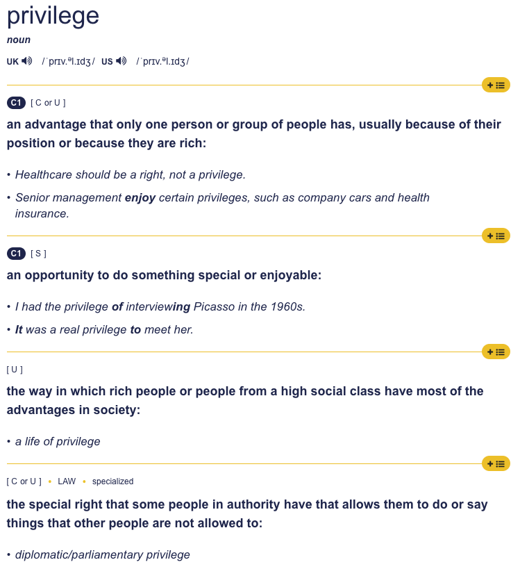

Paul Graham posted a new essay by the title '[Orthodox Privilege](http://paulgraham.com/orth.html)'.

In it he defines Orthodox Privilege as:

> The more conventional-minded someone is, the more it seems to them that it's safe for everyone to express their opinions.

This is an interesting observation, especially in the current climate, and especially because of the conclusion it leads to. Also from the same essay:

> If you believe there's nothing true that you can't say, then anyone who gets in trouble for something they say must deserve it.

What I found strange about Paul's essay, however, is his choice of the word 'privilege'. He starts the essay by saying:

> There has been a lot of talk about privilege lately. Although the concept is overused, there is something to it, and in particular to the idea that privilege makes you blind — that you can't see things that are visible to someone whose life is very different from yours.

It seems Paul wants to use the blindness aspect he ascribes to privilege to describe the blindness that a 'conventional-minded' person experiences towards certain thoughts non-conventional-minded people may have.

There are two problems with this.

_Firstly_, blindness is not part of any definition of privilege.

Even though Paul seems to think it is:

<blockquote class="twitter-tweet">
Privilege is more specific. It's a specific type of blindness afflicting those who've led a sheltered existence.
&mdash; Paul Graham (@paulg) <a href="https://twitter.com/paulg/status/1283434346196742145?ref_src=twsrc%5Etfw">July 15, 2020</a></blockquote> 

_Secondly_, we already have a word for describing 'blindness' in our thinking. It's called a cognitive bias.

What Paul is describing in his essay is not a privelege. It is a cognitive bias. It's probably close to [Groupthink](https://en.wikipedia.org/wiki/Groupthink), but because it involves a failure to empathize, I think it might be appropriate to call it an [Empathy Gap](https://en.wikipedia.org/wiki/Empathy_gap).

To describe who experience this cognitive bias which manifests as a failure to empathize, I believe it's helpful to borrow a term originally coined in Sweden: The [Opinion Corridor](https://en.wikipedia.org/wiki/Opinion_corridor) — A range of opinions delineated by the perceived high social costs associated with challenging them.

I believe what Paul is describing is a failure on part of the people with opinions within the Opinion Corridor to empathize with the people with opinions outside of it.

<blockquote class="twitter-tweet" data-conversation="none">
Maybe the definition of privilege has moved, but I cannot recognise or corroborate this definition.  What you're describing sounds like a bias — an empathy gap experienced by people within an Opinion Corridor towards people outside of it.
&mdash; Jesse Szepieniec (@jessems) <a href="https://twitter.com/jessems/status/1285087174124277760?ref_src=twsrc%5Etfw">July 20, 2020</a></blockquote> 
