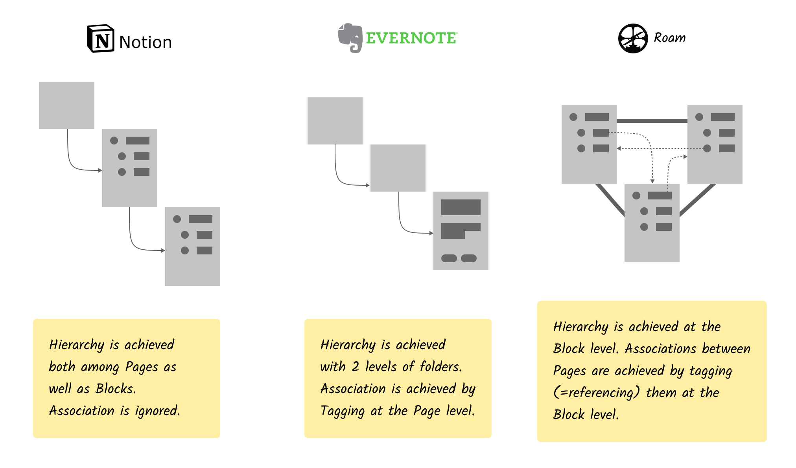
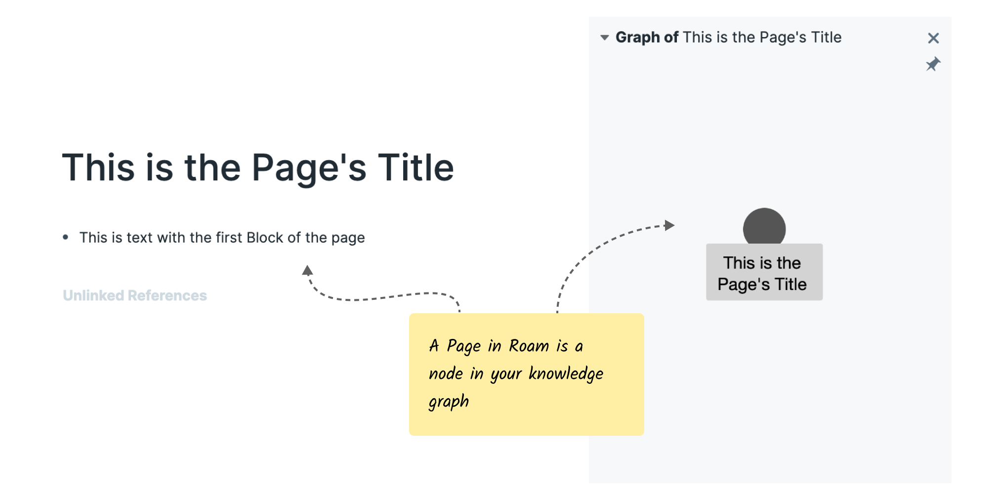
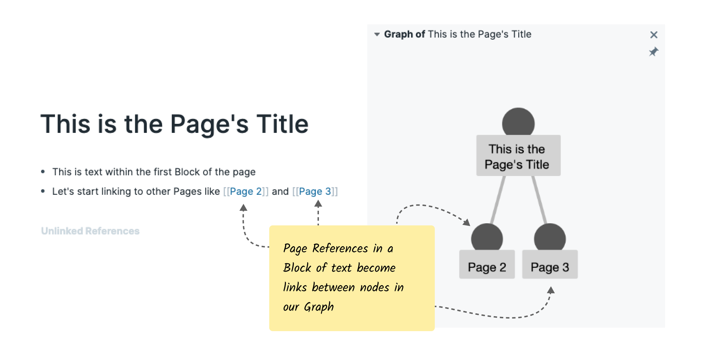
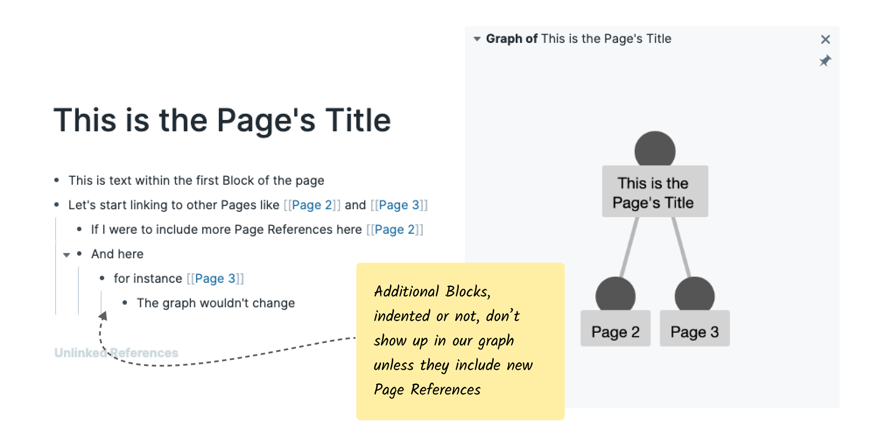

*([Roam Research](https://roamresearch.com) is a knowledge management tool that has taken a corner of the tech world by storm. It's not easy to use at first, but once you get a hang of the novel design patterns that it uses, it feels like you're using something which is aligned with how your brain works, as opposed to conventional, linear text editing. This is a weekly series where I cover Roam's UI patterns in-depth in order to understand what Roam is doing that accomplishes this feat. This week we take a closer look at Roam's concept of Pages and Blocks.)*

# Problem

Any repository of knowledge needs some structure in order for it to be useful.  Most knowledge management systems [^1] encourage you to choose a location for your note while or after creating it. On first pass this makes sense. It's how we would write and archive a physical note, and it's long been the dominant metaphor for working with computer files i.e. the file cabinet metaphor: storing a *file* in a *cabinet*. 

Some tools augment this ability of storing notes at specific locations with an ability to tag the note. Folders have hierarchy, tags do not. Notes can have one-to-many relationships with tags, whereas with folders you're limited to one-to-one relationships. As a result, using tags in addition to folders gives you some more flexibility in defining how entities relate to oneanother, but that flexibility quickly comes at a cost of things getting messy and unwieldy.

# Solution: Pages & Blocks

Roam makes its first design choice here. Where we’re used to tags being something we apply to a Page (i.e. a Note in Evernote), Roam makes no distinction between what we otherwise might haved referred to as a Page or a Tag. Pages and Tags are the same thing in Roam, and as we'll see later, this is both confusing and powerful.

In Roam, the text that comprises your notes lives inside Blocks (more on those later), and Blocks live inside Pages. Pages in Roam aren’t like "Notes" in Evernote or "Pages" in Notion, primarily because: *they have no location*. When you create a new Page in Roam, you're not asked to put it anywhere, because there's no concept of putting it anywhere. When you reference a Page, then that *reference* (which may look `[[Like This]]`) lives inside a Block, but the Page that is being referenced does not.

This creates a problem: 

How do you find something that isn't located anywhere? 

Roam gets around this problem by allowing Pages to be found through the references that exist pointing to it from within other Pages [^2].

These Pages, and the references between them, form a graph which tells you how your notes relate to one another. A Page without any references is a node in the graph without any connections to other nodes.

A Page can contain Blocks of text — units of text preceded by a bullet point. Together they are reminiscent of a bullet point list as seen in any conventional text editor. 

Although Pages themselves don’t have a location, they serve as locations for Blocks to live in. If a specific Block lives in Page A, that means it doesn't live in Page B, or anywhere else for that matter.

Blocks are atomic units of text in Roam. By atomic I mean that a Block cannot be divided into something smaller. The text within the block comes with a variety of super powers, which we'll get into in a later post.

For now the most important super power of the text within a Block is its ability to contain a Page Reference: a link to another Page. This is invoked by enclosing the Page name in double square brackets (`[[Like This]]`). 

Although these Page References are made at the Block level, they constitute links between Pages at the Page level, and as such, show up when we let Roam draw our graph [^3].

Where Pages were location-less and non-hierarchical, Blocks have both a location (i.e. the Page they live in) and a hierarchical relationship (in relation to other blocks). Hierarchy is achieved and manipulated by visually indenting one block under another. The indented Block becomes the child Block to the non-indented Block [^4]. Unless a new Page Reference is made, adding Block Indentations doesn't impact our graph.

For some readers this rendition of Blocks will sound reminiscent of Blocks in [Workflowy](https://workflowy.com) or in [Notion](https://notions.so), and up until this point, the parallels are indeed strong. 

So Pages are the nodes in our network, and Pages are composed of Blocks. Pages are location-less and non-hierarchical whereas Blocks have a location as well as  hierarchy. Blocks are the components that contain text, and the text can be used to create references between Pages [^5].

These are two of the most fundamental building blocks of Roam and as conceptual units they could hardly be more different. That being said, much of the power of Roam comes from having two classes of building blocks with perpendicular conceptual properties, and allowing them to build off of each other.

---

Thanks to [Alan Szepieniec](https://asz.ink/) for reviewing an early draft of this article.

[^1]: There's legitimate debate whether we should be calling Roam knowledge management software, note taking software, or something else entirely. I'm going to go with knowledge management software acknowledging that's not an exhaustive description.

[^2]: From within a Block in another Page to be exact.

[^3]: This also has important implications when we cover Linked References in a later post.

[^4]: A Block that is not indented will have the Page itself as parent.

[^5]: Blocks can also reference other Blocks, but I've left that out for simplicity's sake for now.