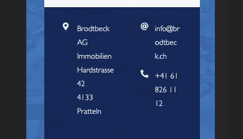

While I testing out the responsive behavior of a site I was building, I noticed that on very narrow viewports normal text was wrapping as expected (see the address on the left-hand side in the image below), but ahref links were not wrapping (see the email and telephone number on the right-hand side in the image below).


Searching on Google led me to the suggestion of using the `word-wrap` CSS property, like so:

```css
word-wrap: break-word;
```

This didn't work for me (on Brave/Chrome) however. But the following did [^1]:

```css
word-break: break-all;
```

Here's what the end result looks like:



[^1]: [https://stackoverflow.com/questions/7309115/break-huge-urls-so-they-dont-overflow](https://stackoverflow.com/questions/7309115/break-huge-urls-so-they-dont-overflow)