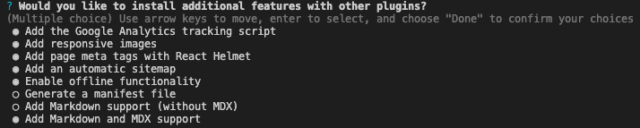

### Problem

When experimenting with a new install of Gatsby with MDX, I was running into the following issue:

```bash
error There was an error in your GraphQL query:

Field "featuredImage" must not have a selection since type "String" has no subfields.

This can happen if you e.g. accidentally added { } to the field "featuredImage". If you didn't expect "featuredImage" to be of type "String" make sure that your input source and/or plugin is correct.
However, if you expect "value" to exist, the field might be accessible in another subfield. Please try your query in GraphiQL and use the GraphiQL explorer to see which fields you can query and what shape they have.

It is recommended to explicitly type your GraphQL schema if you want to use optional fields. This way you don't have to add the mentioned
"dummy content". Visit our docs to learn how you can define the schema for "undefined":
https://www.gatsbyjs.org/docs/schema-customization/#creating-type-definitions
```

### Solution

It turns out that when you run a new Gatsby install with `npm init gatsby` it will ask you a series of questions to help you configure your installation. At one point you're asked if you want to install (among other features) "responsive images".



I selected this option, but the installer, as of this writing, installs [`gatsby-plugin-image`](https://www.npmjs.com/package/gatsby-plugin-image) which is the intended follow-up plugin to the default `gatsby-image` and is currently still in beta. This is what leads to the issue above.

(Why is the npm init gatsby command including a library which is in beta? I don't know.)

As you'll be able to find on the `gatsby-plugin-image` [npm page](https://www.npmjs.com/package/gatsby-plugin-image), the syntax compared to `gatsby-image` changes slightly. This means that following the default Gatsby tutorial ["Working with images"](https://www.gatsbyjs.com/docs/working-with-images-in-markdown/) won't work without some slight modifications.

Here are those modifications:

```diff-javascript
import React from "react"
import { graphql } from "gatsby"
import Layout from "../components/layout"
- import Img from "gatsby-image"
+ import { GatsbyImage, getImage } from "gatsby-plugin-image"

export default function BlogPost({ data }) {
- let post = data.markdownRemark
+ const { mdx } = data // data.markdownRemark holds your post data
+ const { frontmatter, body } = mdx
+ const imageData = getImage(frontmatter.featuredImage)

- let featuredImgFluid = post.frontmatter.featuredImage.childImageSharp.fluid

  return (
    <Layout>
      <div>
        <h1>{post.frontmatter.title}</h1>
-       
        <GatsbyImage image={imageData} alt="Plant"/>
        <div dangerouslySetInnerHTML={{ __html: post.html }} />
      </div>
    </Layout>
  )
}

export const query = graphql`
  query PostQuery($slug: String!) {
-   markdownRemark(fields: { slug: { eq: $slug } }) {
+   mdx(frontmatter: { slug: { eq: $slug } }) {
      html
      frontmatter {
        title
        featuredImage {
          childImageSharp {
-           fluid(maxWidth: 800) {
-             ...GatsbyImageSharpFluid
-           }
+         gatsbyImageData(maxWidth: 800, layout: FLUID, placeholder: TRACED_SVG)
          }
        }
      }
    }
  }
`
```