*Last update: December 10th, 2020*

This is a chronological overview of outlining software applications. I will be updating this list incrementally.

# ThinkTank (Mac/PC, 1984-1987)

## Summary

Released in June 1984, ThinkTank 128 was one the first electronic outlining applications and the precursor to MORE.

## Screenshots

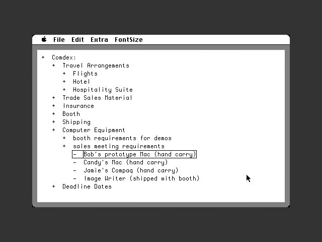

https://www.youtube.com/watch?v=OFp0Y1DukdQ

## Platforms

Mac/PC

## Lifetime

1984 - 1987

## Features

- Expand / collapse items
- Drag and drop items to re-order
- Hoisting

## More Reading

http://scripting.com/dwiner/outlinersProgramming.html
# MORE (Mac, 1986)

## Summary

Outliner with the ability to switch between the outline view, a tree chart view and a chart list view (which was suitable for presentations).

## Platforms

Macintosh

## Lifetime

1986

## Features

- Hide / unhide subordinate items
- Drag and drop items to re-order
- Tree chart view
- Bullet chart view
- Hierarchy-level-specific text formatting
## Screenshots

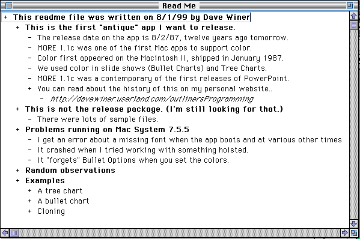

# KAMAS ("CP/M"/DOS, 1984-1993)

## Summary

The first outliner for the CP/M with basic keyboard driven outlining capabilities and an internal programming language. Probably the first outliner to introduce the convention of indenting out outdenting with tab and shift+tab respectively. The DOS version shipped without the internal programming language.

## Screenshots

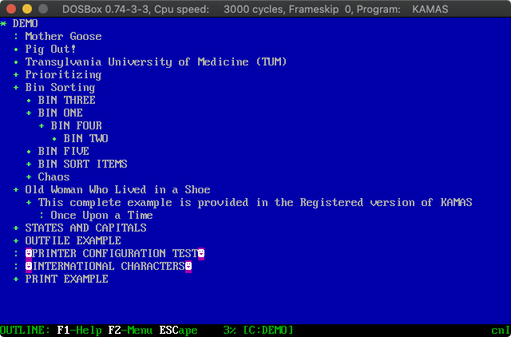

## More Reading

https://web.archive.org/web/20020321122910/https://www.jlarue.com/outlinersredux.html
https://en.wikipedia.org/wiki/KAMAS_(program)
http://archive.today/2020.05.31-144922/http://blog.fogus.me/2020/05/20/8-bit-spiritua/

# Out-Think (DOS, 1986)

## Summary

Simplified version of KAMAS without its programming facilities.

## More Reading

https://archive.org/stream/PROFILES_Volume_4_Number_1_1986-07_Kaypro_Corp_US#page/n19/mode/2up
https://en.wikipedia.org/wiki/KAMAS_(program)

# PC-Outline (DOS, 1987)

## Summary

An MSDOS text outliner program created by Brown Bag Software and a competitor to ThinkTank.

## Screenshots

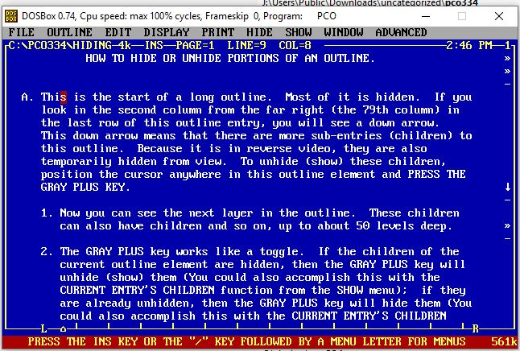
## Platforms

MSDOS

## Lifetime

? - 1987

## Features

- Move items
- Mark / unmark items
- Copy / move marks
- Join / divide items
- Sort outline level
- Multi-window (up to 9, resizable)
- Printing options

## More Reading

https://www.danielsays.com/ssg-dossw-pco334.html

# GrandView (DOS, 1987-1990)

## Summary

First outliner supporting color. GrandView combined features of a traditional outliner with a spreadsheet (columnar metadata).
## Screenshots

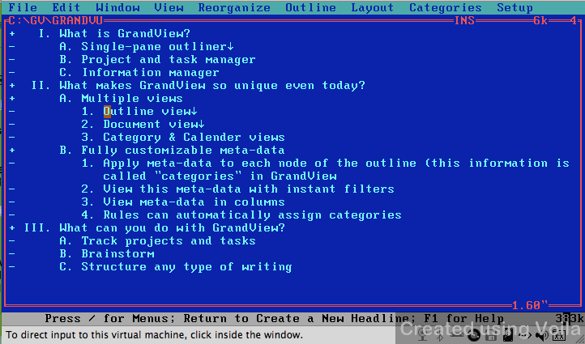

## Features

- Hide / unhide subordinate items
- Drag and drop items to re-order
- Hierarchy-level-specific text formatting
- Named ranges

## More Reading

https://welcometosherwood.wordpress.com/2009/10/10/grandview/
https://www.atarimagazines.com/compute/issue139/114_GrandView_20.php
https://books.google.ch/books?id=Eq0wALnyM_MC&q=%22grandview%22+%22friend%22+outliner&pg=PA34&redir_esc=y#v=snippet&q=%22grandview%22%20%22friend%22%20outliner&f=false

# Acta (Mac, 1986-1993)

## Summary

Version 1.3 was bundled with Living Videotext's MORE in 1987 and Acta evolved into Opal.

## Screenshots

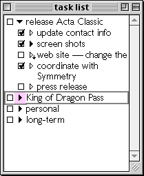

## More Reading

https://archive.vn/AGWFc
http://archive.today/2020.12.08-073941/http://a-sharp.com/acta/

# ECCO Pro (Windows, 1993-1997)

## Summary

Ecco Pro was a personal information manager software based on an outliner, and supporting folders similar to spreadsheet columns that allow filtering and sorting of information based upon user defined criteria. It was seen to have an easier learning curve than GrandView. At the same time, its novel and complicated mix of features may have prevented it from gaining mainstream adoption.

## Lifetime

1993-1997

## Screenshots

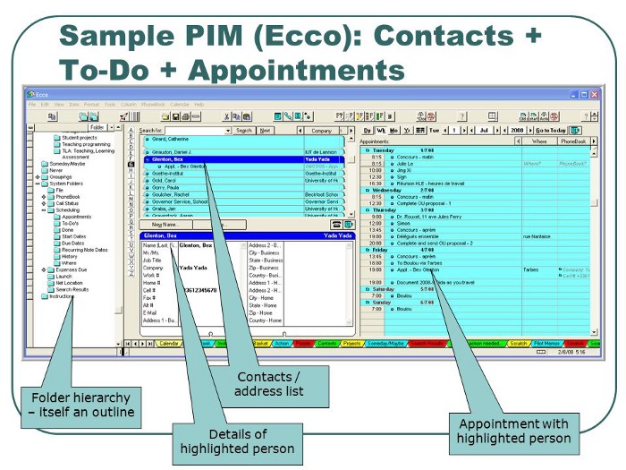

## Features

- Basic outliner functionality
- Tags
- Columns with meta data
- Clipping tool to add highlighted text to your outline
- Sync with PalmPilot

## More Reading

http://archive.today/2020.12.09-052442/https://www.theguardian.com/technology/2007/jul/26/comment.guardianweeklytechnologysection
https://en.wikipedia.org/wiki/Ecco_Pro
https://www.mind-mapping.org/index.php?title=ECCO_Pro
http://archive.today/2020.12.09-060302/http://www.fredshack.com/docs/pim.html
http://archive.today/2020.12.10-045221/https://medium.com/@rice.doug/ecco-pro-in-the-90s-outlook-not-so-good-a5542ee440d7
https://web.archive.org/web/20080205164526/http://www.thenakedpc.com/dan/pims/ecco.html
https://web.archive.org/web/20080202162758/http://www.eccorocks.com/

# Action Outline (Windows, 2000-2012)

## Summary

Simple two-pane outliner for Windows with a tree-like file explorer pane combined with a document viewer pane. 

## Developer

Green Parrots Software

## Screenshots

## Features

- Basic outliner features
- Ability to minimize to the Windows System Tray and easily pop up to paste a piece of text
- Tabbed interface for opening multiple documents
- Different text styling options
- Tags
- Printing
- Rich media inside outlines (Images)

## More reading

http://archive.today/2020.12.10-052846/https://www.actionoutline.com/

# TAO (Mac)

## Screenshots

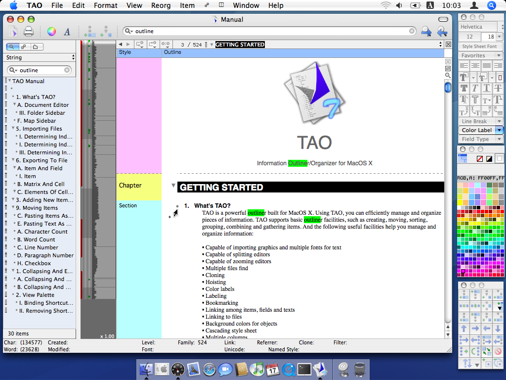

# Opal (Mac, 2006-)

## Summary

A succesor to Acta from its creator David Dunham. 

## Screenshots

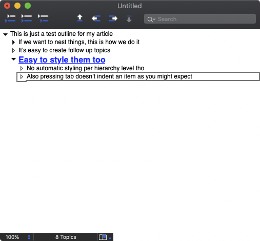

## Features

- Basic outliner features
- Checkboxes
- Formatting
- Search

## More Reading

http://archive.today/2020.12.08-074855/http://a-sharp.com/acta/history.html

# ConnectedText (Windows, 2011-2016 [Discontinued])

## Summary

ConnectedText brands itself as a "Personal Wiki". It has a very basic editor with an outliner option. It was somewhat unique in that it was one of the first PIM tools to generate a visual graph representation of your notes. There's also the ability to embed Python scripts that run on the page.

## Status

Discontinued

## Screenshots

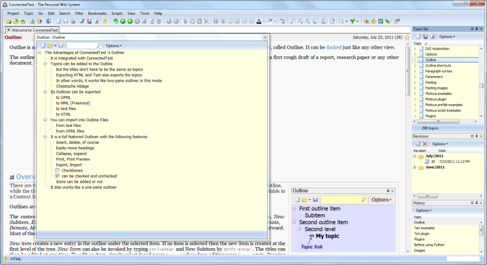

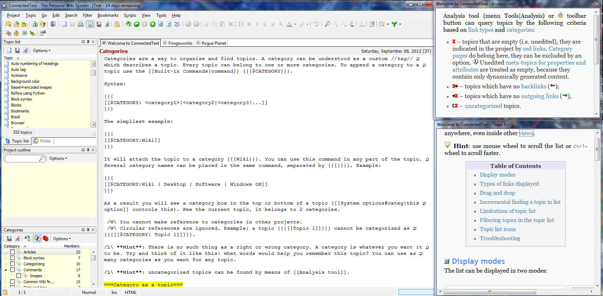

## More Reading

https://www.connectedtext.com/
https://web.archive.org/web/20190421085255/http://takingnotenow.blogspot.com/search/label/ConnectedText

# UV Outliner (Windows)

# VisualOutliner (Windows)

## More Reading

https://www.visualoutliner.com/

# InfoQube

## Summary

Information Manager with support for multiple views, including an outliner. Free Windows app built as a successor to Ecco Pro. An outliner with columns, allowing search, filter, sort. Includes a rich text pane for larger content / web links. Fully portable. Tries to do everything which Connected Text can do and more but without the markup language so everything is done through a GUI and with tables of properties and context menus.

## Screenshots

## Features

- Gantt Charts
- Pull in data from remote databases
- Integrated Calendar
- Integrated Web Clipper
- Spreadsheet Capabilities
    - Pivot Tables
    - Charts
- Item Formatting
    - Rule Based
- Markdown support

## More Reading

- https://www.reddit.com/r/design_critiques/comments/ggocxu/infoqube_outliner_free_app_your_comments_please/
- https://pauljmiller.wordpress.com/2018/03/29/a-review-of-infoqube/

# MyInfo (Windows, 2000-today)

## Summary

Bare bones outliner. 

## Status

Active

## Screenshots

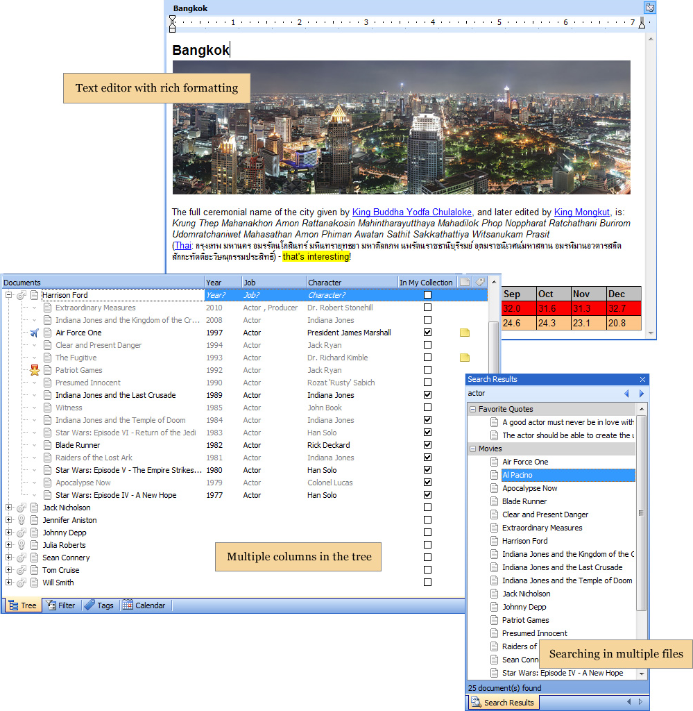

# Features

- Basic outliner functionality
- Multiple columns
- Formatting
- Embedding PDFs
- Transclusion
- Templates

## More Reading

- https://en.wikipedia.org/wiki/MyInfo
- http://www.loosewireblog.com/2006/03/an_outliner_tha.html
- https://www.bitsdujour.com/software/myinfo
- https://manual.myinfoapp.com
- http://archive.today/2020.12.12-061630/https://pauljmiller.wordpress.com/2018/10/23/a-comparative-review-of-four-note-taking-programs/

# Accordia IT

# Zoot

# InfoSelect

# Microsoft Word Outline View

# UltraRecall

# Cherry Tree

## More Reading

https://www.giuspen.com/cherrytree/

# Jot+

# TreePad

# Inspiration

# The Brain

# The Archive

## More Reading

# Vim Outliner

# Mindomo (Web-based)

## More Reading

https://www.mindomo.com/

# Little Outliner (Web-based)

# Workflowy (Web-based)

# Dynalist (Web-based)

# Checkvist (Web-based)

# Roam Research (Web-based)

# LeoEditor

http://leoeditor.com/

