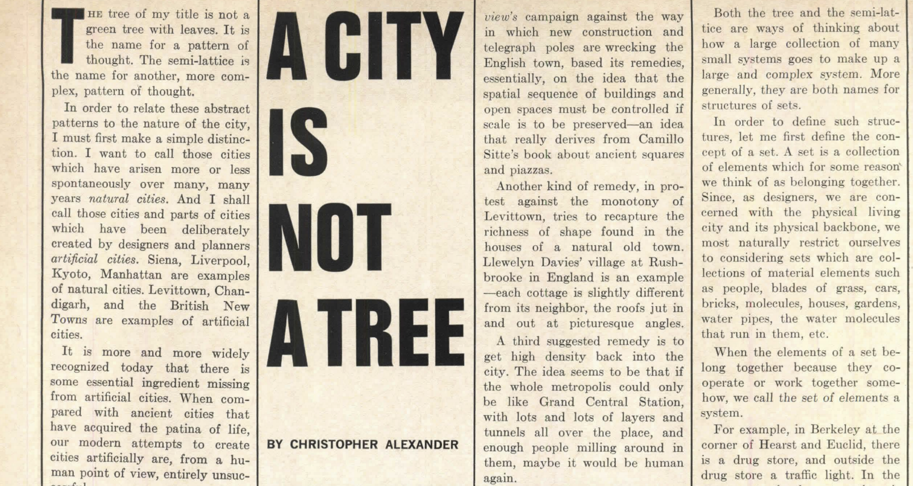

*Originally published in: Architectural Forum, Vol 122, No 1, April 1965, pp 58-62 (Part I), Vol 122, No 2, May 1965, pp 58-62 (Part II). Scans of the original can be found on the website of the US Modernist [^1] [^2]*

# Part I

The tree of my title is not a green tree with leaves. It is
the name for a pattern of thought. The semi-lattice is the name for another, more complex, pattern of thought. In order to relate these abstract
patterns to the nature of the city, I must first make a simple distinction. I want to call those cities which have arisen more or less spontaneously over many, many years natural cities. And I shall call those cities and parts of cities which have been deliberately created by designers and planners
artificial cities. Siena, Liverpool, Kyoto, Manhattan are examples of natural cities. Levittown, Chandigarh, and the British New Towns are examples of artificial cities.

It is more and more widely recognized today that there is some essential ingredient missing from artificial cities. When compared with ancient cities that have acquired the patina of life, our modern attempts to create cities artificially are, from a human point of view, en tirely unsuccessful.

Architects themselves admit more and more freely that they
really like living in old buildings more than new ones. The non-artloving public at large, instead of being grateful to architects for what they do, regards the onset of modern buildings and modern cities everywhere as an inevitable rather sad piece of the larger fact that the world is going to the
dogs.

It is much too easy to say that these opinions represent only people's unwillingness to forget the past, and their determination to be traditional. For myelf, I trust this conservatism. Americans are usually willing to move with the times. Their growing reluctance to accept the modern city evidently expresses a longing for some real thing, something which for the moment escapes our grasp. The prospect that we may be turning the world into a place peopled only by little glass and concrete boxes has alarmed many architects too. To combat the glass box future, many valiant protests and designs have been put forward, all hoping to recreate in modern form the various charact~ristics of the natural city which seem to give it life. But so far these designs have only remade the old. They have not been able to create the new.

"Outrage," the Architectural Review's campaign against the way in which new construction and Lelegraph poles are wrecking the English town, based its remed ies, essentially, on the idea that the spatial sequence of buildings and open pace must be controlled if scale is to be preserved-an idea that really derives from Camrno Sitte's book about ancient squares and piazza. 

Another kind of remedy, in protest against the monotony of Levittown, tries to recapture the richness of shape found in the houses of a natural old town. Llewelyn Davies' village at Ru hbrooke in England is an example -each cottage is slightly different from its neighbor, the roofs jut in and out at picturesque angles.

A third suggested remedy is to get high density back into the city. The idea seems to be that if the whole metropolis could only be like Grand Central Station, with lots and lots of layers and tunnels all over the place, and enough people milling around in them, maybe it would be human again.

Another very brillliant critic of the deadness which is everywhere is Jane Jacobs. Her criticisms are excellent. But when you read her concrete proposals for what we should do instead, you get the idea that she wants the great modern city to be a sort of mixture between Greenwich village and some Italian hill town, full of short blocks and people sitting in the street.

The problem these designers have tried to face is real. It is vital that we discover the property of old towns which gave them life and get it back into our own artificial cities. But we cannot do this merely by remaking English villages, Italian piazzas, and Grand Central Stations. Too many designers today seem to be yearning for the physical and plastic characteristics of the past, instead of searching for the abstract ordering principle which the towns of the past happened to have, and which our modern conceptions of the city have not yet found.

*What is the inner nature, the ordering principle, which distinguishes the artificial city from the natural city?*

You will have guessed from my title what I believe this ordering principle to be. I believe that a natural city has the organization of a semi-lattice; but that when we organize a city artificially, we organize it as a tree. 

Both the tree and the semi-lattice are ways of thinking about how a large collection of many small systems goes to make up a large and complex system. More generally, they are both names for structures of sets.

In order to define such structures, let me first define the concept of a set. A set is a collection of elements which for ome reason we think of as belonging together. Since, as designers, we are concerned with the physical living city and its physical backbone, we most naturally restrict ourselves to considering sets which are collections of material elements such as people, blades of grass, cars, bricks , molecules, houses, gardens, water pipes, the water molecules that run in them, etc.

When the elements of a set belong together because they cooperate or work together somehow, we call *the set of elements* a system.

For example, in Berkeley at the comer of Hearst and Euclid, there is a drug store, and outside the drug store a traffic light. In the entrance to the drug store there is a newsrack where the day's papers are displayed. When the light is red, people who are waiting to cross the street stand idly by the light; and since they have nothing to do, they look at the papers displayed on the newsrack which they can see from where they stand. Some of them just read the headlines, others actually buy a paper while tbey wait.

This effect makes the new rack and the traffic light interdependent; the newsrack, the newspapers on it, the money going from people's pockets to the dime slot, the people who stop at the light and read papers, the traffic light, the electric impulses which make the lights change, and the sidewalk which the people stand on form a system—they all work together.

From the designer's point of view, the physically unchanging part of this system is of special interest. The newsrack, the traffic light, and the sidewalk between them, related as they are, form the fixed part of the system. It is the unchanging receptacle in which the changing parts of the system - people, newspapers, money, and electrical impul es-- can work together. I define this fixed part as a unit of the city. It derive it coherence as a unit both from the forces which hold its own elements together, and from the dynamic coherence of th larger living system which include it as a fixed invariant part.

Of the many, many fixed concrete subsets of the city which are the receptacles for its system , and can therefore be thought of as significant physical units, we usually single out a few for special consideration. In fact, I claim that whatever picture of the city someone has is defined precisely by the ubsets he ees as units. 

Now, a collection of subsets which goes to make up such a picture is not merely an amorphous collection. Automatically, merely because relationships are established among the subsets once the subsets are chosen, the collection has a definite structure.

To understand this structure, let us think abstractly for a moment, using numbers as symbols. Instead of talking about the real subets of millions of real particles which occur in the city, let us consider a simpler structure made of just half a dozen elements. Label these elements 1, 2, 3, 4, 5, 6. Not including the full set [1, 2, 3, 4, 5, 6), the empty set [-], and the one element sets [1], [2], [3], [4], [5], [6], there are 56 different subsets we can pick from six elements.

Suppose we now pick out certain of these 56 sets (just as we pick out certain sets and call them unit when we form our picture of the city). Let us say, for example, that we pick the following subset : [123], [34], [45], [234], [345], [12345], [3456].

What are the possible relationships among these sets? Some sets will be entirely part of larger sets, as [34] is part of [345] and [3456]. Some of the sets will overlap, like [123] and [234]. Some of the sets will be disjoint-that is, contain no elements in common, like [123] and [45].

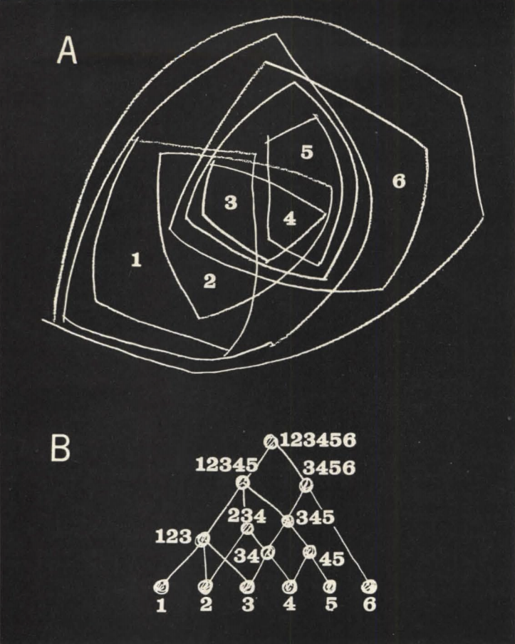

We can see these relationships displayed in two ways. In diagram A each set chosen to be a unit has a line drawn round it. In diagram B the chosen sets are arranged in order of ascending magnitude, so that whenever one set contains another (as [345] contains [34]), there is a vertical path leading from one to the other. For the sake of clarity and visual economy, it is usual to draw lines only between sets which have no further sets and lines between them; thus the line between [34] and [345], and the line between [345] and [3456], make it unecessary to draw a line between [34] and [3456].

As we see from these two representations, the choice of subset alone endows the collection of subsets as a whole with an overall structure. This is the structure which we are concerned with here. When the structure meets certain conditions it is called a semi-lattice. When it meets other more restrictive conditions, it is called a tree.

The semi-lattice axiom goes like this: *A collection of sets forms a semi-lattice if and only if, when two overlapping sets belong to the collection, then the set of elements common to both also belongs to the collection.*

The structure illustrated in diagrams A and B is a semi-lattice. It satisfies the axiom since, for instance, [234] and [345] both belong to the collection and their common part, [34], also belongs to it. (As far as the city is concerned, this axiom states merely that wherever two units overlap, the area of overlap is itself a recognizable entity and hence a unit also. In the case of the drug store example, one unit consists of the newsrack, sidewalk, and traffic light. Another unit consists of the drug store itself, with its entry and the newsrack. The two unit overlap in the newsrack. Clearly this area of overlap is itself a recognizable unit, and so satisfies the axiom above which defines the characteristic of a semi-lattice.)

The tree axiom states: *A collection of sets forms a tree if and only if, for any two sets that belong to the collection, either one is wholly contained in the other, or else they are wholly disjoint.* The structure illustrated in diagrams C and D is a tree. Since this axiom excludes the possibility of overlapping sets, there is no way in which the semi-lattice axiom can be violated, so that every tree is a trivially simple semi-lattice.

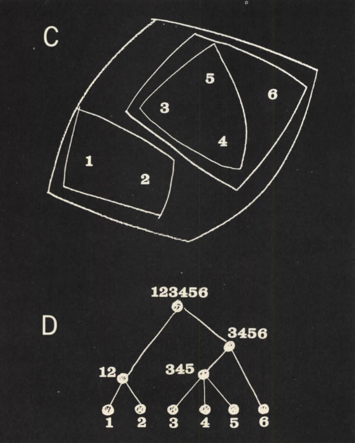

However, in this paper we are not so much concerned with the fact that a tree happens to be a semi-lattice, but with the differnce between trees and those more general semi-lattices which are *not* trees because they do contain overlapping units. We are concerned with the difference between structures in which no overlap occur , and those structures in which overlap does occur. *It is not merely* the overlap which makes the distinction between the two important. Still more important is the fact that the semi-lattice is potentially a much more complex and subtle structure than a tree. We may see just how much more complex a semi-lattice can be than a tree in the following fact: a tree based on 20 elements can contain at most 19 further subsets of the 20, while a semi-lattice based on the same 20 elements can contain more than 1,000,000 different subsets.

Thi enormously greater variety is an index of the great structural complexity a semi-lattice can have when compared with the structural simplicity of a tree. It is this lack of structural complexity, characteristic of trees, which is crippling our conceptions of the city.

To demonstrate, let us look at some modern conceptions of the city, each of which I shall show to be essentially a tree. It will perhaps be useful, while we look at these plans, to have a little ditty in our minds:

```
Big fleas have little fleas Upon their back to bile 'em,
Little fleas have lesser fleas,
And so ad infinitum.
```

This rhyme expresses perfectly and succinctly the structural principle of the tree.

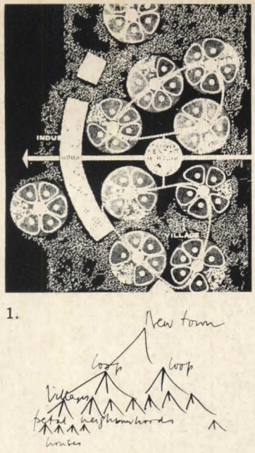

**Figure 1.** Columbia, Maryland, Community Research and Development Inc.: Neighborhoods, in clusters of five, form "villages." Transportation joins the villages into a new town. The organization is a tree.

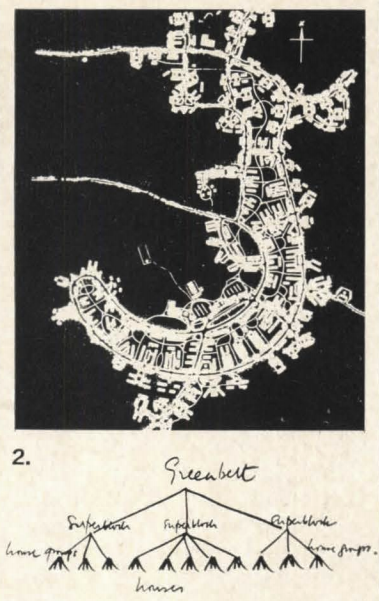

**Figure 2.** Greenbelt, Maryland, Clarence Stein: This "garden city" has been broken down into superblocks. Each superblock contains schools, parks, and a number of subsidiary groups of houses built around parking lots. The organization is a tree.

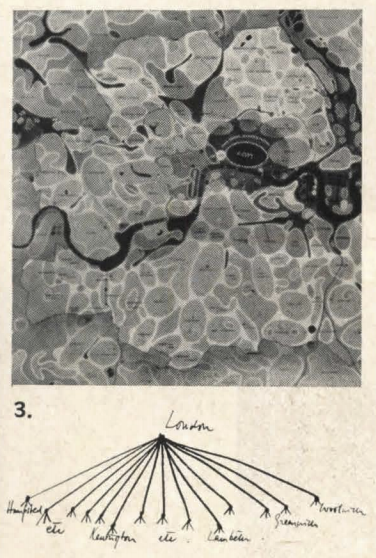

**Figure 3.** Greater London plan (1943), Abercrombie and Forshaw: The drawing depicts the structure conceived by Abercrombie for London. It is made of a large number of communities, each sharply separated from all adjacent communities. Abercrombie writes, "The proposal is to emphasize the identity of the existing communities, to increase their degree of segregation, and where necessary to reorganize them as separate and definite entities." And again, "The communities themselves consist of a series of sub-units, generally with
their own shops and schools, corresponding to neighborhood units." The city is conceived as a tree with two principal levels. The communities are the larger units of the structure; the smaller sub-units are neighborhoods. There are no overlapping units. The structure is a tree.

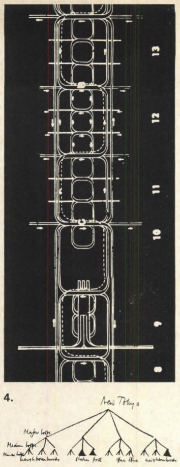

**Figure 4.** Tokyo plan, Kenzo Tange (left): This is a beautiful example. The plan consists of a series of loops stretched across the Tokyo Bay. There are four major loops, each of which contains three medium loops. In the second major loop, one medium loop is the railway station and another is the port. Otherwise, each medium loop contains three minor loops which are residential neighborhoods, except in the third major loop where one contains government offices and another industrial offices.

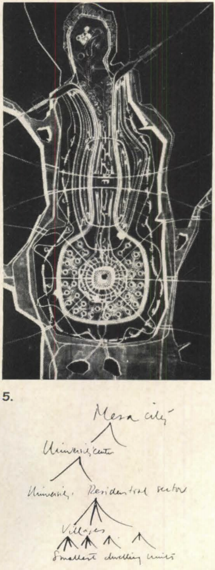

**Figure 5.** Mesa City, Paolo Soleri (left) : The organic shapes of Mesa City lead us, at a careless glance, to believe that it is a richer structure than our more obviously rigid examples. But when we look at it in detail we find precisely the same principle of organization. Take, particularly, the university center. Here we find the center of the city divided into a university and a residential quarter, which is itself divided into a number of villages (actually apartment towers) for 4,000 inhabitants, each again subdivided further and surrounded by groups of still smaller dwelling units.

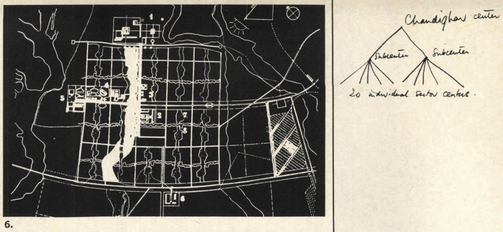

**Figure 6.** Chandigarh (1951) by Le Corbusier (top right): The whole city is served by a commercial center in the middle, linked to the administrative center at the head. Two subsidiary elongated, commercial cores are strung out along the major arterial roads, running north- outh. Subsidiary to these are further administrative, community and commercial centers, one for each of the city's 20 sectors.

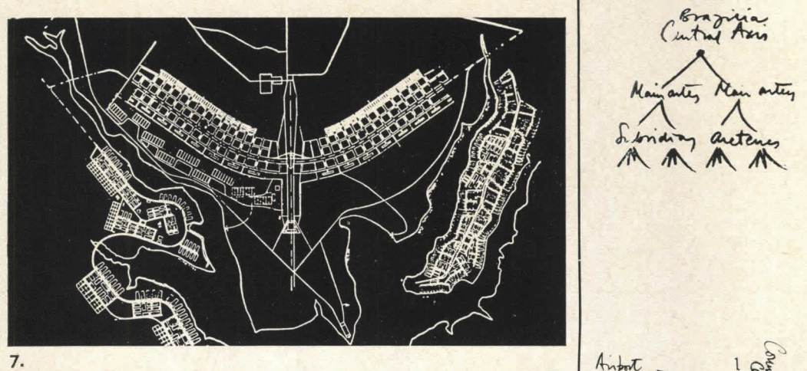

**Figure 7.** Brazilia, Lucio Costa: The entire form pivots about the central axis, and each of the two halves is served by a single main artery. This main artery is in turn fed by subsidiary arteries parallel to it. Finally, these are fed by the roads which surround the superblocks themselves. The structure is a tree.

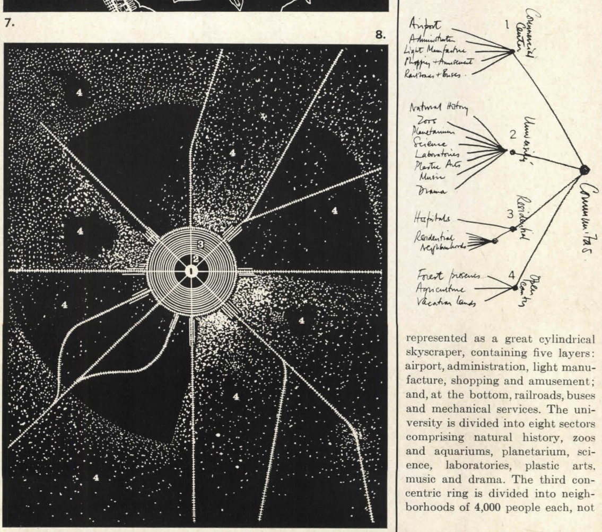

**Figure 8.** Communitas, Percival and Paul Goodman: Communitas is explicitly organized as a tree: it is first divided into four concentric major zones, the innermost being a commercial center, the next a university, the third residential and medical, and fourth open country. Each of these is further subdivided: the commercial center is consisting of individual houses, but of apartment blocks, each of these containing further individual dwelling units. Finally, the open country is divided into three segments: forest, preserves, agriculture, and vacation-lands. The over-all organization is a tree.

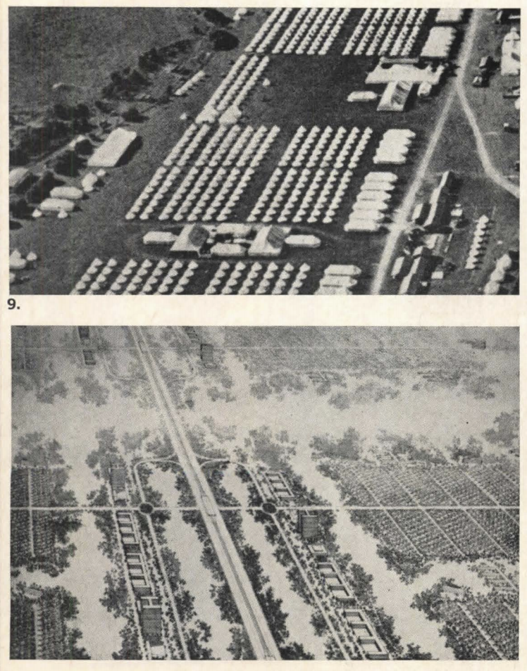

**Figure 9.** The most beautiful example of all I have kept until last, because it symbolizes the problem perfectly. It appears in Hilber eimer's book called The Nature of Cities. He de cribes the fact that certain Roman towns had their origin as military camps, and then shows a picture of a modern military encampment as a kind of archetypal form for the city. It is not possible to have a structure which is a clearer tree. 

The symbol is apt, for, of course, the organization of the army was created precisely in order to create discipline and rigidity. When a city is endowed with a tree structure, this is what happens to the city and its people. The lower photo, is Hilber eimer's own cheme for the commercial area of a city based on the army camp archetype.

Each of these structures, then, is a tree. Each unit in each tree that I have described, moreover, is the fixed, unchanging residue of some system in the living city (just as a hou e is the residue of the interactions between the member of a family, their emotions, and their belongings; and a freeway is the residue of movement and commercial exchange). However, in every city there are
thousands, even millions, of time a many more systems at work whose physical residue does not appear as a unit in these tree structures. In the worst cases, the units which do appear fail to corre pond to any living reality; and the real systems, whose existence actually makes the city live, have been provided with no physical receptacle.

Neither the Columbia plan nor the Stein plan, for example, corresponds to social realities. The physical layout of the plans, and the way they function, suggests a hierarchy of stronger and stronger closed ocial groups, ranging from
the whole city down to the family, each formed by associational ties of different strength.

In a traditional society, if we ask a man to name his best friends and then ask each of these in turn to name their be t friends, they will a ll name each other so that they form a closed group. A village is made of a number of separate closed groups of this kind.

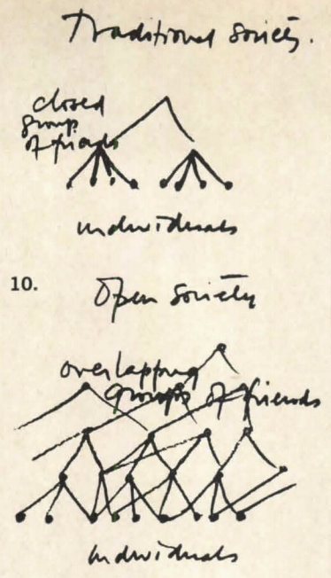

But today's social structure is utterly different. If we ask a man to name bis friends and then ask them in turn to name their friends, they will all name different people, very likely unknown to the first person; these people would again name others, and so on outwards. There are virtually no closed groups of people in modern society. The reality of today's social structure is thick with overlap-the system of friends and acquanintances form a semi-lattice, not a
tree **(Figure 10)**.

In the natural city, even the house on a long street (not in some little cluster) is a more accurate acknowledgment of the fact that your friends live not next door, but far away, and can only be reached by bus or automobile. In this respect Manhattan has more overlap in it than Greenbelt. And though one can argue that in Greenbelt too, friends are only minutes away by car, one must then ask: Since certain groups have been emphasized by the physical units of the physical structure, why are just these the most irrelevant ones?

In the second part of this paper, I shall furth er demonstrate why the living city cannot be properly contained in a receptacle which is a tree-that indeed, its very life stems from the fact that it is not a tree.

Finally, I shall try to show that it is the process of thought itself which works in a treelike way, so that whenever a city is "thought out" instead of "grown," it is bound to get a treelike structure. 

# Part II

In the first part of this article, we saw that the units of which an artificial city is made up are organized to form a tree. So that we get a really clear understanding of what this means, and shall better see its implications, let us define a tree once again:

Whenever we have a tree structure, it means that within this structure no piece of any unit is ever connected to other units, except through the medium of that unit as a whole. 

The enormity of this restriction is difficult to grasp. It is a little as though the members of a family were not free to make friends outside the family, except when the family as a whole made a friendship.

In simplicity of structure the tree is comparable to the compulsive desire for neatness and order that insists the candlesticks on a mantlepiece be perfectly straight and perfectly symmetrical about the center. The semi-lattice, by comparison, is the structure of a complex fabric; it is the structure of living things; of great paintings and symphonies.

It must be emphasized, lest the orderly mind brink in horror from anything that is not clearly articulated and categorized in tree form, that the idea of overlap, ambiguity, multiplicity of aspect, and lhe semi-lattice, are not less orderly than the rigid tree, but more so. They represent a thicker, tougher, more subtle and more complex view of structure.

Let us now look at the ways in which the natural, when unconstrained by artificial conceptions, hows itself to be a semi-lattice.

A major aspect of the city's social structure which a tree can never mirror properly is illustrated by Ruth Glass's redevelopment plan for Middlesborough, a city of 200,000 which she recommends be broken down into 29 separate neighborhoods. After picking her 29 neighborhoods by determining where the sharpest discontinuities of building type, income, and job type occur, she asks herself the question: "If we examine some of *the social systems* which actually exist for the people in such a neighborhood, do the physical units defined by these various social systems all define the same patial neighborhood?" Her own answer to this question is, no. 

Each of the social systems she examines is a nodal system. It is made of some sort of central node, plus the people who use this center. Specifically she takes elementary schools, secondary schools, youth clubs, adult clubs, post offices, greengrocers, and grocers elling sugar. Each of these centers draws its users from a certain spatial area or spatial unit. This spatial unit is the physical residue of the social system as a whole, and is therefore a unit in the terms of this paper. The units corresponding to different kinds of centers for the single neighborhood of Waterloo Road are shown in **Figure 1**.

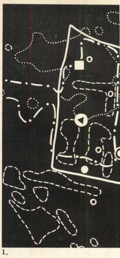

The hard outline is the boundary of the so-called neighborhood itself. The white circle stands for the youth club, and the small solid rings stand for areas where its members live. The ringed spot is the adult club, and the homes of its members form the unit marked by dashed boundaries. The white square is the post office and the dotted line marks the unit which contains its users. The secondary school is marked by the spot with a white triangle in it. Together with its pupils, it forms the system marked by the dot-dashed line.

As you can see at once, the different units do not coincide. Yet neither are they disjoint. They overlap. We cannot get an adequate picture of what Middlesborough is, or of what it ought to be, in terms of 29 large and conveniently integral chunks called neighborhoods. When we describe the city in terms of neighborhoods, we implicitly assume that the smaller elements within any one of these neighborhoods belong together so tightly that they only interact with elements in other neighborhoods through the medium of the neighborhood to which they themselves belong. Ruth Glass herself shows
clearly that this is not the case.

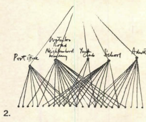

Below are two pictures of the Waterloo neighborhood. For the sake of argument I have broken it into a number of small areas. **Figure 2** shows how these pieces stick together in fact, and **Figure 3** shows how the redevelopment plan pretends they stick together. 

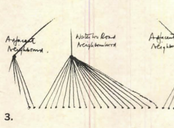

There is nothing in the nature of the various centers which says that their catchment areas should be the same. Their natures are different. Therefore the units they define are different. The natural city of Middlesborough was faithful to the semi-lattice structure they have. Only in the artificial tree conception of the city are their natural, proper, and necesary overlaps destroyed. 

Take the separation of pedestrians from moving vehicles, a tree concept proposed by Le Corbusier, Louis Kahn, and many others. At a very crude level of thought this is obviously a good idea. It is dangerous to have 60-mile-an-hour cars in contact with little children toddling. But it is not always a good idea. There are times when the ecology of a situation actually demands the opposite. Imagine yourself coming out of a Fifth Avenue store; you have been shopping all afternoon; your arms are full of parcels; you need a drink; your wife is limping. Thank God for taxis. Yet the urban taxi can function only because pedestrians and vehicles are not strictly separated. The prowling taxi needs a fast stream of traffic so that it can cover a large area to be sure of finding a passenger. The pedestrian needs to be able to hail the taxi from any point in the pedestrian  world, and to be able to get out to any part of the pedestrian world to which he wants to go. The system which contains the taxicabs needs to overlap both the fast vehicular traffic system and the system of pedestrian circulation. In Manhattan pedestrians and vehicles do share certain parts of the city, and the necessary overlap is guaranteed (**Figure 4**). 

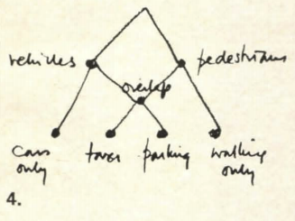

Another favorite concept of the CIAM theorists and others is the separation of recreation from everything else. This has crystallized in our real cities in the form of playgrounds. The playground, asphalted and fenced in, is nothing but a pictorial acknowledgment of the fact that "play" exists as an isolated concept in our minds. It has nothing to do with the life of play itself. Few selfrespecting children will even play in a playground. 

Play itself, the play that children practice, goes on somewhere different everyday. One day it may be indoors, another day in a friendly gas station, another day down by the river, another day in a derelict building, another day on a construction site which has been abandoned for the weekend. Each of these play activities, and the objects it requires, forms a system. It is not true that these systems exist in isolation, cut off from the other systems in the city. The different systems overlap one another, and they overlap many other systems besides. The units, the physical places recognized as play places, must do the same. 

In a natural city this is what happens. Play takes place in a thousand places-it fills the interstices of adult life. As they play, children become full of their surroundings. How can a child become filled with his surroundings in a fenced enclosure? He cannot.

## The isolated campus

A similar kind of mistake occurs in trees like that of Goodman's Communitas, or Soleri's Mesa City, vvhich separate the university from the rest of the city. Again, this has actually been realized in common American form of the isolated campus. What is the reason for drawing a line in the city so that everything within the boundary is university, and everything outside is non-university? It is conceptually clear.

But does it correspond to the realities of university life. Certainly it is not the structure which occurs in non-artificial university cities. Take Cambridge University, for instance. At certain points Trinity street is physically almost indistinguishable from Trinity college. One pedestrian crossover in the street is literally part of the college. The buildings on the street, though they contain stores and coffe,, shops and banks at ground level, contain undergraduates' rooms in their upper stories. In manv cases the actual fabric of the street buildings melts into the fabric of the old college buildings so that one cannot be altered without the other.

There will always be many systems of activity where university life and city life overlap: pubcrawling, coffee-drinking, the movies, walking from place to place. In some cases whole departments may be actively involved in the life of the city's inhabitants (the hospital-cnm-medical school is an example). In Cambridge, a natural city where university and city have grown together gradually, the physical units overlap because they are the physical residues of city systems and university systems which overlap (Figure 5).

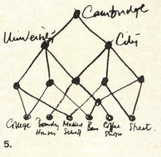

Let us look next at the hierarchy of urban cores, realized in Brazilia, Chandigarh, the MARS plan for London, and, most recently, in the Manhattan Lincoln Center, where vitrious performing arts serving the population of greater New York have been gathered together to form just one core.

Does a concert hall ask to be next to an Opera House? Can the two feed on one another? Will anybody ever visit them both, gluttonously, in a single evening, or even buy tickets from one after going to a concert in the other? In Vienna, London, Paris, each of the performing arts has found its own place, because all are not mixed randomly. Each has created its own familiar section of the city. In Manhattan itself, Carnegie Hall and the Metropolitan Opera House were not built side by side. Each found its own place, and now creates its own atmosphere. The influence of each overlaps the parts of the city which have been made unique to it.

The only reason that these functions have all been brought together in the Lincoln Center is that the concept of performing art links them to one another. But this tree, and the idea of a single hierarchy of urban cores which is its parent, do not illuminate the relations between art and city life. They are merely born of the mania every simple-minded person has for putting things with the same name into the same basket.

The total separation of work from housing, started by Tony Garnier in his industrial city, then incorporated in the 1929 Athens Charter, is now found in every artificial city and accepted everywhere where zoning is enforced. Is this a sound principle? It is easy to see how bad conditions at the beginning of the century prompted planners to try to get the dirty factories out of residential areas. But the separation misses a variety of systems which require, for their sustenance, little parts of both. 

Jane Jacobs describes the growth of backyard industries in Brooklyn. A man who wants to start a small business needs space, which he is very likely to have in his own backyard. He also needs to establish connections with larger going enterprises and with their customers. This means that the system of backyard industry needs to belong both to the residential zone, and to the industrial zone — these zones need to overlap. In Brooklyn they do (Figure 6). In a city which is a tree, they can't.

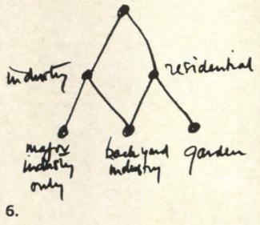

Finally, let us examine the subdivision of the city into isolated communities. As we have seen in the Abercrombie plan for London, this is itself a tree structure. The individual community in a greater city has no reality as a functioning unit. In London, as in any great city, almost no one manage to find work which suits him near his home. People in one community work in a factory which is very likely to be in another community. 

There are, therefore, many hundreds of thousands of worker-workplace systems, each consisting of a man plus the factory he works in, which cut across the boundaries defined by Abercrombie's tree. The existence of these
units, and their overlapping nature, indicates that the living systems of London form a semi-lattice. Only in the planner's mind has it become a tree.

The fact that we have so far failed to give this any physical expression has a vital consequence. As things are, whenever the worker and his workplace belong to separately administered municipalities, the community which contains the workplace collects huge taxes and has relatively little on which to spend the tax revenue. The community where the worker lives, if it is mainly residential, collects only little in the way of taxes, and yet has great additional burdens on its purse in the shape of schools, hospitals, etc. Clearly, to resolve this inequity, the worker-workplace systems must be anchored in physically recognizable units of the city which can then be taxed.

It might. be argued that, even though the individual communities of a great city have no functional significance in the lives of their inhabitants, they are still the most convenient administrative units, and should, therefore, be left in their present tree organization.

However, in the political complexity of a modern city, even this is suspect. Edward Banfield, in a recent book called *Political Influence*, gives a detailed account of the patterns of influence and control that have actually led to decisions in Chicago. He shows that although the lines of administrative and executive control have a formal structure which is a tree, these formal chains of influence and authority are entirely overshadowed by the ad hoc lines of control which arise naturally as each new city problem presents itelf. These ad hoc lines depend on who is interested in the matter, who has what at stake, who has what favors to trade with whom.

This second tructure, which is informal, working within the framework of the first, is what really control public action. It varies from week to week, even from hour to hour, as one problem replaces another. Nobody's sphere of influence is entirely under the control of any one superior; each person is under different influences as the problems change. Although the organization chart in the mayor's office is a tree, the actual control and exercise of authority is semi-lattice-like.

## Trapped In a tree

Now, why is it that so many designers have conceived cities as trees when the natural structure is in every case a semi-lattice? Have they done so deliberately, in the belief that a tree structure will serve the people of the city better? Or have they done it because they cannot help it, because they are trapped by a mental habit, perhaps even trapped by the way the mind works; because they cannot encompass the complexity of a semi-lattice in any convenient mental form; because the mind has an overwhelming predisposition to see trees wherever it looks and cannot escape the tree conception?

I shall try to convince you that it is for this second reason that trees are being proposed and built as cities-that it is because designers, limited as they must be by the capacity of the mind to form intuitively accessible structures, cannot achieve the complexity of the semi-lattice in a single mental act.

Let me begin with an example. Suppose I ask you to remember the following four objects: an orange, a watermelon, a football, and a tennis ball. How will you keep them in your mind, in your mind's eyes? However you do it, you will do it by grouping them. Some of you will take the two fruits together, the orange and the watermelon, and the two sports balls together, the football and the tennis ball. Those of you who tend to think in terms of physical shape may group them differently, taking the two small spheres together-the orange and the tennis
ball and the two larger and more egg-shaped objects-the watermelon and the football. Some of you will be aware of both.

Let us make a diagram of these groupings (Figure 7).

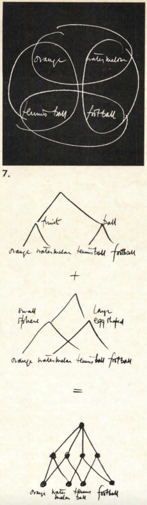

Either grouping taken by itself is a tree structure. The two together are a semi-lattice. Now let us try and visualize these groupings in the mind's eye. I think you will find that you cannot visualize all four sets simultaneously-because they overlap. You can visualize one pair of set, and then the other, and you can alternate between the two pair extremely fast, so fast that you may deceive yourself into thinking you can visualize them all together. But in truth, you cannot conceive all four sets at once in a single mental act. You cannot bring the semi-lattice tructure into a visualizable form for a single mental act. In a single mental act you can only visualize a tree.

This is the problem we face as designers. While we are not, perhaps, necessarily occupied with the problem of total visualization in a single mental act, the principle is still the same. The tree is accessible mentally, and easy to deal with. The semi-lattice is hard to keep before the mind's eye, and
therefore hard to deal with.

It is known today that grouping and categorization are among the most primitive psychological processes. Modern psychology treats thought as a process of fitting new situations into existing slots and pidgeon holes in the mind. Just as you cannot put a physical thing into more than one physical pidgeon hole at once, so, by analogy, the processes of thought prevent you from putting a mental construct into more than one mental category at once. Study of the origin of these processes suggests that they stem essentially from the organism's need to reduce the complexity of its environment by establishing
barriers between the different events which it encounters.

It is for this reason-because the mind's first function is to reduce the ambiguity and overlap in a confusing situation, and because, to this end, it is endowed with a basic intolerance for ambiguity that structure like the city, which do require overlapping sets within them, are nevertheless persistently
conceived as trees.

The same rigidity dogs even the perception of physical patterns. In
experiments by Huggins and myself at Harvard, we showed people patterns whose internal units overlapped, and found that they almost always invented a way of seeing tbe patterns as a tree - even when the semi-lattice view of the pattern would have helped them perform the task of experimentation which was before them. 

The most startliug proof that people tend to conceive even physical pattern as trees is found in some experiments of Sir Frederick Bartlett. He showed people a pattern for about 14 second and then asked them to draw what they had seen. Many people, unable to grasp the full complexity of the pattern they had seen, simplified the pattern by cutting out the overlap. In Figure 8, the original is shown at the top, with two fairly typical redrawn versions below it. In the redrawn version the circle are separated from the rest; the overlap between triangles and circles disappear.

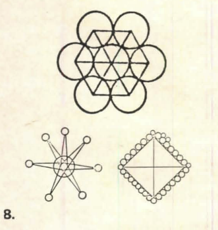

These experiments suggest strongly that people have an underlying tendency, when faced by a complex organization, to reorganize it mentally in terms of non-overlapping units. The complexity of the semi-lattice is replaced by the simpler and more easily grasped tree form.

You are no doubt wondering, by now, what a city looks like which is a semi-lattice, but not a tree. I must confess that I cannot yet show you plans or sketches. It is not enough merely to make a demonstration of overlap - the overlap must be the right overlap. This is doubly important, because it is so tempting to make plans in which overlap occurs for its own sake. This is essentially what the high density "life-filled" city plan of recent years do.  But overlap alone does not give structure. It can also give chaos. A garbage can is full of overlap. To have structure, you must have the right overlap, and this is for us almost certainly different from the old overlap which we observe in historic cities. As the relationships between functions change, so the systems which need to overlap in order to receive these relationships must also change. The recreation of old kinds of overlap will be inappropriate, and chaotic instead of structured.

The work of trying to understand just what overlap the modern city requires, and trying to put this required overlap into physical and plastic terms, is still going on. Until lhe work is complete, there is no point in presenting facile sketches of ill thought out structure. 

## Overlapping triangles

However, I can perhaps make the physical consequences of overlap more comprehensible by means of an image. The painting illustrated is a recent work by Simon Nicholson (**Figure 9**). The fascination of this painting lies in the fact that although constructed of rather few simple triangular elements, these elements unite in many different ways to form the larger units of the painting - in uch a way indeed, that if we make a complete inventory of the perceived unit in the painting, we find that each triangle enters into four or five completely different kinds of units, none contained in the other, yet all overlapping in that triangle.

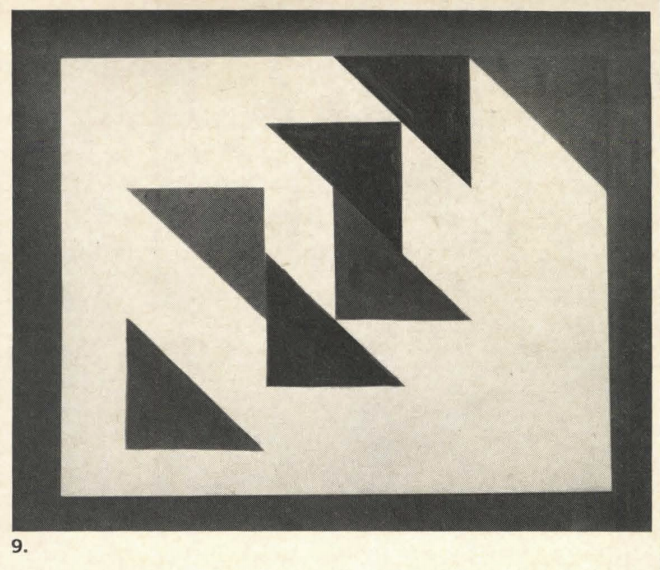

Thus, if we number the triangles and pick out the sets of triangles
which appear as strong visual units, we get the semi-lattice shown in **Figure 10**. 

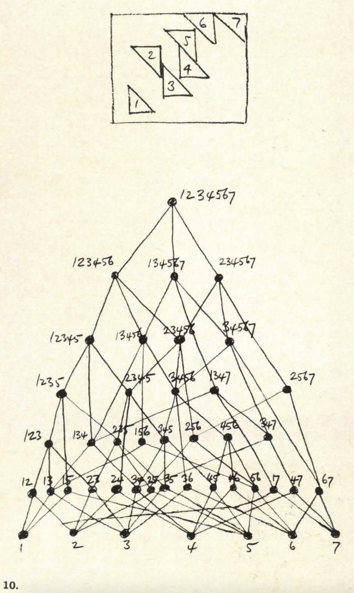

Three and 5 form a unit because they work together as a rectangle; 2 and 4 because they form a parallelogram; 5 and 6 because they are both dark and pointing the same way; 6 and 7 because one is the ghost of the other shifted sideways; 4 and 7 because they are symmetrical with one another; 4 and 6 because they form another rectangle; 4 and 5 because they form a sort of Z; 2 and 3 because they form a rather thinner kind of Z; 1 and 7 because they are at opposite corners; 1 and 2 because they are a rectangle; 3 and 4 because they point the same way as 5 and 6, and form a sort of off-center reflection; 3 and 6 because they enclose 4 and 5; 1 and 5 because they enclose 2, 3, and 4. I have only listed the units of two triangles. The larger units are even more complex. The white is more complex still, and is not even included in the diagram because it is harder to be sure of its elementary pieces.

The painting is significant, not so much because it has overlap in it (many paintings have overlap in them), but rather because this painting has nothing else in it except overlap. It is only the fact of the overlap, and the resulting multiplicity of aspects which the forms present, that makes the painting fascinating. It seems almost as though the painter had made an explicit attempt, as I have done, to single out overlap as a vital generator of structure.

All the artificial cities I have described have the structure of a tree rather than the semi-lattice structure of the Nicholson painting. Yet it is the painting, and other images like it, which must be our vehicles for thought. And when we wish to be precise, the semi-lattice, being part of a large branch of modern mathematics, is a powerful way of exploring the structure of these images. It is the semi-lattice we must look for, not the tree.

When we think in terms of tree we are trading the humanity and richness of the living city for a conceptual simplicity which benefits only designers, planners, administrators and developers. Every time a piece of a city is torn out, and a tree made to replace the semi-laltice that was there before, the city take a further step toward dissociation.

In any organized object, extreme compartmentalization and the dissociation of internal elements are the first sign of coming destruction. In a society, dissociation is anarchy. In a person, dissociation is the mark of schizophrenia and impending suicide. An ominous example of city-wide dissociation is the separation of retired people from the rest of urban life, caused by the growth of desert citie for the old like Sun City, Arizona. This separation
is only possible under the influence of tree-like thought. 

It not only takes from the young the company of those who have lived long, but worse, it causes the same rift inside each individual life. As you will pass into Sun City, and into old age, your ties with your own past will be unacknowledged, lost, and therefore, broken. Your youth will no longer be alive in your old age the two will be dissociated, your own life will be cut in two.

For the human mind, the tree is the easiest vehicle for complex thoughts. But the city is not, cannot, and must not be a tree. The city is a receptacle for life. If the receptacle severs the overlap of the strands of life within it, because it is a tree, it will be like a bowl full of razor blades on edge, ready to cut up whatever is entrusted to it. In such a receptacle life will be cut to pieces. If we make cities which are trees, they will cut our life within to pieces. 

[^1]: https://usmodernist.org/AF/AF-1965-04.pdf
[^2]: https://usmodernist.org/AF/AF-1965-05.pdf

