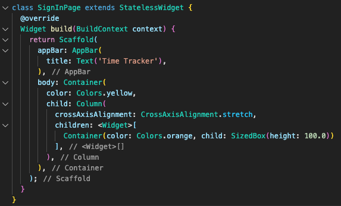

*This is an overview of the design patterns that are commonly used in outliner software. You can view a comprehensive list of outliners [here](/outliner-list).*

*This is a working document*

*Last updated 2020-01-05*

## Nesting, Promote/Demote, Collapsing (Basic Outliner Features)

### Problem

We want to be able to easily view, navigate and manipulate the hierarchy of a collection of items. Classical word processors only offer a linear display of the text.

### Solution

Nesting is the affordance of putting something in or under something else and having it displayed as a subordinate of that item, usually through indentation. Classically windows would display such a relationship with a plus and mac with an arrow.

Nested items can be promoted or demoted in the hierarchy, usually by adjusting their indentation accordingly. Modern outliners allow this to be done through the Tab and Shift + Tab keyboard shortcuts.

Collapsing is the affordance of allowing the user to hide an item's subordinate items, only displaying the top-level item. Usually this is paired with some type of state change in the top level's icon indicating that it contains hidden subordinate items.

## Hierarchy-based automatic styling

### Problem

It is difficult to discern the structure of the hierarchy represented by the outline through indentation alone. Applying styling which is consistent across outline levels can help emphasize the structure, but can be tedious to apply when each level needs to be styled independently.

### Solution

Afford the user the option to define styles on a heading level. This is similar to what we're used to seeing in word processors, but isn't often seen in outliners.

## Hierarchy-independent manual styling

### Problem

We might want to convey a structure within our outline, through styling, which doesn't map onto the hierarchy (and possible hierarchy-based styling).

### Solution

Some outliners include options for changing the font size and text decoration irrespective of the outline level.

## Inline Notes

### Problem

We want to include a comment or meta-information about an item within the outline without editing the item's contents itself.

### Solution

Afford the user the option to add a meta-level comment on each item across the hierarchy.

## Multiple entities

### Problem

Having only one type of entity at their disposal prevents a user from structuring their notes hierarchically or by delineating between different classes of entities.

### Solution

Allow for multiple entities to be used in the hierarchy. The Mac Finder, for example, allows you to use folders and files. A file can live inside a folder,  nothing can live inside a file and different types of files exist.

## Additional columns

### Problem

The entity in the outline might have additional attributes that cannot be displayed in the outline itself.

### Solution

Afford the user the ability to add additional columns to the outline to display otherwise hidden attributes.

## Outlines within outlines

### Problem

A small amount of allowed hierarchy levels may not be enough to fully represent some information.

### Solution

Allow infinite levels of outlining.

### Examples

## File explorer

### Problem

Within a tree / file cabinet metaphor, the note entities are stored at a location within some abstraction. The file system and the explorer / finder are the default paradigms for navigating files across platforms. Allowing for manipulation of the hierarchy's highest level, therefor, amounts to manipulating individual files. Manipulation at the file-level, however, may not be something that is afforded to the user.

### Solution

Integrate the file-level view into the outliner.

## Meta-outlines (Outlines __about__ outlines)

### Problem

Sometimes we would like to work with outlines as the entities themselves and view and manipulate a hierarchy of such entities. 

## Folding

### Problem

When text spans more than a single line, it can clutter the hierarchical overview.

### Solution

Folding limits the space a line takes up to 1 line by truncating it.

## Other Graphical Layouts

### Problem

A hierarchical or textual view of our notes often doesn't give us the perspective or context necessary.

## Clippers

### Problem

We want to be able to take information we find outside of our note taking tool and bring it into our notes.

### Solution

Use a separate tool or a browser extension to "clip" content and send it back to the outliner.

## Integrated Multilevels

### Problem

Sometimes a sub-item warrants a separate entity with its own outline, or conversely, sometimes the header of a note is better suited as a sub-item of another. When a note's title isn't part of the hierarchy, it becomes cumbersome to demote it to a bullet point.

### Solution

Ability to promote and demote between outline items and the note header.

## Embedding external content

### Problem

We want to link to external resources.

## Internal Links

### Problem

We want to be able to indicate that two ideas are connected and easily navigate between the two within our notes.

### Solution

Afford the user the ability to link to an item within the existing outline (or another outline if supported).

Identifying the location to be linked to can become cumbersome in and of itself. Other outliners have implemented Media-Wiki-style link auto-suggestions to aid in the process.

## Clones

### Problem

You want an item to exist in two different outlines at the same. Said differently, you have a concept which has multiple parent concepts.

### Solution

The solution can be analogous to an "alias" in file systems.

## Group operations

### Problem

You want to perform an operation on a non contiguous group of items.

### Solution

Allow the user to search for items that match certain criteria, which results in a selection which can then be moved or promoted / demoted.

## Hoisting / Zooming

### Problem

You want to work on part of an outline without experiencing the distractions and increased cognitive load involved with having irrelevant parts of the outline in view.

### Solution

A location in the outline can be "hoisted", which displays the item and its subordinates as if they were the only items in the outline.

## Closing hierarchy reminder

### Problem

When you've opened up a long or complex hierarchy, or set or hierarchies, you can lose track of which piece of content corresponds to which hierarchy level.

### Solution

An indication can be added to the end of the hierarchical block which repeats the information about which hierarchy it pertains to usually found at the top of the hierarchy block

### References

http://archive.today/2020.12.12-062347/http://www.atpm.com/9.10/atpo.shtml

http://archive.today/2020.12.12-061939/http://www.atpm.com/9.11/atpo.shtml