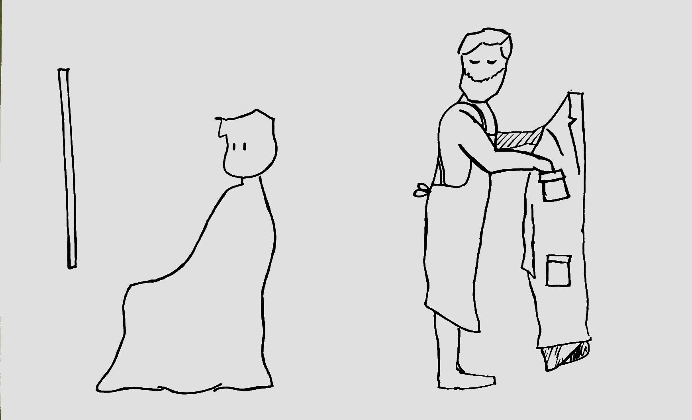

_This is a thought exercise to help explore what is okay (and what isn't) when it comes to the exchange between personal information and the provision of a personalised service._

Imagine you've moved to a new city and you're in need of a hairdresser to do your hair every other week. Perhaps you try out one or two different ones first, or perhaps you go with a friend's recommendation. Either way, after a short while you've settled on a hair dresser you're happy with. They're professional, they treat you well, they remember your name and you build up a relationship with them over time.

## The more your hairdresser knows about you, the better their service gets

As you visit this hairdresser more often, they gain more experience with your specific hair type, your preferred hair style and your preferred hair products. Perhaps the hairdresser, knowing that you have particularly thick hair, and remembering that you dislike the way it curls around your ears when it gets too long, ensures a shorter cut in those areas by default. Or, perhaps remembering that you’re most happy when your hair has a bouncy look to it, they introduce you to a specific type of wax that helps you achieve that type of effect.

There's a direct relationship here between (1) how much the hairdresser knows about you, and remembers about you, and (2) the quality of the service you receive. The more the hairdresser knows about you, the better the service they can provide. It's convenient to you when you don't have to explain what you want every time you visit. It's valuable to you when your hairdresser knows so much about your hair and your preferences that they're able to suggest things to you you didn't even know you wanted. It can also be nice if they remember the names of your children, or if they ask about that issue you were grappling with at work the last time you stopped by.

## Your hairdresser starts collecting more information

Now imagine it’s time for your regular haircut, so you visit your trusted hairdresser. You sit down in the salon chair, as you've been doing every other week and they tell you they'll be "right with you." As you look into the mirror in front of you, you see them in the reflection walking up to the coat hanger where you've hung up your coat. Having arrived at your coat they start to insert their hand into your coat's pockets one by one. For each pocket they extract its contents (your wallet, your mobile phone, your keys [^1]) and examine each carefully, before placing them back. After having made their way through your entire coat, they return to your chair to finally tend to your needs: "So, what will it be today? The usual?"

## They're just trying to improve their service

In this real-life scenario most people would, at the very least, be astonished but hopefully also a bit angry. You might want to say: "Hey! What are you doing in my coat?" Now imagine their response being "Oh, that's just a new policy we've introduced which helps us improve our service to you. You see," they continue, "as I was examining the items in your coat, I noticed a car key with an Audi logo. One of my friends happens to be an Audi mechanic. I can put you in touch with him, if you're interested, and they can help you if your car ever breaks down. I also made note of the contacts in your phone, and if one of them ever comes in for a haircut, and I'll be sure to give them a special treatment, on the house." [^2]

Would this explanation suffice for you? Would it be sufficient justification for rummaging [^3] through your coat? Would it quench the anger you felt above?

I would hope that to most people this justification sounds silly, perhaps even patronizing and certainly not an adequate justification for rummaging through your belongings. Whether or not the hairdresser's rummaging improves his service to you doesn't matter.

The only thing that matters here is that your hairdresser has no business rummaging through your fucking coat [^4].

Please remember how this makes you feel. We're going to change some variables in the story and see what happens.

## I didn't agree to this!

Let's go back to our imagined scenario. You feel offended that your hairdresser went through your coat and you say: "Hey man, I didn't agree to that!"

"Oh, I'm sorry" he replies "I didn't mean to offend you. But actually, you did consent to this new policy. You see, there's a sign at the door which says:

_‘Anybody that walks through this door consents to their coat being rummaged through for purposes of improving our service to you.'_

So by walking through the door, you've actually given your consent." [^5].

## The invisible assistant

Let’s ignore, for the sake of brevity, the issue of whether walking through a door could reasonably constitute giving consent. Imagine instead that you don't catch the hairdresser rummaging through your coat, but instead they tell you their assistant will examine all your belongings while you lie back, close your eyes and have your hair washed by them with lavender shampoo.

Try to notice within yourself: Do you feel less outrage if you're not witnessing the act of someone rummaging through your coat, but you know it's happening? For me it makes it slightly more difficult to "find" the outrage inside of myself. Since I’m not witnessing the act with my own eyes, I need to first imagine it happening before I'm able to perceive any level of outrage. The outrage is still there, but it's become a bit harder to access. It's become a bit more distant if you will.

## The high-tech camera

Let's continue to change variables. Let's imagine there's no assistant but the hairdresser has installed a high tech camera in the room which, without touching your coat and within a microsecond, is able to scan your coat and analyze all its contents. In doing so, it is able to extract the same information the hairdresser and their assistant were able to do when they were doing it themselves. Imagine this takes place in a split second and it happened as you sat down.

Do you feel angry about what just happened? Do you feel less outrage than before now that the violation is invisible to you, instantaneous and done through an inanimate object?

For me, I feel outrage, but it's become less visceral and more intellectual. It's as if I only feel outrage because I’m able to follow a sequence of logical steps to arrive at the conclusion that the outcomes of the camera scan and the physical rummaging are one and the same. That said, without the image of a person with their hands in my coat (imagined or not), it’s more difficult to feel outraged. It’s also harder to feel outraged when the violation is committed by an inanimate object. For one, I'm not sure who to get angry at, and I somehow feel less violated when it's a machine or an algorithm committing the act.

## The invisible technology in the room

Now go one step further and imagine it's not even a high-tech camera doing the scanning, but some unknown technology which you cannot see and do not understand. It’s not located anywhere you can point at, it’s just “there” somewhere in the hairdresser’s salon with you as it scans the contents of your jacket.

Are you able to find any outrage at all this time?

I can still find it, but it’s even more difficult to find than before. With the camera at least I had something I could focus my anger on (and could potentially smash). Without any identifiable person or object committing these acts, the act itself seems to slowly lose the property of being something one could potentially object to.

## How my outrage circuitry works

My outrage seems to require at a minimum a crime and a perpetrator. I struggle to find those here. Only by invoking the analog equivalent from before and by imagining an actual person committing these acts do I feel outrage. But equating this last scenario to the analog equivalent feels slightly awkward; an oversimplification. As a result, the outrage doesn’t transfer fully from one scenario to the other.

By changing the process through which the information was extracted while keeping the outcome (the extracted data) the same, my outrage circuitry has almost entirely been bypassed. This was achieved by making the scenario more abstract, instantaneous, invisible and by making the actor an inanimate, unidentifiable piece of technology.

## What if we didn't start with the hairdresser?

Now, one final step. Imagine we hadn't started with the analog example of the rummaging hairdresser and the emotional memory of how that made you feel. Imagine instead we would have started with the invisible, instantaneous, inanimate technology. Would you have been able to feel any outrage? Any whatsoever? Would you naturally think of coming up with an analog equivalent scenario to gauge your outrage?

You actually don't need to imagine the last example. If you're currently using WhatsApp, you're living inside of it. The hairdresser represents Facebook and the coat rummaging policy represents their new privacy policy, or Facebook's general conduct for that matter. If you don't feel outrage, then perhaps that's because you haven't imagined the analog equivalent of what's happening yet (which isn't always self-evident, that’s what I’ve tried to help you with here) [^6].

## Outrage is triggered by the how, not the if

The key observation to note here is that the outrage that gets triggered inside of you gets modulated by _the manner in which_ your information gets extracted, not so much _if_ it gets extracted. It's as if robbing someone of $100 would somehow be less outrageous if you did it through the internet rather than snatching it directly from their wallet.

In a high-tech society, where we’re surrounded by technological abstractions upon abstractions, should we only be relying on our instinctual outrage circuits to be our moral compasses when they can so easily be fooled?

## Final note

_Even though the hairdresser in this story (Facebook / WhatsApp) is rummaging through your coat, there are many reputable hairdressers (messaging services) that do not. My favourite alternative is [Signal](https://signal.org) [^7], but I've heard good things about [Threema](https://threema.ch/) and although I don't get the impression the technology is accessible enough to port my friends and family, I'm supportive of what [Matrix](https://matrix.org/) is trying to accomplish._

[^1]: The coat rummaging is intended as an analogy for WhatsApp / Facebook sucking up personal data on you which they do not strictly need to provide their services. It is not a perfect, lossless analogy. That's because tehre are none. WA/FB doesn’t examine your wallet or your physical device. These items are stand-ins for the stuff they actually do such as collecting your contacts' phone numbers, app usage statistics and location data.
[^2]: Ostensibly there's still a relationship here between the data that the hairdresser is collecting and their ability to use that data to improve their service to you. The main point I would make here is twofold. (1) It's unclear how that relationship plays out and (2) it's unreasonable to except it to be okay to rummage through someone's coat in the context of a visit to the hairdresser's.
[^3]: I use the word “rummaging” here on purpose because it has a different emotional charge than “collecting data”. The main associations I have for “collecting” are benign or positive things on the one hand, such as “collecting donations”, “collecting coins” and, on the other hands, things like bringing together some non-scarce resource that is already being dispersed or freely available (with or without the collecting) such as “collecting rainfall” or “collecting resources”. I think these are misleading associations to have when it comes to a commercial entity assuming ownership of information which it doesn’t strictly need to provide its service (and might not yet know how it will use). For this reason I think rummaging — "to search thoroughly or actively through, especially by moving around, turning over, or looking through contents." — has a more fitting emotional charge.
[^4]: Of course, under a consensual agreement such conduct could be perfectly acceptable.
[^5]: Have you ever walked through a door without reading notices that might have been attached to it? Now imagine a door where the notices are replaced every couple of weeks and the text takes 30 minutes to read, written in a way which doesn't guarantee you'll understand the implications once you do. Is it reasonable to assume that someone that walks through such a door consents to everything that is mentioned on it? Not entirely, right? This is a rough analogy for the terms and conditions pop ups that we’re confronted with online and in-app. Admittedly, I’m pointing at a problem here without offering a solution. I’d expect a business owner to ask me to my face if I understand and agree to such a policy.
[^6]: Some might argue that having our personal information read and processed by machines and algorithms isn’t as invasive as when it’s read by a single, real-life person. And, for that reason, drawing an equivalence relationship between it and an analog scenario is neither accurate or fair. I grant that point. Analogies are lossy. But in some cases they might be among the best tools we have, which makes them worth using.
[^7]: Signal is open source, set up as a non-profit, has a great reputation, has been endorsed by Edward Snowden en Bruce Schneier and always seems to do their best to collect the absolute minimum information possible to provide their services.
