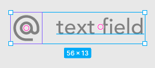
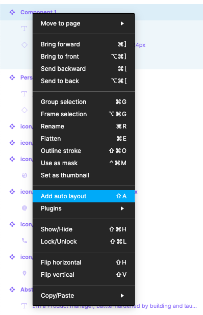
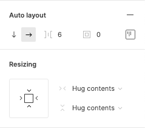
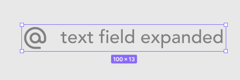

## The problem

I created a component with an instance of another component (an icon) and a text field.

After creating the component it looks like this:

The problem is that when I choose to change the text and expand it, the component will look like this:

## The solution

The solution is to select the component you just created, right click and select "Add auto layout" or press Shift-A. This adds Auto Layout to the component which will allow it to resize automatically.

Adding Auto Layout should give you an extra section in the Properties panel on the right hand side that looks like this:

Here you can define the resizing behavior of the component, which will be applied automatically upon resizing. This is exactly what we want.

The default is set to "Hug contents" for both the horizontal and vertical directions. This means the outer edge of the component will "hug" the inner content, resizing itself as the contents expands or shrinks.

The result is a component that resizes with its contents.

