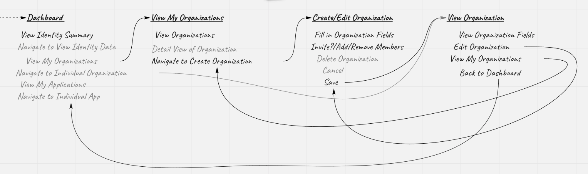
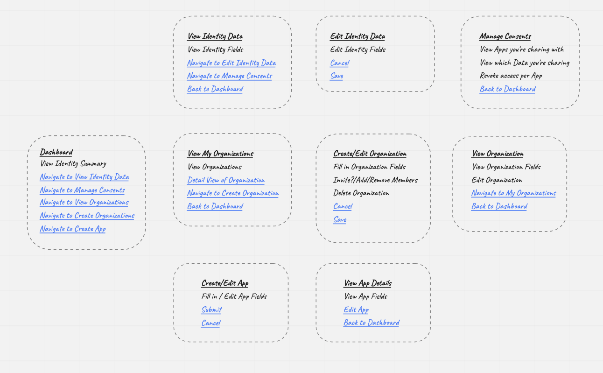

I got the idea of breadboards from Ryan Singer in his book [Shape Up](https://basecamp.com/shapeup).

Borrowing from the field of electrical engineering, a breadboard is a fully functioning prototype without the industrial design. We can do the same for an interaction idea and choose not to specify any visual design.

To do this we specify three things:

- Places — Things you can navigate to, like screens, modals etc.
- Afforandances — Things users can act on, like buttons, menus but also interface copy.
- Connection Lines — These show how affordances take users to different places.

Places go on top, affordances go underneath, connections define the flow.

By staying in low-fidelity, the breadboarding and fat marker sketching leave room for designers later in the process.

## The problem

One problem with breadboards is that the connection lines can get messy.

A slightly different approach is using a [Miro](https://miro.com) board and using its ability to link to objects. Clicking on a link will move the current view to the linked object.

Because Miro zooms into the object that was linked, once you click a link, it can be helpful to link to a frame around the place/location in the breadboard. That way you never zoom in too far.

Here's a video of how it works in practice.

https://youtu.be/G9ArLvCqPiE
