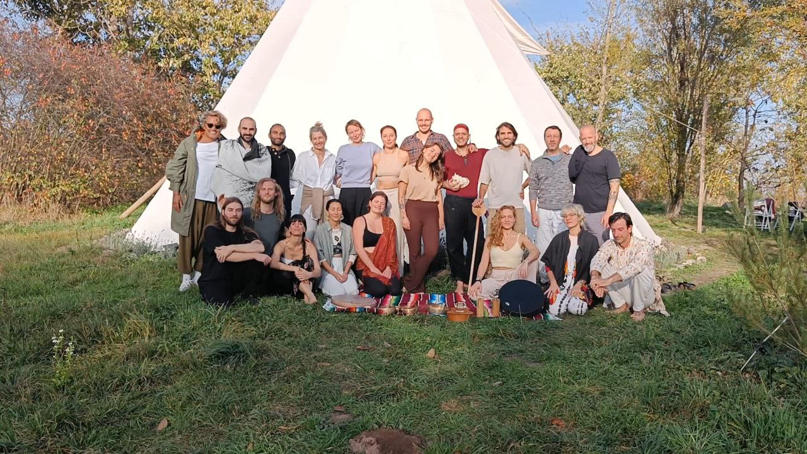

Pia, Gabo and Alejandro guide the ritual and are the curanderos (the healers). A couple of hours before the ritual we have an opening circle where we set our intention and we do an exercise in occult magic to transform that intention into a symbol. I tell the group that my intention is that I believe there's a way to live in which it looks and feels like the universe flows through you. I'm drawn to that way of life but it feels like there are certain patterns that pull me back. Mostly fear-related. It's those patterns that I wish to work on and continue to dissolve.

Pia asks everyone how many grams they would like to take. The options are 3,4 and 5 grams. I want to say 5, but I feel a bit anxious about it. Pia offers to let me take 4 and then take an additional gram if I think it's not enough. When I speak to my friend Kostas, who is less experienced than I am, he tells me he is taking 5 grams and he says so with seriousness and conviction.

Kostas' courage is striking and it reminds me of the intention I had set and my desire to overcome fear-based patterns. This was a fear based pattern right here, so I set out to take 5 grams as well.
The ritual takes place in a tipi big enough for 20 people to sit in a circle with a fire in the middle. Everyone has their own little mattress, blanket and cushion.

When the forza of the mushrooms hits the curanderos walk around playing a xylophone and other subtle musical instruments. Something about these gentle sounds make them the perfect stimulus for this moment, as the forza gets stronger.

I was sitting upright in a cross-legged position and at this moment I started to feel very cold. I've had this before with Santo Daime rituals where, once the forza is strong, I feel intensely cold. The obvious solution was moving closer to the fire, but I wasn't sure if this was allowed and whether it wouldn't be perceived as selfish behavior. But as a grew colder it became more and more of a necessity to move closer to the fire. There was a little lesson here for me, I had to be okay with taking up space.

At this point the curanderos are singing and playing songs and the whole experience feels very similar to what I'm used to from Santo Daime. One or two people guiding the ritual, healing songs, everyone going through their own process, the quieting of the default mind and a profound connection with life — all of which are parallels between this mushroom ritual and Santo Daime. My body responds strongly to the music and I let my upper body swing with the melody.

At some point I experience what I think might be ego dissolution. It's relatively anti-climatic because I simply stumble upon the realization that I don't remember who I am. I wait for a second for the answer to slide in with a slight delay, but nothing slides in. I am only awareness. There is no person "Jesse", no familiar personality or character in a story. Only awareness. And this awareness can be shifted around on different things. This sensation dissolves as silently as it came up.

Then there's an opportunity to make a prayer and throw some small organic material (which I'm now forgetting the name of) into the fire. I say a prayer for Rebecca. I say that she was only here for 8 days but that she taught us so much. That although she's not here with us, that we're doing well and that we hope she's happy. It's important to be happy, but it's also important to remember. So the prayer was addressed to Rebecca, that we will remember her.

Pia invites us to sing songs of our own at this point in the ritual. I search for any Santo Daime song in my memory but nothing comes up. This makes a big impact on me. I've sung Daime songs hundreds, perhaps thousands of times, yet nothing comes up. It helps me realize that apparently I'm experienced enough with plant medicine to take a big dose and be in a good place, my experience is a mere drop in the bucket when compared with the curanderos, who are supporting the ritual with their singing. This ends up hardening my conviction that I want to be able to sing healing songs.
