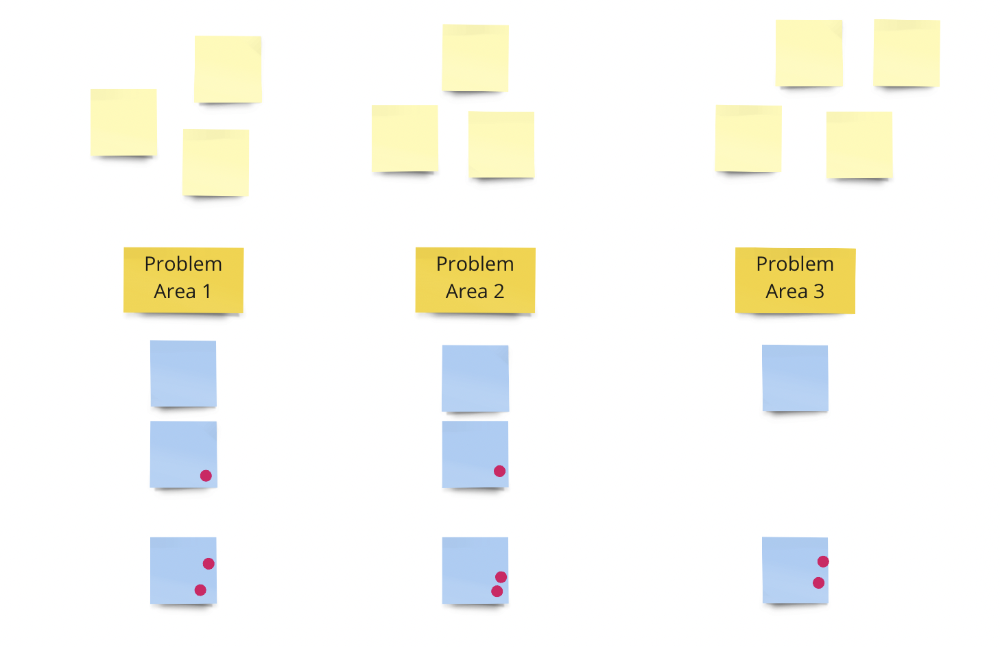

This is a workshop format that we ran at the ETH Gathering 2022. It's particularly useful for a group of people (regardless if they know each other) to coordinate on (1) what work needs to be done? and (2) who's going to do it. It's an alternative to a central committee or person dictating what works needs to be done.

## Preamble

The workshop needs to be centered around some work that a group of people should coordinate around. It's okay if it's not clear what that work should be. An example that we've used is "What problems have you experienced with conferences?"

## Step 1: Problems

Ask the participants to ideate on the problems that exist within the chosen topic.
Ask the participants to affinity map the post its and give each problem cluster a name. Within an organization you could consider that these problem clusters might map onto departments.

## Step 2: Solutions

Ask the participants to ideate on solutions for each problem cluster.
Then do a round of dot voting on the solutions and rank them according to their votes. Make a selection of the top voted solutions. This can be for instance the top voted solution per problem cluster.

## Step 3: Tasks

Ask the participants to ideate on what tasks would be involved to bring each of the selected solutions into fruition.

Remove duplicate tasks and reorder them in rough chronological order.

Ask the participants to put their name on any task they feel willing and inspired to take responsibility for. Emphasize that they're not required to take responsibility for anything — only if they think it's important and they really want to commit themselves to it. This is important. Because even if you end up with tasks that don't have anyone that wants to do them, this is information that feeds back into the workshop.

Take a look at the tasks. Are there any solutions where all tasks have a person assigned to them? This would be a solution that could be pursued right away. For a solution where tasks are left unassigned one might interpret this to mean that the solution doesn't have enough support to be pursued. Alternatively you could discuss whether the solution needs to be scaled down in a way that full coverage of its tasks may be reached.
