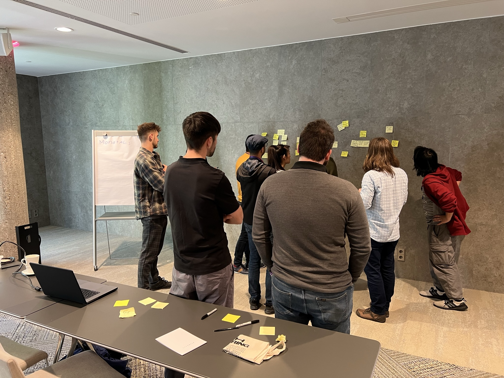
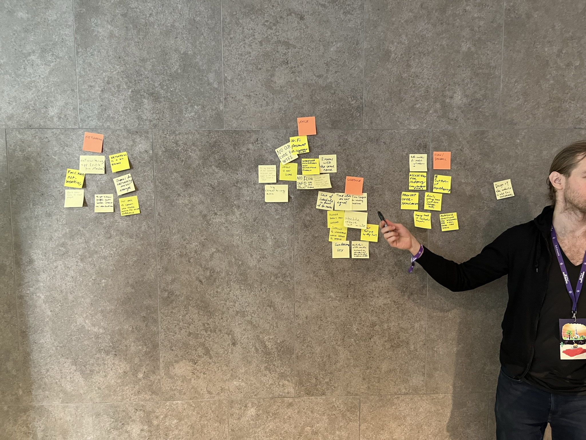
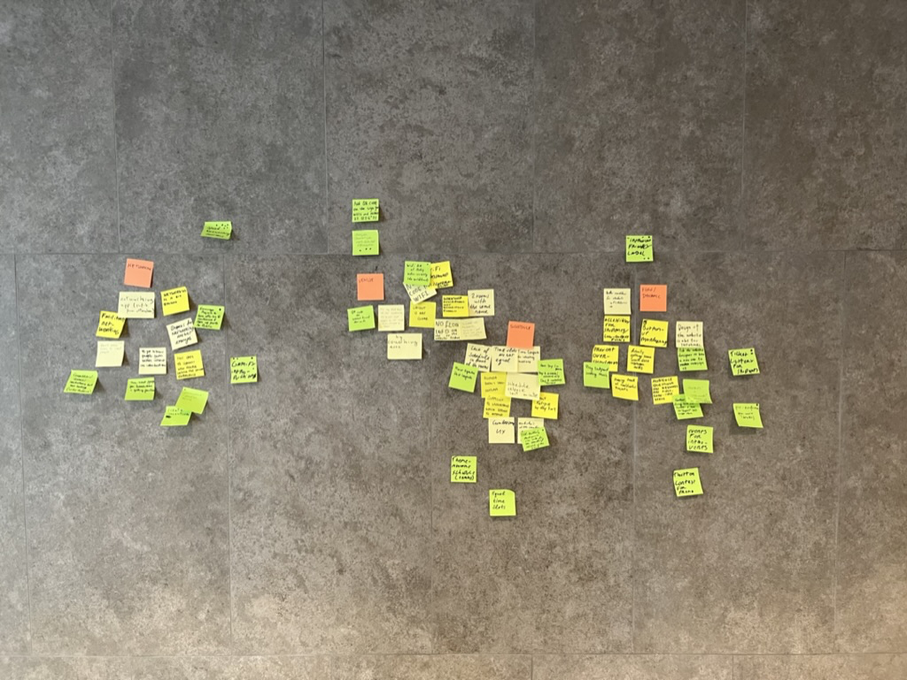
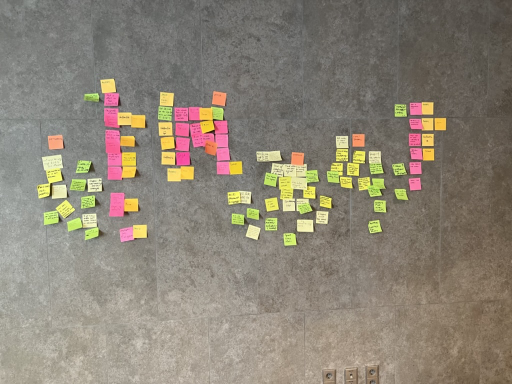
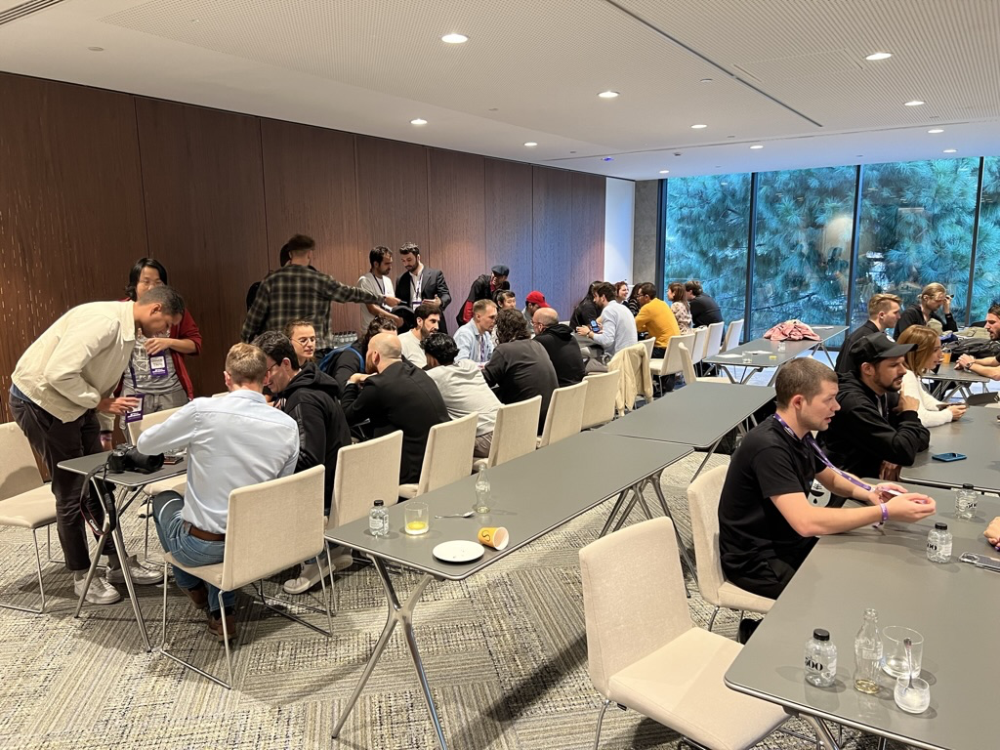

We (Deep Work) ran a relatively new workshop format at ETH Gathering 2022. The goal of this workshop is to help a group of people coordinate their labor.

We were considering this workshop as a small scale analogue for DAOs trying to get work done among themselves. In both cases you have a group of people where not everyone knows each other (if at all), yet both groups are interested in finding a way to coordinate their labor.

Because of its bottom-up (i.e. emergent) nature, this workshop is a potential alternative to the more traditional centralized or hierarchical (i.e. top-down) approach to coordinating labor. Rather than a single person or committee dictating a vision from the top of an organization downwards, the ideas that are perceived to be important and that have support emerge from the bottom up. This may be of particular interest to DAOs that are often interested in maintaining a decentralized and/or flat organizational structure. I've written an instruction guide on how to run the workshop [here](https://jessems.com/emergent-coordination-of-labor-workshop).

Before one gets to the meat of the workshop one needs to choose a topic; an area or domain where there exists the potential of some work to be done. Because we were at a conference it seemed reasonable to use the current conference as our topic. The prompt we used was (more or less) "How would you improve the current conference?" The workshop took place during the morning slot, but the organizers had given us an afternoon slot as well. We decided to use this second slot to implement whatever solution we came up with in the first. So we were asking the workshop participants to come up with an improvement to the conference in the morning **and** to implement it in the afternoon.

## Step 1: Problems

We started off by asking the participants to come up with problems which, if solved, would improve their current conference experience. They wrote down a litany of problems on post-its. One problem per post-it.

Then we affinity mapped them and gave labels to each cluster.

The emergent problem clusters were Networking, Venue, Schedule and Flow. Problem clusters, by the way, are great candidates for erecting a substructure around within your organization. At Deep Work our problem clusters become our departments.

## Step 2: Solutions

The second part of the workshop was generating solutions within those clusters. Again, one solution per post-it. After generating a bunch of solutions the participants voted on the best solutions by drawing dots on the post-its. There was an implicit constraint present here. Because the participants knew that they would need to implement the solution that same day, only the more realistic solutions got upvoted.

We then made a selection of the top 3 solutions by moving them to the top of conference room wall. The top 3 solutions were (1) a speed networking event (Networking cluster), (2) a giant QR code on the wall as the wifi password (Venue cluster) and (3) an introvert-friendly label on each conference session (Flow cluster).

## Step 3: Tasks

For these three solutions we asked the participants to come up with a list of tasks they believed would be necessary to bring the given solution to fruition.

After removing duplicate tasks and sorting them in rough chronological order, we asked the participants which tasks they would **like** to take responsibility for. We stressed that this is about what they would truly like to do, and if they weren't interested in making a commitment — they shouldn't.

This can be considered a departure from a more classical model of coordinating labor in which work is dictated from top down. In such a context whether you want to do it or not is not immediately relevant.

What happened next is that responsibility for all tasks had not been claimed. For whatever reason the participants did not feel compelled to take responsibility for all tasks within each solution.

And that's okay.

If a solution has unassigned tasks it might mean that the solution doesn't have enough support within the group. Or it might mean that it needs to be modified a bit such that it does. The point is that a task for which no one wishes to take responsibility is valuable information.

In this case it naturally focused our attention on the only solution for which we _did_ find people willing to take responsibility for each task. The winning solution was the Speed Networking Event.

Because we had generated the tasks, and everyone had assigned themselves responsibilities, we knew what needed to be done, and we knew who would be doing it. One task was to liaise with the conference organizers to use our afternoon slot for the networking event, another was to make some announcement at the conference and another was to appoint someone that would facilitate the event itself.

The result blew even us workshop organizers away. We started with a group of 5-6 people, most of whom didn't know one another. We asked them a couple of questions and had them stick post-its on the wall. What we ended up with was an event that was so well-attended and so lively it might have been considered the highlight of the conference.

Clearly this idea had appealed to a lot of people at the conference.
But why? "Who would have thought that in 2022, that what the conference most needed was a real life networking event?" Andrej (Deep Work cofounder) remarked.

I too found the whole experience a bit counterintuitive. How is it possible that you ask a small group of participants to come up with an improvement for the current conference and they come up with an absolute banger of an event?

Andrej and I discussed this question and we arrived at the following answer. The power of the workshop comes from its purposeful leveraging of the wisdom of the crowd. At every stage of the process — problem, solution, task — the input gathering process is democratic. The best solution is determined by a combination of two factors. The first is a popular vote, which can be seen as a proxy for the perceived importance of the solution. The second is whether people are willing to do the work to make it happen, which can be considered a proxy for commitment.

So you have some very powerful ingredients: Democratically sourced problems and solutions that are selected through a crowd-sourced filter which takes into consideration importance and commitment levels.
When stated in those terms, perhaps it shouldn't be surprising that this process surfaced a group sentiment within a subset of the conference participants which turned out to be representative for a sentiment that existed within the larger set of conference participants.

What's perhaps most exciting is that because of the parallels between a group of conference workshop participants and a group of DAO members we can expect similar results when we do this in a DAO context.
