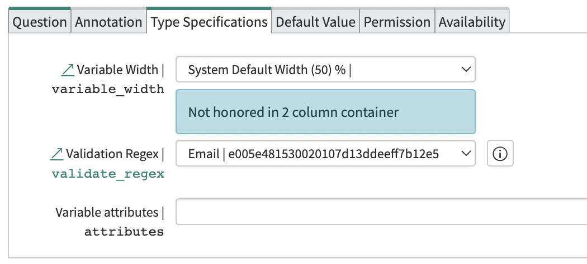

Sometimes you may want to include an email address field on a catalog item in service now.

The way to do this is by adding a separate variable.

You can create a normal variable of type "Single Line Text" and then use the built-in Validation Regex option to specify the "Email" regex option.

The result is email validation on your Catalog Item.

