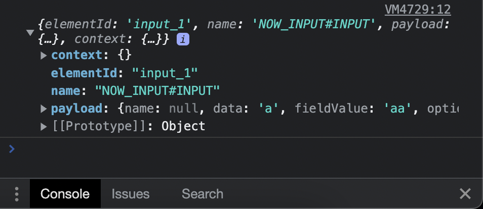
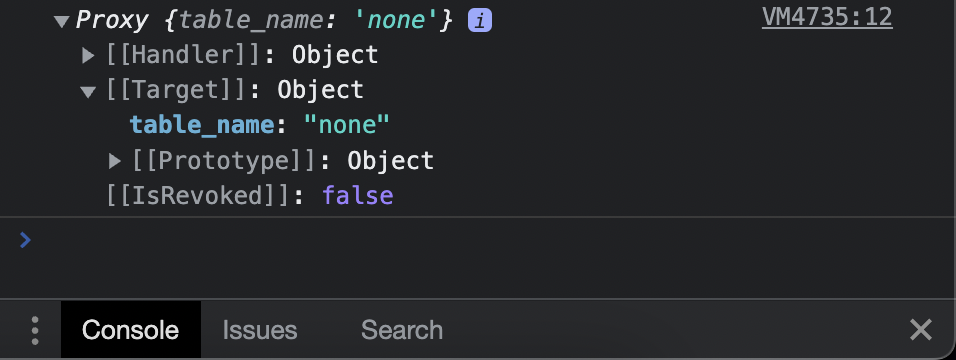

<YouTube id="1XjtMwKFx6U" />

Watch the video tutorial or read the tips below.

## Tip 1: Logging an event object

Most components come with more than one event that can be mapped onto a Page Script. Depending on what type of event it is, there will be a payload object attached to the event with some contextual information. Using the Page Script you can take some actions every time the event is fired (like manipulating a State Parameter) and you can use the information that is passed through the payload.

A button component, for instance, has an "Button clicked" event. But since a button doesn't have any useful context, the payload object is empty. You can still map the event to a Page Script in order to do something though.

```js
{
    "elementId": "button_1",
    "name": "NOW_BUTTON#CLICKED",
    "payload": {},
    "context": {}
}
```

The "Input" component has various events that can be mapped onto various handlers, including Page Scripts. Here is the event object for the "Input input" event, which fires when the user enters into the input field. Notice that we have a payload object here which contains the "data" key with the value that was entered: "a".

```js
{
    "elementId": "input_1",
    "name": "NOW_INPUT#INPUT",
    "payload": {
        "name": null,
        "data": "a",
        "fieldValue": "a",
        "options": {}
    },
    "context": {}
}
```

The takeaway here is that event payload can contain useful contextual information. The events themselves though are not always well-documented or their documentation is difficult to find. So the best way of figuring out what information is included in the payload is by logging the event.

You can log any event by creating a Page Script with the following script:

```js
/**
 * @param {params} params
 * @param {api} params.api
 * @param {any} params.event
 * @param {any} params.imports
 * @param {ApiHelpers} params.helpers
 */
function handler({ api, event, helpers, imports }) {
	console.log(event);
}
```

All this script does is log the entire event object. Then you can view the object in the browser console to see what structure it has.



## Tip 2: Creating a Log State button

A UI of any complexity will soon need to keep track of some state. We can use Page Scripts to make changes to the state. However, while we're building our solution, we might want to know whether those changes to the state have been executed correctly. In short: We want to know if the state indeed did change.

There's no out-of-the-box way to display or navigate the state on the client side. But this is easily remedied by adding a button on your UI which logs the current state object to the console.

All you need to do is to create a Page Script with the following script:

```js
/**
 * @param {params} params
 * @param {api} params.api
 * @param {any} params.event
 * @param {any} params.imports
 * @param {ApiHelpers} params.helpers
 */
function handler({ api, event, helpers, imports }) {
	console.log(api.state);
}
```

Then create a new Button component and map the "Button clicked" event to the Page Script you just created.

The result is a Proxy object which gets logged to the console. We can navigate down into the `[[Target]]` key to reveal the state object in its entirety.



You can even choose to make the visibility of the "Log state" button conditional on a specific role by creating an audience for it. But that's for another blog post.
