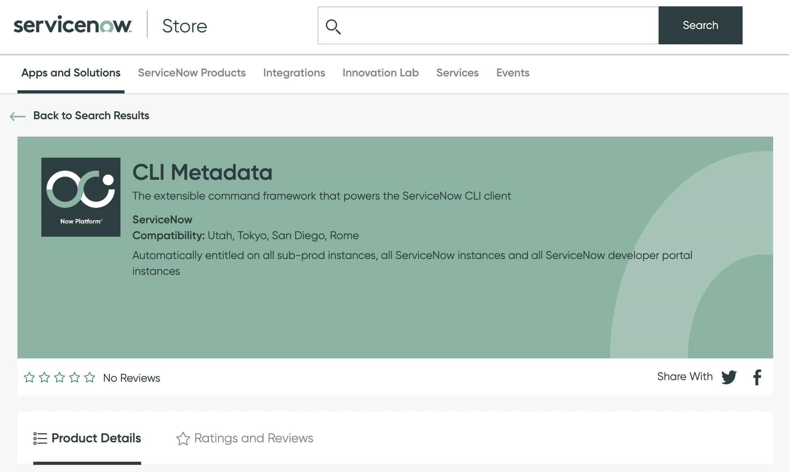
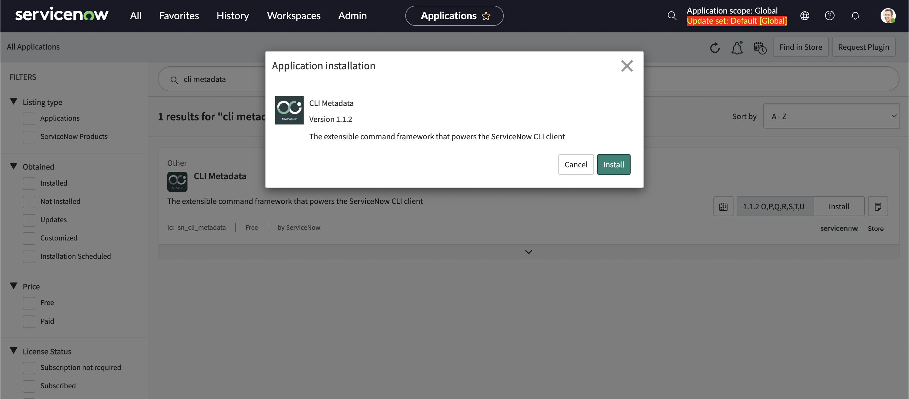

When first connecting to your ServiceNow instance via the ServiceNow CLI you might see the following warning:

```
✔ Connection to https://dev132078.service-now.com successful.
✗ This instance does not support dynamic commands. Functionality will be limited.
Profile personal-dev has been saved
```

The reason for this warning is because your instance is not running the "CLI Metadata" application.

Here's how to install the CLI Metadata application on your instance:

### Step 1: Enable the CLI Metadata application for your instances

Visit the ServiceNow Store and search for CLI Metadata. Then enable it for your instances.



### Step 2: Install the CLI Metadata on your instance

1. On your instance navigate to **System Definitions > Plugins**. You'll be redirected to an overview of All Applications.

2. Here search for CLI Metadata. Select it and install it.



3. Now if you set up your profile again using the following command:

```shell
snc configure profile set --profile <profile-name>
```

The warning should have been replaced with a confirmation that the metadata was retrieved successfully:

```shell
✔ Connection to https://<your-instance>.service-now.com successful.
✔ Metadata retrieved successfuly from https://<your-instance>.service-now.com
Profile personal-dev has been saved
```
