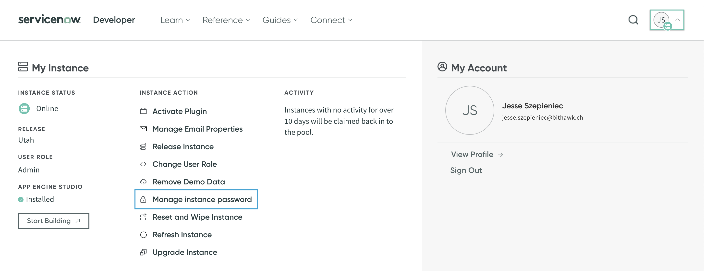
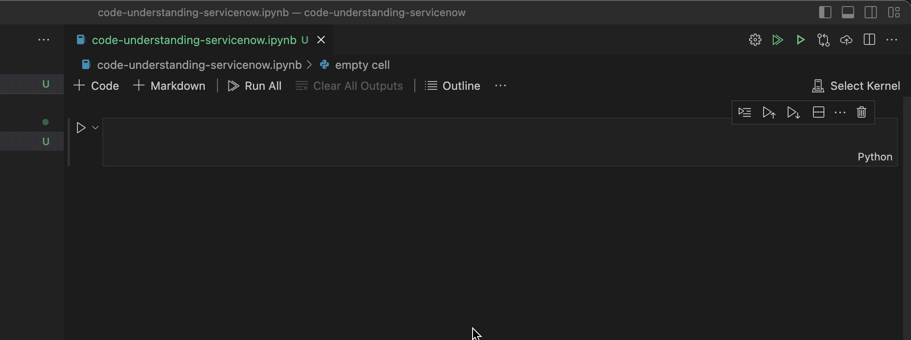

import YouTube from '@components/youtube'

In this tutorial I will show you how to use Chat GPT on a collection of script files from your ServiceNow instance. This allows you to chat with the code that is running on your instance.

You can follow along with the video, or with the blog post below.

<YouTube id="T2e4cbnHD0g" />

## Prequisites (for following along)

- An environment to run an iPython notebook.
- A ServiceNow instance to experiment with.
- An [OpenAI API](https://openai.com/blog/openai-api) key.
- An [ActiveLoop](https://activeloop.ai) token.

## Step 0: Setup

### Getting your developer instance password

If you want to try this out on your own personal development instance, you may want to get your instance' username and password handy.

To get your developer instance password go to developer.servicenow.com and click on the menu on the top right corner. Then select **Manage Instance Password** to see your developer instance password.



### Setting up an iPython Notebook

Most of the LLM tooling is python-based and one convenient way of working with Python is through an iPython notebook. Google offers a hosted service to run iPython Notebook called [Google Colabs](colabs.google.com). I prefer develop locally using the iPython functionality within VSCode using the [Jupyter](https://marketplace.visualstudio.com/items?itemName=ms-toolsai.jupyter), [Python](https://marketplace.visualstudio.com/items?itemName=ms-python.python) and [Pylint](https://marketplace.visualstudio.com/items?itemName=ms-python.pylint) extensions.

(If you use Google Colabs you don't need to worry about virtual environments, but you do need to preface all your shell commands with a `!` to run them in the shell.)

If you go with a local iPython Notebook, read on.

In a new folder type in the following to create a new virtual environment:

```bash
python3 -m venv .venv
```

Follow that by activating the virtual environment:

```bash
source .venv/bin/activate
```

On windows this would be:

```bash
.venv\Scripts\activate
```

Then select the newly created venv from the interpreter dropdown in VSCode if its not selected already.



To install all the needed libraries we need to start off by running the following (inside our virtual environment):

```bash
pip install -qU --upgrade langchain 'deeplake[enterprise]' openai tiktoken pysnc
```

## Step 1: Getting your ServiceNow instance code

Now let's get the code from our ServiceNow instance. For this we'll use the amazing [PySNC](https://servicenow.github.io/PySNC/) library. This library allows you to easily interact with your ServiceNow instance from Python.

```python
import os
import pysnc

# Create the directory if it does not exist
os.makedirs('data/sys_script_include', exist_ok=True)

client = pysnc.ServiceNowClient('dev168935', ('admin', getpass.getpass("Dev Instance Password:")))
gr = client.GlideRecord('sys_script_include')
gr.add_query('sys_package', '16ce0f75e8e1211076da10591ad28708')
gr.query()
for i, r in enumerate(gr):
    with open(f'data/sys_script_include/{r.name}.js', 'w') as f:
        # If r.script is None, replace it with an empty string
        name = r.script.get_value() if r.script is not None else ''
        # Write the script to the file
        f.write(name)
    print(f"Finished writing file for record {i}: {r.name}.js")
```

## Step 2: Creating embeddings

Now let's get ready to connect with OpenAI and ActiveLoop AI:

```python
import os
import getpass

from langchain.embeddings.openai import OpenAIEmbeddings
from langchain.vectorstores import DeepLake

os.environ["OPENAI_API_KEY"] = getpass.getpass("OpenAI API Key:")
activeloop_token = getpass.getpass("Activeloop Token:")
os.environ["ACTIVELOOP_TOKEN"] = activeloop_token
```

For the embeddings let's use the Open AI embeddings:

```python
embeddings = OpenAIEmbeddings(disallowed_special=())
```

## Step 3: Chunking the files

Now let's load and split the files using [`TextLoader`](https://python.langchain.com/docs/modules/data_connection/document_loaders/) and its load_and_split method:

```python
import os
from langchain.document_loaders import TextLoader

root_dir = 'data/sys_script_include'
docs = []

# Go through each folder
for dirpath, dirnames, filenames in os.walk(root_dir):

    # Go through each file
    for file in filenames:
        try:
            # Load up the file as a doc and split
            loader = TextLoader(os.path.join(dirpath, file), encoding='utf-8')
            docs.extend(loader.load_and_split())
        except Exception as e:
            pass
```

Let's confirm the files were split correctly:

```python
print (f"You have {len(docs)} documents\n")
print ("------ Start Document -----")
print (docs[0].page_content[:300])
```

This should return something like this:

```text
You have 35 documents

------ Start Document -----
function Schema() {}

Schema.fromTable = function fromTable(table, fields) {
	var tableSchema = {};

	var tableDescriptor = GlideTableDescriptor.get(table);
	var glideTableSchema = tableDescriptor.getSchema();

	if (glideTableSchema.isEmpty()) {
		NiceError.raise("Unknown table: '" + table + "'");
```

## Step 4: Adding the chunks to the vector store

```python
from langchain.text_splitter import CharacterTextSplitter

text_splitter = CharacterTextSplitter(chunk_size=1000, chunk_overlap=0)
texts = text_splitter.split_documents(docs)
```

Now let's add these chunks to our vector store:

```python
from langchain.vectorstores import DeepLake

username = "jessems"  # replace with your username from app.activeloop.ai
db = DeepLake(
    dataset_path=f"hub://{username}/glidequery",
    embedding_function=embeddings,
)
db.add_documents(texts)
```

```text
Your Deep Lake dataset has been successfully created!
-Dataset(path='hub://jessems/glidequery', tensors=['embedding', 'id', 'metadata', 'text'])

  tensor      htype       shape      dtype  compression
  -------    -------     -------    -------  -------
 embedding  embedding  (138, 1536)  float32   None
    id        text      (138, 1)      str     None
 metadata     json      (138, 1)      str     None
   text       text      (138, 1)      str     None
['6599c136-221f-11ee-a991-0242ac1c000c',
 '6599c2c6-221f-11ee-a991-0242ac1c000c',
 ...
```

Now let's load the data lake:

```python
db = DeepLake(
    dataset_path="hub://jessems/glidequery",
    read_only=True,
    embedding_function=embeddings,
)
```

## Step 5: Creating the retriever

Let's define a retriever:

```python
retriever = db.as_retriever()
retriever.search_kwargs["distance_metric"] = "cos"
retriever.search_kwargs["fetch_k"] = 100
retriever.search_kwargs["maximal_marginal_relevance"] = True
retriever.search_kwargs["k"] = 10
```

## Step 6: Creating the chatbot

I've customized this a bit in relation to the original Langchain tutorial so that Open AI returns a markdown response and includes plenty of code snippets.

````python
from langchain.chat_models import ChatOpenAI
from langchain.chains import ConversationalRetrievalChain
from langchain.prompts.prompt import PromptTemplate
from langchain.prompts.chat import (
    ChatPromptTemplate,
    SystemMessagePromptTemplate,
    HumanMessagePromptTemplate,
)

general_system_template = r"""
Your are a professional ServiceNow dveloper. Give a detailed answers aimed at other programmers. Start your explanations off in simple terms. Respond with markdown. Include code snippets if appropriate. If you don't know the answer, simply say you don't know.
 ----
{context}
----
"""
general_user_template = "Question:```{question}```"
messages = [
            SystemMessagePromptTemplate.from_template(general_system_template),
            HumanMessagePromptTemplate.from_template(general_user_template)
]
qa_prompt = ChatPromptTemplate.from_messages( messages )

model = ChatOpenAI(model_name="gpt-4")
qa = ConversationalRetrievalChain.from_llm(model, retriever=retriever, combine_docs_chain_kwargs={"prompt": qa_prompt})
````

Create a function we can use to ask questions:

```python
chat_history = []

def ask(question, chat_history):
    result = qa({"question": question, "chat_history": chat_history})
    chat_history.append((question, result["answer"]))
    with open('answers.md', 'a') as f:
        f.write(f"**Question**: {question} \n\n")
        f.write(f"**Answer**: {result['answer']} \n\n")
```

## Step 7: Asking questions

Then ask your questions and watch them appear inside answers.md in markdown.

```python
ask('How does GlideQuery work?', chat_history)
```

````markdown
**Question**: How does GlideQuery work?

**Answer**: `GlideQuery` is a class in ServiceNow that provides a more modern and flexible way to perform database operations compared to the traditional `GlideRecord` and `GlideAggregate` APIs. It allows developers to build and execute database queries in a more intuitive and succinct manner, while also providing more advanced and powerful query features.

Here's a simple breakdown of how it works:

1. **Initialization**: You create a new `GlideQuery` object by passing the table name to its constructor:

   ```javascript
   var query = new GlideQuery("sys_user")
   ```

2. **Building the query**: You can then chain methods onto the `GlideQuery` object to build your query. Each method corresponds to a specific database operation or condition. For example, you can add filter conditions using the `where()` method:

   ```javascript
   query.where("active", true)
   ```

   You can also limit the number of records returned using the `limit()` method:

   ```javascript
   query.limit(10)
   ```

3. **Executing the query**: You can execute the query and retrieve the results using the `toArray()` or `toGlideRecord()` methods:

   ```javascript
   var results = query.toArray()
   ```

   ```javascript
   var glideRecord = query.toGlideRecord()
   glideRecord.query()
   while (glideRecord.next()) {
     // Do something with the glideRecord
   }
   ```

Under the hood, the `GlideQuery` class maintains an internal representation of the query, which is updated each time you call a method to modify the query. This internal representation is used to generate the actual SQL query that is executed against the database when you call `toArray()` or `toGlideRecord()`.

In addition to the standard query operations provided by `GlideRecord`, `GlideQuery` also supports more advanced features like subqueries, complex join operations, and aggregation functions.
````

```python
ask('How is GlideQuery implemented that it allows for you to chain methods on top of each other? ', chat_history)
```

````markdown
**Question**: How is GlideQuery implemented that it allows for you to chain methods on top of each other?

**Answer**: GlideQuery is designed to allow method chaining by returning a new GlideQuery object after each method call. This is made possible because each method call adds a new object to the 'plan' array representing the action to be taken, then returns a new GlideQuery with the updated 'plan'.

Let's take a look at the 'withAcls()' method as an example:

```javascript
GlideQuery.prototype.withAcls = function withAcls() {
  return new GlideQuery(
    this.table,
    this.plan.concat({
      type: "withAcls",
    })
  )
}
```

In the code above, a new GlideQuery object is created and returned. The new GlideQuery has the same 'table' as the current GlideQuery, and a 'plan' array that includes all current plan steps plus a new step of the type 'withAcls'. This returned object can then be used for further method chaining.

So if you have a GlideQuery, you can chain methods like this:

```javascript
var users = new GlideQuery("sys_user")
  .withAcls()
  .limit(20)
  .orderByDesc("first_name")
  .select("first_name")
  .toArray(100)
```

Each method call in the chain adds a new step to the 'plan' and returns a new GlideQuery object, allowing for the next method in the chain to be called.
````

```python
ask("What about the toArray() method, I don't understand why we need that. What does it do?", chat_history)
```

````markdown
**Question**: What about the toArray() method, I don't understand why we need that. What does it do?

**Answer**: The `toArray()` method in GlideQuery is used to fetch the records from the ServiceNow database and returns an array of JavaScript objects representing the records. The objects in the array have properties and values corresponding to the fields and values of the records.

This method is terminal, meaning it executes the GlideQuery, fetches the records, and transforms them into an array of JavaScript objects. After calling `toArray()`, you cannot add more operations to the GlideQuery.

Here's a simple example:

```javascript
var users = new GlideQuery("sys_user")
  .select("name", "email")
  .limit(10)
  .toArray()

users.forEach(function (user) {
  gs.info(user.name + ": " + user.email)
})
```

In this example, `users` is an array of objects. Each object represents a user record and has `name` and `email` properties. The `forEach` loop is used to print the name and email of each user.

Behind the scenes, GlideQuery converts each GlideRecord it fetches into a JavaScript object. The returned JavaScript objects are plain data objects, they do not have the methods a GlideRecord has. If you need to call GlideRecord methods on the records, you should use `forEach()`, `map()`, or `reduce()` instead.

It's important to note that, by default, GlideQuery only fetches the values of the fields you specify with `select()`. If you call `toArray()` without calling `select()` first, the returned objects will only have `sys_id` field.

Also, remember to use `limit()` method when using `toArray()`, to avoid fetching a large number of records and potentially running out of memory.
````

## Resources

- [Google Colab for this Post](https://colab.research.google.com/drive/1dogpeQWZCzEqeC0lOiiA5hah4rRbrKxQ?usp=sharing)
- [Repository for this Post](https://github.com/jessems/Code-Understanding-ServiceNow)
- [Official Langchain tutorial](https://python.langchain.com/docs/use_cases/code/twitter-the-algorithm-analysis-deeplake)
- [StackOverflow question](https://stackoverflow.com/questions/76175046/how-to-add-prompt-to-langchain-conversationalretrievalchain-chat-over-docs-with)
- [GlideQuery Blog Post by ServiceNow](https://developer.servicenow.com/blog.do?p=/post/glidequery-p1/)
- [A GlideQuery Cheat Sheet by Sam Meylan](https://www.snow-adventures.com/blog/glidequery-cheat-sheet/)
- [Official PySNC documentation](https://servicenow.github.io/PySNC/)
