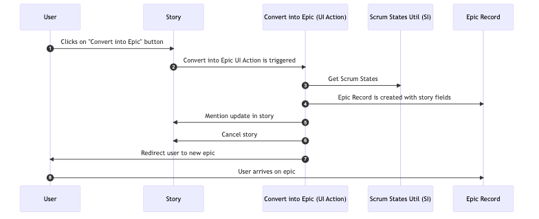
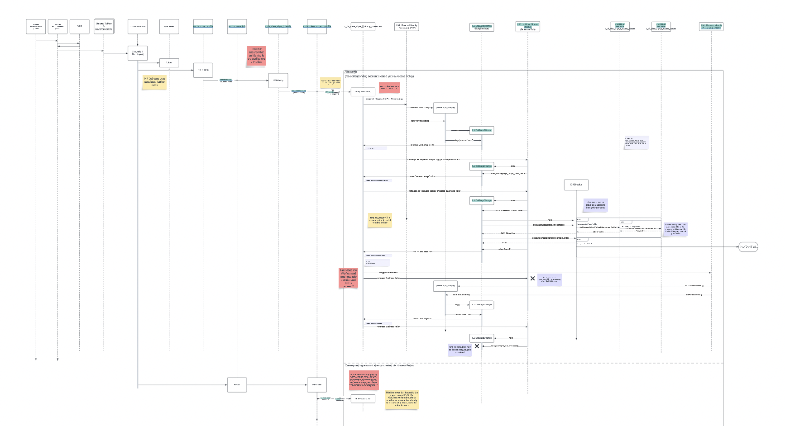
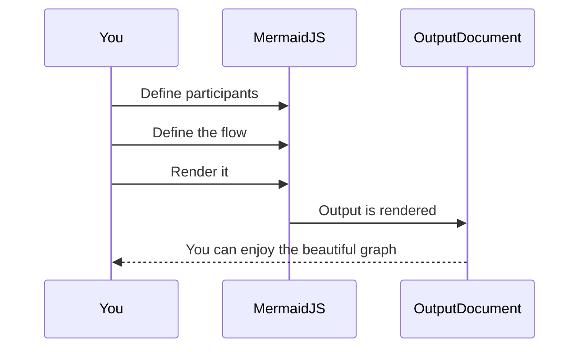
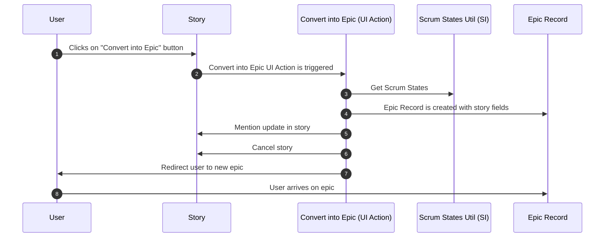
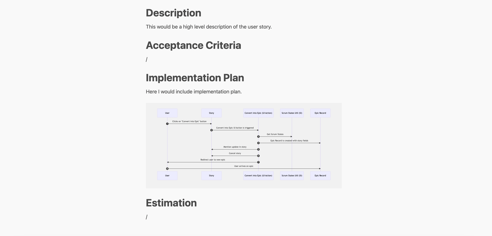

import YouTube from '@components/youtube'



Recently I came across this article written by the founder of MermaidJS, Knut Sveidqvist:

[Sequence diagrams, the only good thing UML brought to software development](https://www.mermaidchart.com/blog/posts/sequence-diagrams-the-good-thing-uml-brought-to-software-development)

Knut argues that the UML standard has been a flop, but sequence diagrams have been somewhat of a success, because unlike most of UML, they're actually quite useful.

What has surprised me since — and what this article is about — is how surprisingly pleasant it is to create sequence diagrams in code with MermaidJS.

I'm a big fan of visualizing things. Not everyone seems to be such a proponent of this. My experience is that as soon as I'm able to offload some of the complexity of a problem to a visual representation, it frees up space. I can use that space to increase my capacity for grappling with complexity. If I cannot do this, I notice that I struggle to hold mutliple big chunks in my head at once.

If you've dabbled in UML, or if you've seen a sequence diagram, you might acknowledge that they're pretty useful.

The problem is that creating them with visual tools is a pain in the ass. I've created a handful of sequence diagrams using Lucidchart and it's a slow process and extremely brittle to any future change.



Mermaid, on the other hand, represents a different approach. It is a Javascript diagramming library, where you declaratively define your diagram in code.

This input:

````markdown

````

Leads to this output:


I'll admit, that never sounded appealing to me. I reach for visualizations because the code is overwhelming me. Reaching for code to solve my code problem seemed like something that would only appeal to someone that loves code so much that they're probably no good at visualizing.

But then I tried it and I loved it. It was quick, painless and beautiful. I'm honestly surprised how quick it is and how well it works.

Here are some tips on how I use it.

## Fleshing out user stories

At my work at [BitHawk](https://bithawk.ch) I use it to flesh out user stories. Typically I'll need to understand how some part of the sytem works before I come up with a solution. Both the current implementation as well as the solution may benefit from being mapped out as a sequence diagram.

I start with a markdown file, which may look something like this:

```md
## Description

## Acceptance Criteria

## Implementation Plan

Here I would include implementation plan.

## Estimation
```

But then I could augment it with a sequence diagram to explain my implementation plan. Right inside of markdown!

````md
## Description

This would be a high level description of the user story.

## Acceptance Criteria

/

## Implementation Plan

Here I would include implementation plan.



## Estimation

/
````

I will first render this with a markdown parser with hot reloading.

The one I settled on is a Rust library called [Marky](https://github.com/npm/marky-markdown), which has some nice built-in templates and comes with Mermaid support.

```bash
marky output.md -D --live
```

And the result looks like this:



With the default theme the diagram is somewhat small. As soon as I have some time I'll create a theme that allows for a full-width diagram, until then I've been zooming in a bit with the browser to make the diagram full screen.

This allows me to tweak the code and get an instant preview of the result.

### Linking up your sequence diagram

At this point the diagram is being rendered as html elements. The main benefit I see is that this allows you to link conceptual components to their actual implementation. This is especially useful in the ServiceNow context where Scripts live within records which have their own URLs.

````markdown {11-13}

````

And this is how that looks:


### Rendering as an image

That might be good enough for most use cases. But typically I want to copy and paste my markdown into an HTML input field on a `rm_story` record in ServiceNow. When I do that I want the HTML formatting as well as an image of the diagram to transfer over.

So long as the diagram is being rendered as HTML, this won't work. We need to render the diagram as a base64 image. That way, when we copy the text with the image, all of the image data is loaded into the clipboard.

Here's how we can accomplish that.

First we convert the mermaid diagrams in our markdown file to an image. I like going with SVG here, but the HTML field I'm targetting doesn't support that, so I'll have to settle for PNG. I use the [mermaid cli library](https://github.com/mermaid-js/mermaid-cli) for this.

```bash
mmdc -i input.md -o output.md -e png
```

Sometimes I'll scale up the PNG a bit if it looks too small.

```bash
mmdc -i input.md -o output.md -e png -s 2
```

And then I'll run marky again. This time without the D flag (because `mmdc` converted our mermaid code into image references) and with the I flag to include the images as base64 encoded blobs.

```bash
marky output.md --live --I local
```

If we now navigate to the hot reload server, we'll be able to select the entire page, copy it and paste it into our HTML field, transferring content, styling and images.


## Conclusion

I agree with Knut, sequence diagrams are useful and I've discovered that MermaidJS combined with some Markdown tooling is a very convenient way to use them in practice.
