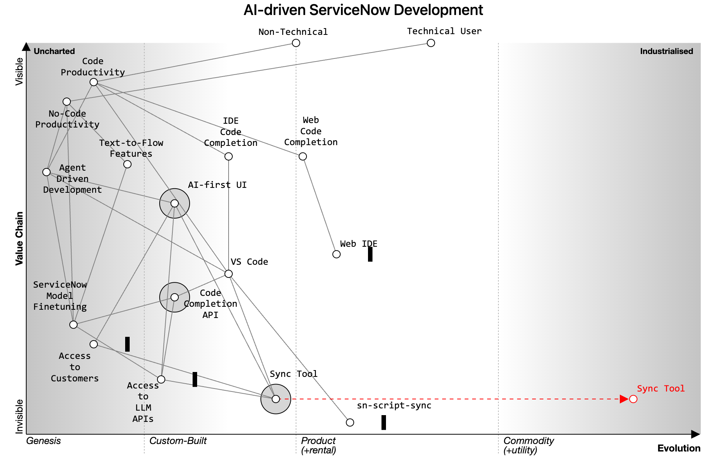

This was initially posted as a Twitter thread here: https://twitter.com/jessems/status/1694713563779420620

Whatever direction AI takes us, I'm assuming there will still be a delineation between technical users (e.g. developers) and non-technical ones.

Both are interested in improving their productivity, each with their own aptitudes and attitudes.

No-code productivity, so far, relies on text-to-flow and other text-to-X types of features.

Code productivity is, so far, driven by code completion (soon to be released). ServiceNow will ship this for the Web IDE, but most likely do nothing for
VS Code users.

I suspect the higher order magnitude gains in productivity will come from agent driven development and related innovations. Non-technical users can benefit from these as well, contingent on an appropriate UX being invented for them. (Opportunity #1)

Web code completion is constrained by the form factor of the Web IDE. I suspect #ServiceNow needs to re-invent this to overcome the inertia here.

Code completion for VS Code users will probably not have access to #ServiceNow's to-be-released model, but third party / open models can be developed. (Opportunity #2) Performance will depend on the degree to which it gets finetuned to the ServiceNow use case (could be tricky!)

VS Code can only be used thanks to an indie browser extension that syncs your code (@sn_utils). It's open source, but owned by a SN employee and not with a completely unrestricted license. Open source contributions have been limited — some inertia here. (Amazing extension btw)

To drive forward productivity gains in VS Code there is an opportunity (#3) for creating a competitor extension with a more unrestricted license and perhaps a plugin/marketplace approach to encourage more developer innovation. #Wardley

The extension would serve as the infrastructure for the AI first no-code UI, while also providing a substrate for other developers to deploy plugins and get access to users (initially VS Code developers).

This nicely sidesteps #ServiceNow's restrictive app store strategy.
