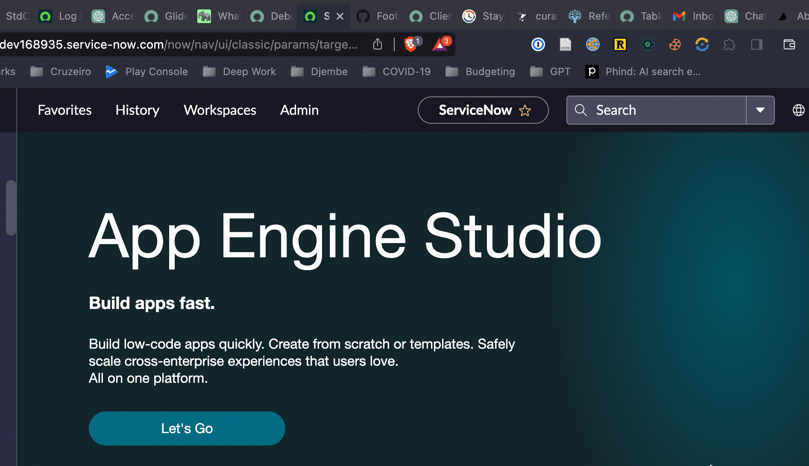
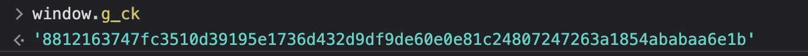
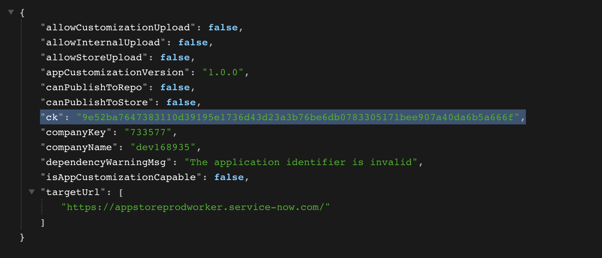
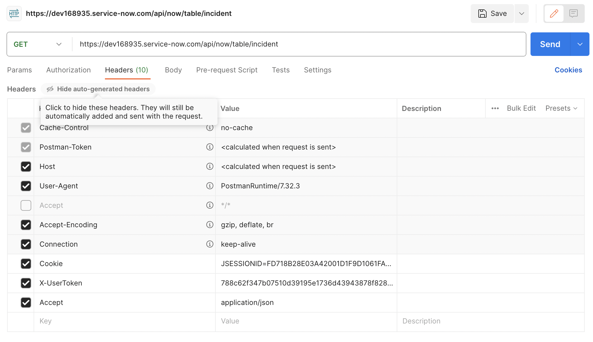

import YouTube from '@components/youtube'

<YouTube id="9BrbjkHiivk" />

ServiceNow provides various REST API endpoints that can be used to interact with an instance. The most well known endpoint is the [Table API](https://docs.servicenow.com/en-US/bundle/vancouver-api-reference/page/integrate/inbound-rest/concept/c_TableAPI.html) which can be used to create, read, update and delete records, as well as perform other operations.

There are several ways to authenticate against the ServiceNow REST APIs for Inbound REST API Requests (Requests to your instance from the outside). Here is an overview of the different authentication schemes:

-   Basic Authentication: The [default authentication scheme](https://support.servicenow.com/kb?id=kb_article_view&sysparm_article=KB0793963) for the REST API is Basic Authentication. This requires a username and password to be provided with each request.
-   [Multi-Factor Authentication](https://docs.servicenow.com/bundle/vancouver-api-reference/page/integrate/inbound-rest/concept/c_RESTAPI.html#c_RESTAPI__multi-factor-auth-inbound-REST): ServiceNow supports Multi-Factor Authentication (MFA) for REST API requests. This requires a username, password and MFA code to be provided with each request.
-   [Certificate-based or Mutual Authentication](https://docs.servicenow.com/bundle/vancouver-platform-security/page/integrate/authentication/concept/certificate-based-authentication.html): Certificate-based authentication lets you mutually authenticate user logins or inbound API requests using certificates from a trusted Certificate Authority (CA).

Basic Authentication is the default and should work out-of-the-box. However, if you've set up Single-Sign-On or Multi-Factor Authentication for logging in on the web platform, because those schemes don't rely on a password, those users might not have a password set on their `sys_user` record.

**Without a password set on the sys_user record a user won't be able to authenticate against the REST API using Basic Authentication.**

This is easily resolved by setting a password on their `sys_user` record. This does not side-step the SSO/2FA authentication on the web interface, but it does allow these users to authenticate against the REST API using a username and password only.

Multi-Factor Authentication and Certificate-based authentication both require some configuration on the instance. Sometimes getting those configurations implemented requires waiting on various layers of bureaucracy. In those cases (and others), it would be helpful if we could authenticate against the REST API without having to configure anything.

This post is about how we can retrieve two different session tokens which when used together allow for a logged in user to authenticate against the ServiceNow REST API.

**One major benefit of session-token (or cookie) based authentication is that it allows you to ineract with the REST API without having to set up any additional authentication schemes or make any other configuration changes.**

Although ServiceNow does mention the possibility of cookie based authentication against its REST APIs, it is not documented in detail. I'll try to do so in the post.

## The session tokens involved

There are two different session tokens involved in this process:

-   **A Java session token (`JSESSIONID`) included in the cookie automatically**
    `JESSIONID` is a session identifier commonly used in Java web applications. Since ServiceNow is built on Java, it uses this session identifier as well. It is stored in the browser's local storage as a cookie and is sent along automatically with every request to the ServiceNow instance.

-   **A CSFR token (`ck`) included in the request header deliberately**
    The `ck` token is also a session identifier but unlike the `JSESSIONID` it is not sent automatically and it is not stored in the browser's local storage. This helps prevent a type of attack known as Cross Site Forgery Request ([CSFR](https://en.wikipedia.org/wiki/Cross-site_request_forgery)) whereby an attacker tricks a user into making a malicious request while using the automatic authentication made possible by a cookie-based token like the `JSESSIONID` token.

    Specifically the attack is prevented by introducing an additional token that requires deliberate inclusion in the request header. In ServiceNow's case this token is referred to as the `ck` token and it is passed along in the `X-UserToken` header key.

### How to retrieve the session token (`JSESSIONID`)

The easiest way to retrieve the `JSESSIONID` token is by installing a browser extension like [Cookie Editor](https://chrome.google.com/webstore/detail/cookie-editor/hlkenndednhfkekhgcdicdfddnkalmdm) to view the variables stored in the cookie and to look up the value for `JSESSIONSID`. Of course you'll need to log in first.



Another alternative is to open your browser dev tools and to record and examine the HTTP request to the ServiceNow instance. You can then look at the cookies that are sent along with the request and copy the value for `JSESSIONID`.

### How to retrieve the CSFR token (`ck`)

There are at least three ways of retrieving the `ck` token:

1. **Programmatically**:

    On the server-side, in a private scope, you can retrieve the session token programmatically by executing the following (for instance as a background script):

    ```js
    var sessionToken = gs.getSession().getSessionToken();
    gs.info(sessionToken); // 1cfd683647303110d39195e1736d4311fc02307ffd32d33ab65c4a51099c28b1ceff9539
    ```

    It only seems to work in a private scope, although I'm not sure why. Also it requires access to server side scripting which is not always available.

2. **Via the `window` object**:

    Sometimes you may not have the requisite permissions to run a server side script. In those cases you can retrieve the session token from the window object in the browser.

    You can open up the browser console (e.g. Chrome Console for Chrome users) and type in `window.g_ck`. This will return the `ck` token for the current session.

    

3. **Via the "Publish Info" `sys_processor`**:

    There is one last alternative for obtaining the `ck`

    This technique is courtesy of Arnoud Kooi, the author of the sn-utils browser extension and the sn-script-sync VS Code extension. sn-utils retrieves the `ck` token by making a call to a legacy `sys_processor` endpoint which still ships with all instances out-of-the-box.

    `sys_processor` [records](https://docs.servicenow.com/en-US/bundle/sandiego-api-reference/page/script/processors/concept/c_Processors.html) are the predecessors to Scripted Rest APIs and ServiceNow has marked them as deprecated. Just like Scripted REST APIs they expose an endpoint which can execute arbitrary server-side code when called.

    Despite them being deprecated, the "Publish Info" `sys_processor` record still works and is available on all instances out-of-the-box (as far as I know).

    The "Publish Info" `sys_processor` record exposes an endpoint at `sn_devstudio_/v1/get_publish_info` that returns a JSON object with — what looks like — some key information needed to publish a custom app. This object includes an entry for the CSFR token `ck`.

    If you simply navigate to that endpoint e.g. `https://dev168935.service-now.com/sn_devstudio_/v1/get_publish_info` you'll get to see the JSON response (install a JSON viewer extension to make it more readable).

    

**Methods 2. and 3. are especially powerful because they enable a scheme where you interact with the ServiceNow REST API without having to configure anything. Even if the web interface requires SSO or 2FA and your `sys_user` record doesn't have a password set.**

There are some instances I work with where it would take months of bureaucratic wrangling to get an authentication scheme set up. In these cases, I can follow the instructions mentioned here to obtain both session tokens and use them to authenticate against the REST API.

Whatever method you use to obtain the CSFR, take note of the value and save it for later.

### Building the request

I'll discuss here how to set up the most basic request usig the `JESSIONID` and `ck` tokens. (You can also construct a valid request by recording a request from the browser, but you end up with a lot of unnecessary headers.)

1. Open an API Testing tool. I like Postman which I'll use for this tutorial.
2. Click on File > New > HTTP Request.
3. Enter the URL for the endpoint you want to call. For instance, if you want to call the Table API endpoint for the `incident` table, you would enter `https://<instance-name>.service-now.com/api/now/table/incident`.
4. Add a header called "Cookie" and set its value to `JSESSIONID=<YOUR-SESSION-ID>;`
5. Add a header called `X-UserToken` and set its value to the `ck` token you retrieved earlier.
6. Under the "Headers" tab change disable the default value for the `Accept` key and create a new one instead. Set its value to `application/json` to force a JSON response.



That should be enough to perform the request. You can click on the "Send" button to send the request and see the response.

You can also click on the "Code" button on the right pane in Postman to get the code snippet for your request.

Here are some examples:

### cURL

```shell
curl --location 'https://dev168935.service-now.com/api/now/table/incident' \
--header 'Cookie: JSESSIONID=FD718B28E03A42001D1F9D1061FAEB4B' \
--header 'X-UserToken: 788c62f347b07510d39195e1736d43943878f8280c2dda9fae4fafe5f5384c468882d16d' \
--header 'Accept: application/json'
```

### NodeJS and Axios

```js
const axios = require('axios');

let config = {
	method: 'get',
	maxBodyLength: Infinity,
	url: 'https://dev168935.service-now.com/api/now/table/incident',
	headers: {
		Cookie: 'JSESSIONID=FD718B28E03A42001D1F9D1061FAEB4B',
		'X-UserToken':
			'788c62f347b07510d39195e1736d43943878f8280c2dda9fae4fafe5f5384c468882d16d',
		Accept: 'application/json'
	}
};

axios
	.request(config)
	.then(response => {
		console.log(JSON.stringify(response.data));
	})
	.catch(error => {
		console.log(error);
	});
```

### JavaScript XHR (This is what sn-utils uses)

```js
var xhr = new XMLHttpRequest();
xhr.withCredentials = true;

xhr.addEventListener('readystatechange', function () {
	if (this.readyState === 4) {
		console.log(this.responseText);
	}
});

xhr.open('GET', 'https://dev168935.service-now.com/api/now/table/incident');
// WARNING: Cookies will be stripped away by the browser before sending the request.
xhr.setRequestHeader('Cookie', 'JSESSIONID=FD718B28E03A42001D1F9D1061FAEB4B');
xhr.setRequestHeader(
	'X-UserToken',
	'788c62f347b07510d39195e1736d43943878f8280c2dda9fae4fafe5f5384c468882d16d'
);
xhr.setRequestHeader('Accept', 'application/json');

xhr.send();
```

### References

-   [SN Developer Blog Post on Testing Scripted REST APIs with an External API Testing Tool](https://developer.servicenow.com/blog.do?p=/post/debugging-inbound-rest-calls-and-the-business-rules/acls-that-impact-them/)
-   [More about ServiceNow REST API Security](https://docs.servicenow.com/bundle/vancouver-api-reference/page/integrate/inbound-rest/concept/c_RESTAPI.html)
-   [Jace Benson's post on `g_ck`](https://jace.pro/post/2018-05-12-g_ck/)
-   [Official KB article on the `g_ck` token and CSRF attacks](https://support.servicenow.com/kb?id=kb_article_view&sysparm_article=KB0565021)
