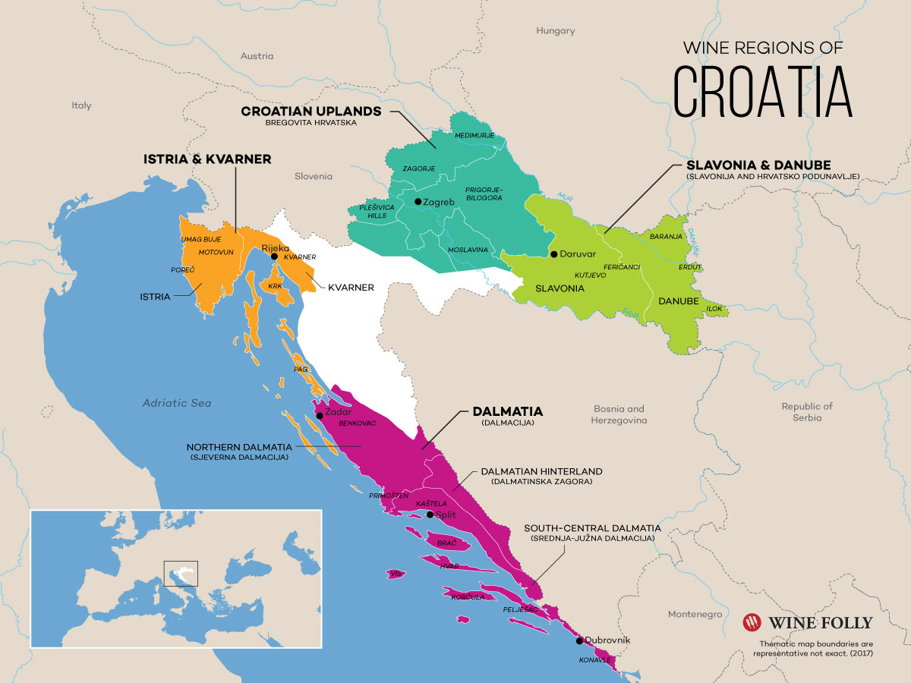

As I'm writing this I'm sitting in Split airport after spending a couple of days with my university fraternity celebrating our 25th anniversary. We rented what can best be described as a repurposed hotel of sorts which was able to house the 27 of us. There was an empty reception at the entrance and each floor had 3-4 rooms for 2 people or more.

I had never been to Croatia so I was very curious what my experience would be like. I feel a natural affinity towards slavic people, perhaps due to me Polish roots, which piqued my interest in Croatia. That said, slavic countries can be a bit rough for a pampered North-Western European as myself. We feel a bit antsy when we cannot use English to communicate and the general threat of getting robbed or pickpocketed is higher than at home. Here are some of my thoughts.

We stayed relatively nearby our rented complex near Split in the South of Croatia, a region also known as Dalmatia. We were located a 10 minute walk away from the beach, a trip we would make on a daily basis. The beaches where we were, were sandy and the water quite warm and clean. It's the best type of sand: soft and clean. The water remains shallow for long stretches, allowing you to wade far out from the shoreline.

I would describe it as idyllic and tranquil if it wasn't for the surprisingly strong gusts of wind that seem to hit you out of nowhere. My cab driver on the way to the airport told me that this is known to occur in the region of Omiš and Duće where we were, but only in the spring and fall allegedly.

The people we interacted with were all active in the tourist industry — the only thing Croatian economy has going for itself, I've been told. What struck me was how good their English was. I associate strong slavic acceents in English with mediocre English at best. But the average level of English among Croatians in our area seemed higher than, say, Switzerland. Our climbing instructor with no particular advanced education seemed to have a larger English vocabulary than most of my Dutch friends.

I learnt that Croatian and Serbian are essentially the same language, but Croatia is oriented towards the West whereas Serbia is oriented towards Russia. When I visited Belgrade many years ago I remember it being rare to encounter someone that spoke English. So it's striking how much of a different such a national orientation can make.

Not only are the locals comfortable in English, I always felt we received first class treatment from the people we interacted with. It seems they're very aware on how to treat tourists with consideration and respect. Our climbing instructors were patient with us and after a climbing route had been set up, they would linger around until one of us needed them to secure us while we climbed up. They also shook our hands individually upon leaving.

As my cab driver did allude to, apart from the tourist industry, Croatia does seem a bit run down. Comparing it to my main reference, Switzerland, houses don't seem to be well maintained. Smaller private roads that run up and down the mountainous terrain are paved with seemingly low quality white concrete. Public areas aren't as filthy as in Spain and they seem cleaner than my memories of similar scenes in Poland.

The food, from what I've experienced, is nothing to write home about. The Mediterranean surroundings and the prevalence of olive trees would almost lead you to assume their cuisine would be as rich and varied as the Italian one. It seems, though, that it is quite rudimentary, being heavy on simple sausages and minced meat without much depth beyond that. Ordering the house specialty gets you fries and a sausage drowned in oil. None of the three dishes I had was served with any vegetables.

I'm left with a sense of the burgeoning potential of Croatia. Their embracing of tourism and the English language take off the rough edges off of a slavic country and their idyllic coastline and temperate ocean make it hard not to swoon.
