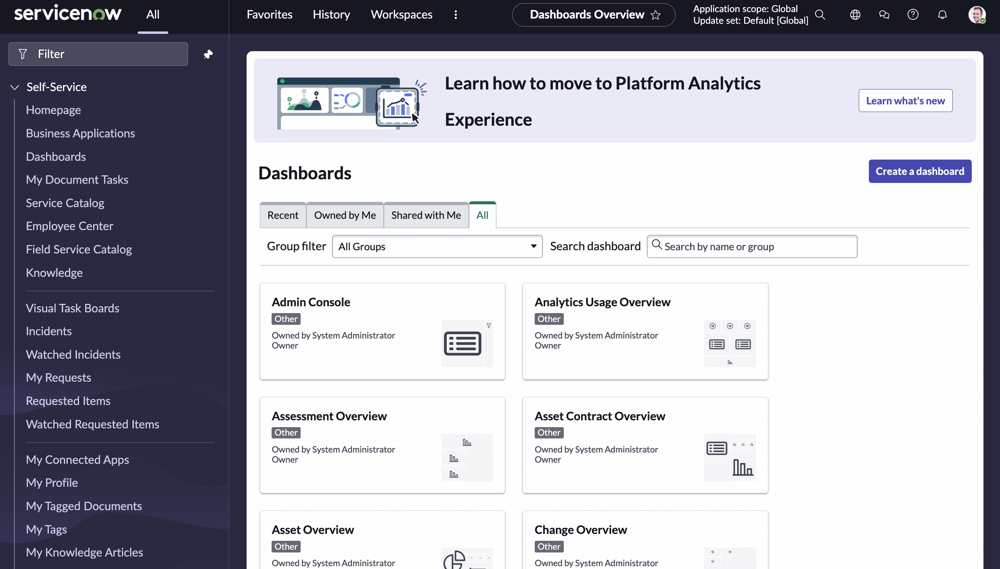

import { Button, Steps } from 'nextra/components';

ServiceNow offers the ability to link a Studio application to a Github repository. This allows you to manage your application's source code in a version control system. This is a guide on how to establish this connection between your ServiceNow instance and GitHub without needing to disable two-factor authentication.

<Steps>
## Step 1: Navigate to Personal Access Token Creation in Github

- Login to Github and navigate to your profile settings. 
- Click on the `Developer settings` tab and then click on `Personal access tokens`. 
- Click on the `Generate new token` button and choose 'Classic'. (You can also choose the fine-grained token, but as of this writing it's in beta, and it's slightly more involved to set up.)

## Step 2: Create a Personal Access Token

- Fill in a note for the token, such as "ServiceNow Token"
- Select the `repo` scope
- Click on the `Generate token` button
- Copy and save your token somewhere safe. You won't be able to see it again.

## Step 3: Create a basic auth credential in ServiceNow

- Navigate to **Connections and Credentials > Credentials** in your ServiceNow instance and click the "New" button.
- As the type of credential, select "Basic Auth Credentials"
- In the subsequent form fill in the following details:
  - **Name**: A name for your credential, such as "Github Token
  - **Username**: Your Github username
  - **Password**: The personal access token you created in the previous step
- Click the "Submit" button to save your credential.

## Step 4: Link your application to a Github repository

- Navigate to **System Applications > Studio** in your ServiceNow instance.
- Click "Import From Source Control".
- Fill in the following details:
  - **URL**: The https URL of your Github repository
  - **Credential**: The credential you created in the previous step
  - **Branch**: The branch you want to clone from
- Click Import.

</Steps>

## References

- [ServiceNow KB Article: Linking an application to Git using a personal access token instead of a password](https://support.servicenow.com/kb?id=kb_article_view&sysparm_article=KB0870863)