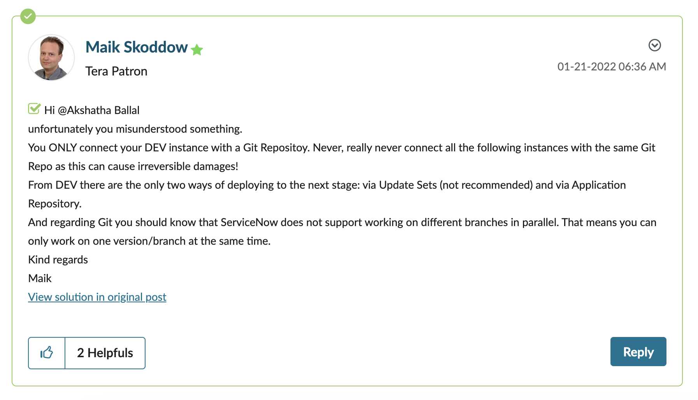

## Only connect your dev instance with a git repository

From a forum post [^1]

> You ONLY connect your DEV instance with a Git Repositoy. Never, really never connect all the following instances with the same Git Repo as this can cause irreversible damages!
>
> From DEV there are the only two ways of deploying to the next stage: via Update Sets (not recommended) and via Application Repository.

Wanted to chime in here. There is technically NO reason anymore to not link more instances to the same repo. The fact that it could cause irreversible damages is outdated since some releases for sure.

> So, nowadays you can very well link your dev, test and even prod instance to the same repository. A flow could be that dev pushes changes to the repo, test and prod only pull (apply) changes from there. This depends on how you want to use source control in our development process. [^1]

## References

[^1]: https://www.servicenow.com/community/developer-forum/how-to-handle-multiple-deployments-using-branches-for-source/m-p/1441128
