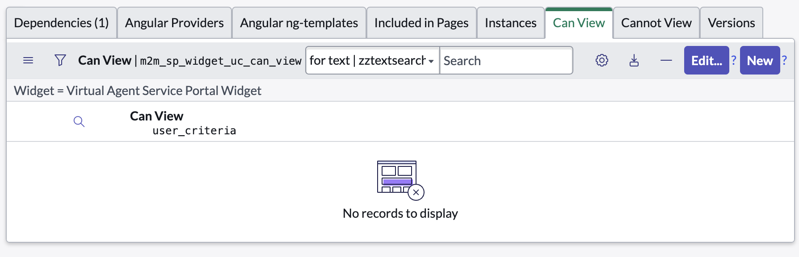
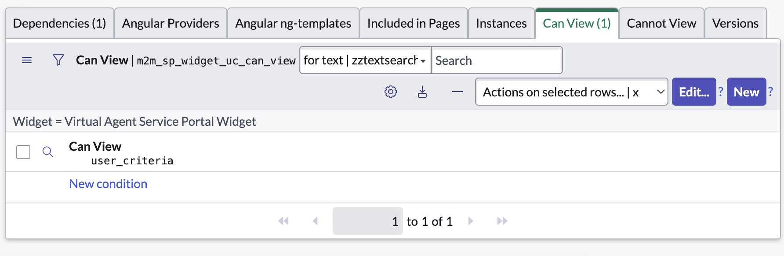

import { Steps } from 'nextra/components';

If you want to restrict access to the virtual agent chat popup, the best way seems to be by retricting access to the widget itself. This can be done by adding a condition to the widget.

<Steps>

### Navigate to the widget

Navigate to **Service Portal > Widgets** and search for a widget called "Virtual Agent Service Portal Widget" with `id` `sn-va-sp-widget`.

### Add a new Can View condition in the related list at the bottom

### Add a condition and save the record to restrict access to the widget

</Steps>
